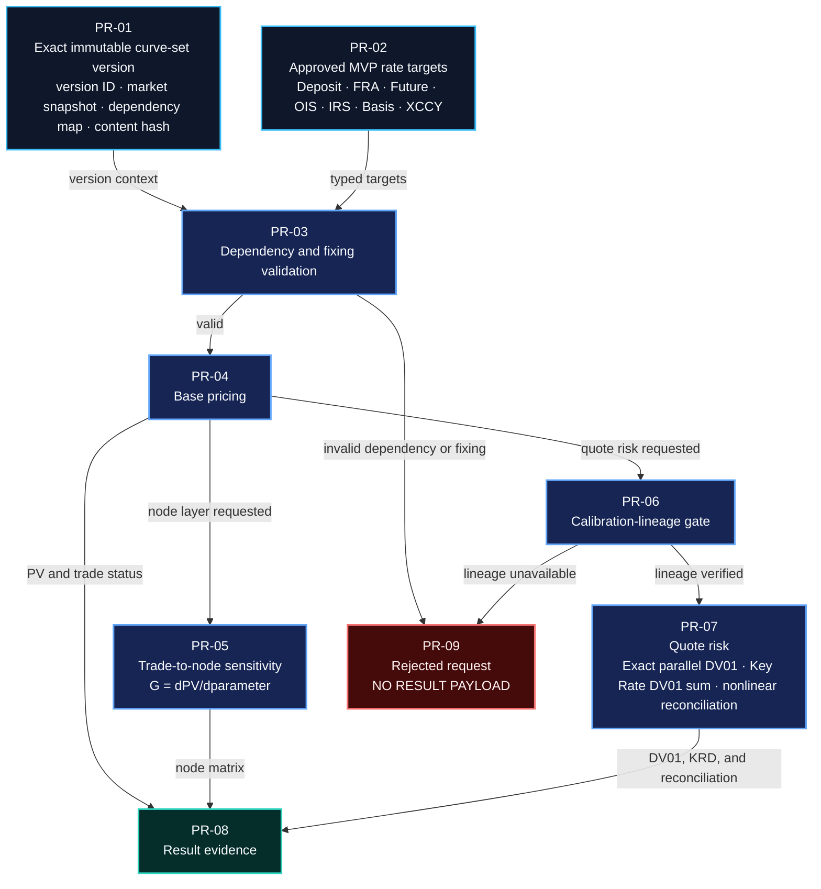
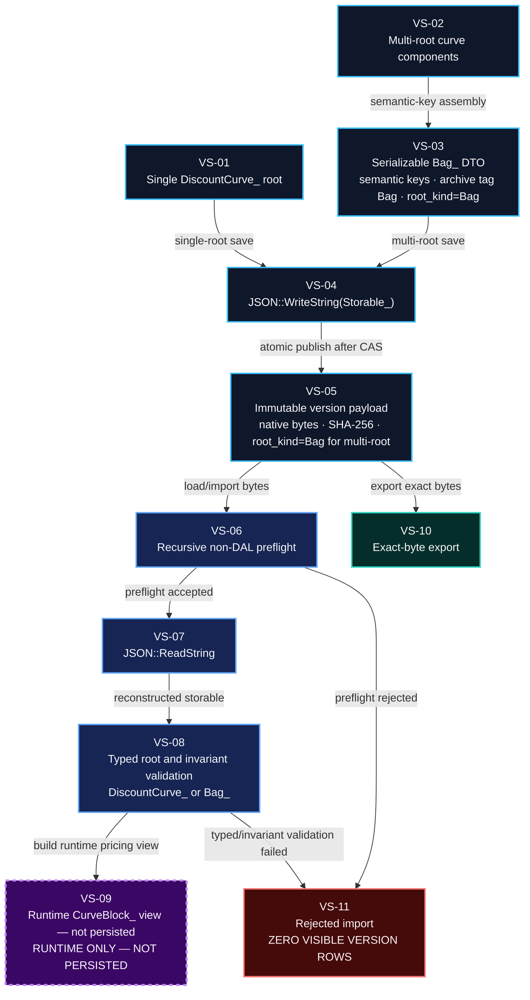

# Curve Lab in DAL-WEB — Technical Design, Revision 8

Status: implementation-ready design correction; implementation remains parked
pending independent DAL-17 re-review
Issue: DAL-24
Role: `dal-api-designer`
Approved product specification: `curve-lab-dal-web-v0.5.md`, SHA-256
`0d0ce731b2beb5591616e6fa865f61335cfcc185c155606e55b67049359ed8da`
Revision 1 technical design SHA-256:
`14430d608dc5e121318fdd855b4323e66219855ad9f277ef337cfa9878dea892`
Revision 2 technical design SHA-256:
`e943fb5533a8a3792d0b53babf8b403c49967631ee12da80577b9c33c1c40ca3`
Stage 1 text-only Revision 3 SHA-256:
`815bab27338d95ff142e151b27ede81f7cb8626a20d2684e92d45ec2367248d5`
Revision 3 final assembly SHA-256:
`3cd1b767ebd08c1882683d2b6199718afccfcbe404a3285d00fc9131732034d2`
Revision 4 SHA-256:
`79d1697878016fa7f5d54ca9a8f30224363cfeca44b18a9d219a221e472b277d`
Revision 5 SHA-256:
`72378a8d5a3c89c7475a6ebdfb6212d854702105e515f522f8f0f72845f99450`
Revision 6 SHA-256:
`83155413657147f8758aefc99ed086a78483e85368928fcf115225379bba9938`
Revision 7 SHA-256:
`5d5abfa129947490df69eb19ca5b63ddc2ace87ebf3e8d64e47d988024e549b9`
Review addressed: latest DAL-17 `curve-lab-technical-design-review.md`,
SHA-256
`24f8531e3d8c7da4bd6c448f76ccb6c2a47ddbd9d4dbffa6f4f6be5bc3a34ffb`
Verified remote `master`:
`98f7b65975a9a5294f5af3693a6fc4a4f1dee7a8`
Approved owner decisions:
`P-01=A: correct visuals to use serializable Bag_ and remove swaption from
MVP; no scope expansion.`
`P-02: every formal Curve Lab V1 surface is generated from the exact positive
success-family allowlist in product specification v0.5.`
`P-03: keep exact_risk_raw_bump fixed; every durable RATE/SPREAD raw_quote is
canonical decimal, +0.0001 is both its raw-coordinate and normalized 1 bp
bump, and percent is presentation metadata only.`

Revision 8 supersedes Revision 7. It preserves the accepted Bag
alias-collision state machine and every other closed contract while making the
RATE/SPREAD durable raw unit and fixed exact-risk bump one canonical decimal
contract across API, DTO, persistence, risk evidence, and replay. Both Mermaid
sources are byte-identical to Revision 7 because they contain no quote-unit or
presentation-convention detail and already match v0.5. This is a design
artifact only. It does not authorize
implementation, a pull request, or a later pipeline stage.

## 1. Revision outcome and the closed owner gate

Revision 8 preserves every executable technical contract, source citation,
test obligation, blocker disposition, and compatibility statement already
closed in Revision 7. It applies `P-01=A`, P-02, and P-03 without expansion
and makes product specification v0.5 the
authoritative closed V1 scope.

The exact P-01 replacements are:

1. A multi-root curve set crosses the persistence and reconstruction boundary
   only as a serializable `Bag_` DTO with stable semantic component keys. Its
   native archive tag and persisted `root_kind` are `Bag`.
2. `CurveBlock_` is runtime-only. It may be reconstructed from a validated
   `Bag_` after deserialization for native pricing, but it is never a saved
   root, persisted DTO, import/export format, stored-type label, or version
   metadata value.
3. The successful Pricing & Risk example contains only the seven families in
   the v0.5 FR-3 allowlist.
4. No volatility surface, exercise, settlement, Vega, calibration, valuation,
   persistence, API, or test contract is added.
5. Revision 8 does not alter the persistence boundary, JSON contract,
   Jacobian semantics, AAD policy, event-loop behavior, restart contract, or
   work budgets.

P-02 is subtractive and fail-closed:

1. the V1 family enum is exactly `DEPOSIT`, `FRA`, `FUTURE`, `OIS`, `IRS`,
   `BASIS_SWAP`, and `XCCY`;
2. no DTO, API field, native gateway branch, persistence metadata, UI element,
   workflow, family-specific error, test, performance term, acceptance
   criterion, or example exists outside that set;
3. DTO, OpenAPI, persistence, gateway, UI, example, result, and test
   projections must equal that exact ordered set; no projection may accept,
   store, dispatch, render, or test an additional success-family value.

P-03 is a unit-boundary correction, not a configurable-risk expansion:

1. every durable or public financial `raw_quote` for a `RATE` or `SPREAD`
   coordinate is an exact canonical decimal value; percent is accepted only by
   an input adapter or retained as non-financial presentation metadata;
2. the closed family registry owns the canonical raw unit, normalized
   transform, raw-coordinate risk bump, and normalized risk bump; callers
   cannot override any of them;
3. `RATE` and `SPREAD` always use raw and normalized `+0.0001`; `FUTURE`
   retains price-coordinate `-0.01`, mapping to normalized `+0.0001`;
4. presentation preference and precision are omitted from the financial draft
   fingerprint and all run evidence that determines calibration or replay.

The rejection contract remains explicit so unsupported input cannot be
mistaken for a successful MVP path:

```text
code=UNSUPPORTED_PRODUCT
field=trades[i].instrument_type
value=SWAPTION
constraint=instrument type is not enabled by the approved Curve Lab MVP
```

There is no fallback, silent IRS mapping, partially successful result, or
persisted object for that input. Section 19 and the separately packaged,
byte-identical Mermaid sources are authoritative for the two deterministic
visual corrections. The corrected approval-package manifest lists no obsolete
Pricing & Risk or Versions PNG.

Revision 8 is ready for independent DAL-17 technical-design re-review.
Implementation remains parked until that review returns `Looks fine` or
`Proceed with caveats` with no blocking finding.

## 2. Audiences and delivery boundary

This design is for:

- DAL C++ implementers adding only the native capabilities that do not exist;
- Python binding implementers preserving the real native hierarchy;
- DAL-WEB backend implementers defining persistence, jobs, validation, and
  response contracts;
- frontend implementers projecting the canonical API without financial math;
- Excel maintainers ensuring public C++ concepts project consistently when exposed;
- test/review owners verifying numerical and concurrency boundaries.

The delivery boundary is:

- no React pricing or calibration math;
- no second curve serialization format;
- no public API that accepts an untyped map for financial terms;
- no implicit `latest` dependency;
- no partial risk aggregate represented as complete;
- no native archive reader invocation before recursive preflight succeeds;
- no successful path for an instrument type outside the approved closed MVP
  family enum.

## 3. Verified repository facts

The following facts are requirements, not assumptions:

### 3.1 Native object hierarchy and archive identity

The actual hierarchy is:

```text
Storable_
├── YCComponent_
│   └── DiscountCurve_
├── YieldCurve_
│   └── CurveBlock_
└── Bag_
```

Evidence:

- `dal-cpp/dal/curve/yccomponent.hpp`
- `dal-cpp/dal/curve/discount.hpp`
- `dal-cpp/dal/curve/yc.hpp`
- `dal-cpp/dal/curve/curveblock.hpp`
- `dal-cpp/dal/storage/bag.hpp`
- `dal-cpp/dal/curve/yc.cpp`

`DiscountCurve_` and `YieldCurve_` are siblings. A concrete discount curve
reports archive base type `DiscountCurve`, while `CurveBlock_` reports
`YieldCurve`. A single-discount root must therefore be checked as
`DiscountCurve_`, never as `YieldCurve_`.

### 3.2 Calibration instruments are not trade terms

`YCInstrument_` exposes market quote and model-rate behavior but not immutable
public cashflow terms. Its concrete schedules and notionals are private
implementation details. It cannot support an exact historical-fixing pricing
workflow by introspection.

Evidence:

- `dal-cpp/dal/curve/ycinstrument.hpp`
- `dal-cpp/dal/curve/ycinstrument.cpp`
- `dal-public/src/curveinstrument.hpp`

The revised pricing contract therefore uses typed immutable pricing definitions
and normalized cashflow plans. It does not cast or inspect `YCInstrument_`.

### 3.3 Existing XCCY lifecycle is reusable

The existing XCCY implementation already establishes the temporal boundaries
adopted in Section 6:

- a fixing strictly before valuation time is historical and required;
- a fixing equal to valuation time uses supplied history when present and
  forecasts otherwise;
- a later fixing is forecast;
- a payment strictly before valuation date is excluded;
- a payment on valuation date remains and has discount factor one.

Evidence:

- `dal-cpp/dal/curve/xccypricing.hpp`
- `dal-cpp/dal/curve/xccypricing.cpp`
- `dal-cpp/tests/curve/test_xccypricing.cpp`
- `dal-cpp/dal/curve/xccyinstrument.hpp`

`CrossCurrencySwapConfig_` already contains absolute domestic and foreign
notionals and explicit domestic/foreign rate fixing identities. There must not
be a second outer notional.

### 3.4 Archive readers are a closed compatibility surface

Current curve roots:

- `DiscountPWLF_v1`
- `DiscountZeroRate_v1`
- `DiscountLogDF_v1`
- `DiscountLogDF_v2`
- `Bag`

`DiscountPWC_`, a normal calibration/basis-curve output, currently throws from
`Write`. Implementation must add prospective archive tag `DiscountPWC_v1`
with required `knotDates` and `fRight`, optional `name`, `ccy`, and recursive
discount-curve `base`. It is the only new native curve tag authorized here.
The tag must build the same passive `DiscountPWC_<double>` representation; it
must not serialize the helper `PiecewiseConstant_` as the curve root.

Only `DiscountLogDF_v1` has a non-curve helper handle, `interp`. Its reachable
registered helper tags are exactly:

- `Interp1Linear_v1`
- `Cubic1`
- `LogLinear1`

The v1 builder discards the helper implementation and reconstructs
`LOG_LINEAR`; this compatibility behavior must be reported, not represented as
verified preservation.

Evidence:

- `dal-cpp/dal/auto/MG_DiscountLogDF_v1_Read.inc`
- `dal-cpp/dal/auto/MG_Interp1Linear_v1_Read.inc`
- `dal-cpp/dal/auto/MG_Cubic1_Read.inc`
- `dal-cpp/dal/auto/MG_LogLinear1_Read.inc`
- `dal-cpp/dal/curve/yclogdf.cpp`

### 3.5 Revision 8 closure facts at verified master

Revision 8 was checked against remote `master`
`98f7b65975a9a5294f5af3693a6fc4a4f1dee7a8`:

- `MG_CollateralType_enum.inc` has exactly `OIS`, `GC`, and `NONE`;
- `MG_PeriodLength_enum.inc` has exactly `MONTHLY`, `QUARTERLY`,
  `SEMIANNUAL`, and `ANNUAL`, while the native reader also recognizes aliases
  including `1M`, `3M`, `6M`, `12M`, `SEMI`, and the long names;
- `curveblock.hpp/.cpp` stores discount routes in
  `std::map<CollateralType_, ...>` and forward routes in
  `std::map<PeriodLength_, ...>`; it requires at least one discount route and
  is not serializable;
- `dal-cpp/dal/protocol/rateconvention.hpp` gives each index convention its
  own `CollateralType_`, while
  `dal-cpp/dal/curve/xccycalibration.hpp/.cpp` separately requires domestic
  `Ccy_ collateralCurrency_` and `CollateralType_ fxForwardCollateral_`;
- `storage/json.hpp/.cpp` currently exposes `ReadString(const String_&, bool)`
  and parses with `src.c_str()`, even though member values can expose a stored
  length;
- `curveblock.hpp`, `calibration.cpp`, `jointcalibration_internal.hpp`, and
  XCCY calibration sources require a positive smoothing weight independently
  of `solveMode_`, so `EXACT` and smoothed are simultaneously true in current
  native specifications;
- `calibration.cpp` records native AAD through the current thread tape and
  `TapeGuard_`; no native work estimator accounts for Curve Lab's required
  per-run parity, so that accounting belongs in the web admission contract.
- `dal-web/backend/app/schemas/calibrations.py` exposes each calibration
  instrument's `market_rate` as a finite numeric value with no percent-unit
  discriminator, and `dal-web/backend/app/services/dal_gateway.py` passes that
  value unchanged to native factories;
- backend/frontend calibration fixtures and examples represent rates as
  decimals such as `0.04`, while native
  `dal-cpp/examples/yield_curve_jacobian/yield_curve_jacobian.cpp` defines a
  quote bump of `+1e-4` absolute decimal as `+1 bp`;
- native examples multiply decimal rates by `100` and spreads by `10000` only
  for display. The existing C++, Python, and generated Excel factory surfaces
  accept a numeric `market_rate`; none supplies a durable percent-vs-decimal
  discriminator.

## 4. Canonical model, identity, and immutability

### 4.1 One request model

Visual Build, Advanced JSON, and optional CSV import all produce
`CurveDraftDocumentV2`. The frontend never owns a parallel financial model.
CSV is parsed server-side into the same instrument definitions and then
round-tripped through the V2 JSON schema.

```text
CurveDraftDocumentV2
  schema_version = 2
  draft_id
  draft_revision
  draft_fingerprint
  mode
  as_of_date
  market_snapshot_id
  declarations[]
  instruments[]
  dependency_version_ids[]
  solver
```

`draft_fingerprint` is SHA-256 over canonical UTF-8 JSON with sorted object
keys, preserved array order, Section 5.1 canonical decimal strings, and omitted
presentation fields. A percent-entered and decimal-entered request that denote
the same financial values therefore produce the same financial document bytes
and fingerprint. All server mutations use compare-and-swap:

```http
PUT /api/curve-lab/drafts/{draft_id}
If-Match: "{draft_revision}"
```

Conflict:

```json
{
  "code": "DRAFT_REVISION_CONFLICT",
  "field": "If-Match",
  "value": "17",
  "constraint": "must equal current draft revision 18"
}
```

### 4.2 Stable instrument identity

Every draft instrument has a server-generated UUID `instrument_id`. It is
created once on admission, survives edits, include/exclude changes, and
reordering, and is copied on clone only as `source_instrument_id`; the clone
receives a new `instrument_id`.

Duplicate IDs are rejected before normalization:

```text
code=INSTRUMENT_ID_DUPLICATE
field=instruments[7].instrument_id
value=<uuid>
constraint=must be unique within the draft
conflicts_with=instruments[2].instrument_id
```

Advanced JSON V1 requests that have no ID receive deterministic run-local IDs
`legacy:{request_hash}:{group_index}:{instrument_index}`. These IDs are
persisted with that run but are not reusable draft identity.

### 4.3 Run admission

A build run snapshots the exact canonical document, revision, fingerprint,
dependency IDs and dependency hashes. A later draft edit marks the run stale
for UI purposes but does not mutate its evidence.

Runs have:

```text
QUEUED -> DECLARING -> RESOLVING_DEPENDENCIES -> NORMALIZING
       -> SOLVING -> DIAGNOSTICS -> SERIALIZING
       -> SUCCEEDED | FAILED | TIMED_OUT
```

`TIMED_OUT` is terminal only between native calls. A native C++ call already
running is always awaited; the worker never abandons a thread, tape, global
evaluation-date scope, or database lease. After the call returns, the soft
deadline is checked and no further native call is started.

## 5. Instrument normalization and calibration quote coordinates

### 5.1 Common definition

Curve-builder instruments and pricing targets are distinct immutable values.
They share family convention/schedule terms, but only calibration instruments
carry a market quote and only pricing targets carry position economics. The
backend derives neither value by inspecting a constructed `YCInstrument_`.

All curve-builder families persist and return:

```text
StoredInstrumentDefinitionV2
  instrument_id: UUID
  instrument_type: enum
  trade_date: date
  start_date: date
  maturity_date: date
  currency_or_pair: string
  quote_coordinate_kind: RATE | PRICE | SPREAD
  canonical_raw_unit: DECIMAL | PRICE_POINTS
  raw_quote: CanonicalQuoteDecimalV1
  normalized_quote: CanonicalQuoteDecimalV1
  exact_risk_raw_bump: CanonicalQuoteDecimalV1
  normalized_risk_bump: CanonicalQuoteDecimalV1
  source: string
  observed_at: timestamp
  included: bool
  terms: family-specific object
```

The corresponding Advanced JSON/write input is
`InstrumentDefinitionInputV2`: it contains the same author-supplied identity,
dates, family terms, provenance, inclusion flag, and one canonical
`raw_quote`, but it omits the five registry-derived fields
`quote_coordinate_kind`, `canonical_raw_unit`, `normalized_quote`,
`exact_risk_raw_bump`, and `normalized_risk_bump`. Those fields are
`readOnly=true` in OpenAPI response schemas. The UI authoring adapter may first
receive the non-durable value:

```text
QuoteInputV1
  input_lexeme: string
  input_convention: DECIMAL | PERCENT | PRICE_POINTS
```

The adapter must construct and validate `InstrumentDefinitionInputV2` before
the draft repository, run request, event log, or fingerprint sees the value.
Advanced JSON and CSV import accept only this canonical financial input DTO;
they do not accept `input_convention=PERCENT` or a percent-valued `raw_quote`.

Every pricing target separately requires a finite strictly positive `quantity`
or family notional and exactly one explicit side. Signed quantity is forbidden.
Calibration instruments do not require economically irrelevant position size.
Fields described below as “pricing-only” therefore appear in
`RateTradeDefinition_`, not in `StoredInstrumentDefinitionV2`.

Validation order is closed schema/family lookup, convention-coordinate
compatibility, decimal syntax and input length, exact transform and canonical
serialization, canonical length and native range, derived-field construction,
family constraints, schedule generation, fixing-plan generation, then native
calibration construction. The first failure stops processing; errors name the
exact array entry and constraint.

One versioned registry is normative for every successful public projection:

| Order | `instrument_type` | coordinate | canonical raw unit | raw 1 bp bump | normalized 1 bp bump |
|---:|---|---|---|---:|---:|
| 0 | `DEPOSIT` | `RATE` | `DECIMAL` | `+0.0001` | `+0.0001` |
| 1 | `FRA` | `RATE` | `DECIMAL` | `+0.0001` | `+0.0001` |
| 2 | `FUTURE` | `PRICE` | `PRICE_POINTS` | `-0.01` | `+0.0001` |
| 3 | `OIS` | `RATE` | `DECIMAL` | `+0.0001` | `+0.0001` |
| 4 | `IRS` | `RATE` | `DECIMAL` | `+0.0001` | `+0.0001` |
| 5 | `BASIS_SWAP` | `SPREAD` | `DECIMAL` | `+0.0001` | `+0.0001` |
| 6 | `XCCY` | `SPREAD` | `DECIMAL` | `+0.0001` | `+0.0001` |

`CurveLabV1SuccessFamily` is exactly the seven `instrument_type` values above,
and `QuoteCoordinateKind` is exactly `RATE`, `PRICE`, and `SPREAD`. The backend
DTO enum, OpenAPI enum, persistence validator, native-gateway exhaustive
dispatch table, frontend authoring registry, result renderer, examples, and
fixture registry must be generated from this table or compared against it
byte-for-byte during package assembly. A missing or additional entry is a
build-time contract failure. Runtime input outside the registry takes the
existing `UNSUPPORTED_PRODUCT` path before terms decoding; there is no
catch-all success branch.

All included calibration quotes normalize to one solver coordinate `x_i` in
decimal calibration units, while the owning public quote-coordinate kind
remains explicit:

| Public coordinate | permitted input convention | canonical `raw_quote` | normalized `x_i` |
|---|---|---|---|
| `RATE` | `DECIMAL` | `d` | `d` |
| `RATE` | `PERCENT` | exact base-10 `p / 100` | same canonical decimal |
| `SPREAD` | `DECIMAL` | `d` | `d` |
| `SPREAD` | `PERCENT` | exact base-10 `p / 100` | same canonical decimal |
| `PRICE` | `PRICE_POINTS` | `p`, e.g. `95.8225` | exact `1 - p / 100` |

`QuoteInputConventionV1` and `QuoteDisplayConventionV1` are distinct closed
enums, each exactly `DECIMAL`, `PERCENT`, and `PRICE_POINTS`. The coordinate
eligibility matrix is also closed: `RATE/SPREAD` permit only
`DECIMAL/PERCENT`; `PRICE` permits only `PRICE_POINTS`. Input mismatch fails
`QUOTE_INPUT_CONVENTION_MISMATCH`; display mismatch fails
`QUOTE_DISPLAY_CONVENTION_MISMATCH`. There is no default based on magnitude,
locale, family label, or punctuation.

`CanonicalQuoteDecimalV1` is a JSON string, not a JSON binary number. Its
accepted pre-canonical lexeme is ASCII
`^-?[0-9]+(\.[0-9]+)?$`, at most 512 bytes, with no exponent,
leading plus, grouping separator, whitespace, locale decimal separator, NaN,
or infinity. Parsing and the `/100` or `1-p/100` transformations use exact
base-10 integer-and-scale arithmetic. No financial input is rounded.
Canonical serialization:

1. emits plain base-10 notation with no exponent or leading plus;
2. removes redundant integer leading zeros and fractional trailing zeros;
3. omits the decimal point for an integer and serializes every signed zero as
   the single byte `0`;
4. rejects a transformed result whose plain canonical form exceeds 512 bytes.

The sign is otherwise preserved; finite positive, zero, and negative RATE,
SPREAD, and PRICE values are admitted by this common layer. Family-specific
constraints still apply where Section 5.2 says so. Lexical or non-finite
failure is `QUOTE_DECIMAL_INVALID`; a pre/post-transform length breach is
`QUOTE_DECIMAL_RANGE`; both identify the exact `instruments[i]` field.

The native gateway converts the canonical base-10 value to binary64 using
correct rounding to nearest, ties to even. A conversion that overflows to
infinity or maps a nonzero decimal to signed zero fails
`QUOTE_NATIVE_RANGE` before a native object is created. Exact risk admission
additionally requires `raw_quote + exact_risk_raw_bump` and
`normalized_quote + normalized_risk_bump` to convert to finite binary64 values
distinct from their bases; otherwise `RISK_BUMP_NOT_REPRESENTABLE` is returned
before queueing. This prevents a large-magnitude value from silently erasing
the fixed bump.

The display inverse is exact base-10 `100 * raw_quote` for
`RATE/SPREAD + PERCENT`, identity for `RATE/SPREAD + DECIMAL`, and identity for
`PRICE + PRICE_POINTS`. `display_scale` is an integer `0..12`; only the
rendered value is rounded to that scale using decimal round-half-to-even, and
trailing zeros are a UI formatting choice. The display convention and scale
may be saved only as presentation metadata. They are excluded from durable
financial DTOs, draft fingerprints, calibrated version evidence, risk axes,
and replay inputs; changing either cannot modify any financial bytes or
result.

The API stores `quote_coordinate_kind`, `canonical_raw_unit`, `raw_quote`,
`normalized_quote`, `exact_risk_raw_bump`, and `normalized_risk_bump`. A
calibration response must never label a future price as a rate or a
rate/spread input as a price. The native `Future_New` receives the normalized
decimal forward rate because that is its current contract.

At DTO construction the server recomputes coordinate kind, canonical unit,
normalized quote, raw risk bump, and normalized risk bump from the registry.
Supplying any of those derived fields in a write request, even with a
numerically identical value, fails the closed schema as
`QUOTE_AXIS_OVERRIDE_FORBIDDEN`. Rate and spread quotes, including historical
rate fixings, may be negative or zero. FX spot, FX reset fixings, notionals,
quantities, and futures contract-value multipliers must be strictly positive.

The quote-boundary error set and precedence are closed:

| Order | Code | Offending condition |
|---:|---|---|
| 1 | `QUOTE_AXIS_OVERRIDE_FORBIDDEN` | write input supplies a registry-derived member |
| 2 | `QUOTE_CONVENTION_UNKNOWN` | input/display enum is outside the closed enum |
| 3 | `QUOTE_INPUT_CONVENTION_MISMATCH` | input convention is not permitted for the registry coordinate |
| 4 | `QUOTE_DECIMAL_INVALID` | lexeme is empty, non-ASCII, non-matching, or non-finite |
| 5 | `QUOTE_DECIMAL_RANGE` | input or transformed canonical bytes exceed 512 |
| 6 | `QUOTE_NATIVE_RANGE` | binary64 conversion overflows or nonzero underflows to zero |
| 7 | `RISK_BUMP_NOT_REPRESENTABLE` | requested exact-risk base/bump is not finite and distinct in binary64 |
| 8 | `QUOTE_DISPLAY_CONVENTION_MISMATCH` | display convention is not permitted for the coordinate |
| 9 | `QUOTE_DISPLAY_SCALE_INVALID` | display scale is outside integer `0..12` |

Each error uses `field=instruments[i].raw_quote`,
`instruments[i].input_convention`, the attempted derived member, or the exact
presentation-preference path; `constraint` names the violated row above and
`details` carries coordinate/family, canonical unit, input length, and limit
where applicable. `value` is capped to a 64-byte escaped prefix so a rejected
512-byte input is not reflected wholesale. No draft/run/audit row, queue slot,
native object, or tape exists at any of these failures.

### 5.2 Required family terms

The family schemas are closed (`additionalProperties=false`).

**Deposit**

- calibration required: index convention;
- pricing-only required: positive notional, finite decimal annual
  `contract_rate=K`, and `LEND` or `BORROW`;
- quote: simple annual rate;
- model quote:
  `(D(start)/D(maturity) - 1) / accrual`;
- `LEND` cashflows: `-N` at start and `N(1+K*accrual)` at maturity;
- `BORROW` negates them.

`K` is a signed decimal-rate value: zero and negative rates are valid, while
NaN and infinity fail with `NON_FINITE_CONTRACT_RATE` at
`trades[i].terms.contract_rate`. Accrual is produced once by the declared index
day-count convention and must be finite and strictly positive. This same
two-cashflow plan is used by passive pricing, parameter bumps and AAD; no
calibration market quote is substituted for `K`.

**FRA**

- calibration required: index convention and settlement style;
- pricing-only required: positive notional and
  `RECEIVE_FLOATING` or `PAY_FLOATING`, contract rate, and
  `FixingIdentity_`;
- settlement style: `AT_START_DISCOUNTED` or `AT_MATURITY`;
- quote/model quote: simple forward rate over the accrual interval;
- payoff for a receive-floating position:
  - at start: `N*alpha*(L-K)/(1+alpha*L)`;
  - at maturity: `N*alpha*(L-K)`;
- `PAY_FLOATING` negates that payoff.

Reject `1+alpha*L <= 0` for start-settled FRA with the coupon index in the
error.

**Future**

- calibration required: quote convention, index convention, and optional
  finite decimal-rate `convexity_adjustment=c`, default `0`;
- pricing-only required: positive `contract_count`, explicit `LONG` or `SHORT`,
  finite `reference_price`, positive `contract_value_per_price_point`, the
  same optional finite decimal-rate `convexity_adjustment=c`, default `0`, and
  `FixingIdentity_`;
- quote convention: `PRICE_100_MINUS_RATE`;
- native model rate and calibration residual:
  `R_model = F(start,maturity) - c` and
  `R_model - normalized_quote`;
- model price: `P_model=100*(1-R_model)=100*(1-F+c)`;
- pricing:
  `PV_long = contract_count * contract_value_per_price_point *
  (P_model-reference_price)`;
- short PV is its negative.

`contract_value_per_price_point` is currency per **one full price point**.
It is not currency per basis point and is never multiplied by 100 again.
`c` uses the same decimal-rate unit as `F` and the normalized quote. It is not
a price-point value. A `+0.0005` adjustment lowers the model rate by five basis
points and raises model price by `0.05`. Calibration and pricing must share the
same normalized terms object so a nonzero adjustment cannot be silently
dropped by either path.

**OIS, IRS and basis swap**

- calibration required: fixed or spread quote, both leg conventions, required
  projection/discount component keys, and `FixingIdentity_` for every floating
  index;
- pricing-only required: positive notional, explicit position side, and fixed
  or spread contract rate;
- fixed coupon: `N*K*alpha`;
- simple floating coupon: `N*(L+spread)*alpha`;
- OIS coupon:
  `N*(product_d(1+r_d*alpha_d)-1+spread*alpha_coupon)`;
- `PAY_FIXED` means floating-leg PV minus fixed-leg PV;
- `RECEIVE_FIXED` is its negative;
- basis `RECEIVE_REFERENCE_PAY_SPREAD` means reference-leg PV minus
  `(spread-leg floating PV + K*spread_annuity)`;
- `PAY_REFERENCE_RECEIVE_SPREAD` is its negative.

The OIS plan materializes every daily observation with its fixing identity,
fixing time and accrual fraction. There is no “historical OIS average” shortcut.

**XCCY**

- `CrossCurrencySwapConfig_::domesticNotional_` and `foreignNotional_` are
  required, finite, strictly positive absolute notionals;
- there is no common or outer trade notional;
- pricing requires an explicit finite positive `position_count`;
- domestic and foreign rate `FixingIdentity_` values are required;
- explicit spread leg: `DOMESTIC` or `FOREIGN`;
- explicit side:
  `RECEIVE_NON_SPREAD_PAY_SPREAD` or
  `PAY_NON_SPREAD_RECEIVE_SPREAD`;
- spread quote/contract spread is decimal annual rate;
- result currency is the domestic currency of the pair.

Existing native plans determine coupon and principal exchanges. Let
`domesticPV` and `foreignPV` be base leg PVs excluding the quoted contract
spread, both expressed in domestic currency, and let the selected spread
annuity also be in domestic currency. For
`RECEIVE_NON_SPREAD_PAY_SPREAD`:

`fxSpot` is domestic-currency units per one foreign-currency unit. A foreign
cashflow at date `t` is converted to domestic present value with
`fxSpot * foreignDiscountFactor(t) / basisDiscountFactor(t)`, exactly matching
the existing native `ForeignConversionFactor`; the implementation must not
invert that factor.

```text
spread on FOREIGN:
  PV = position_count *
       (domesticPV - foreignPV - contractSpread*foreignAnnuity)

spread on DOMESTIC:
  PV = position_count *
       (foreignPV - domesticPV - contractSpread*domesticAnnuity)
```

The opposite side negates PV. These signs reproduce the current native par
spread equations:

```text
foreign par spread = (domesticPV - foreignPV) / foreignAnnuity
domestic par spread = (foreignPV - domesticPV) / domesticAnnuity
```

An annuity must be finite and strictly positive. The error names the spread leg
and value.

### 5.3 C++ surface

Do not add positional factory overloads with all family fields. Add immutable
definitions and market/options structures:

```cpp
struct RateTradeDefinition_ {
    String_ instrumentId_;
    RateInstrumentType_ instrumentType_;
    Date_ tradeDate_;
    Date_ startDate_;
    Date_ maturityDate_;
    CurrencyOrPair_ currencyOrPair_;
    RateTradeTerms_ terms_;       // closed tagged union
    PricingConventions_ conventions_;
};

struct RatePricingMarket_ {
    DateTime_ valuationTime_;
    Ccy_ resultCurrency_;
    std::map<String_, Handle_<DiscountCurve_>> curveComponents_;
    std::shared_ptr<const CrossCurrencyMarket_> xccyMarket_; // nullable
    Handle_<MarketFixingSnapshot_> fixings_;
};

struct RatePricingRequest_ {
    RatePricingMarket_ market_;
    Vector_<RateTradeDefinition_> trades_;
    RatePricingOptions_ options_;
};

RateCashflowPlan_ BuildRateCashflowPlan(
    const RateTradeDefinition_& trade,
    const DateTime_& valuationTime);

RatePricingResult_ PriceRateTrades(const RatePricingRequest_& request);
```

`RateInstrumentType_` has exactly the Section 5.1 seven values in that order;
`RateTradeTerms_` has exactly one alternative per value. A compile-time
cardinality assertion and an exhaustive visitor compare both projections with
the generated public registry. `RatePricingResult_` projects only the exact
Section 6.3 discriminated union.

Required semantic data is inside the required definition/request. Defaults
belong only in `RatePricingOptions_`. `RateTradeDefinition_` is created from
the same normalized server value used to create `YCInstrument_`; neither is
reconstructed from the other.

For a non-XCCY trade, `curveComponents_` must resolve every component key in
the cashflow plan. For an XCCY trade, `xccyMarket_` is required, its valuation
time, fixing snapshot, currencies and component handles must match the
enclosing market. A mismatch identifies the component key and both version
hashes. A sibling `YieldCurve_` handle is deliberately not used as a universal
market because it cannot hold a single `DiscountCurve_` or a
`CrossCurrencyMarket_`.

## 6. Historical fixings and cashflow lifecycle

### 6.1 Fixing key

Every floating observation has:

```text
FixingKey
  identity.index_name: non-empty
  identity.hour: 0..23
  identity.minute: 0..59
  fixing_time: DateTime
```

The key is `(index_name, fixing_time)`. Convention fields such as forecast
tenor are not a fixing identity. Duplicate supplied keys with different values
are rejected.

### 6.2 Resolution algorithm

For each observation:

1. `fixing_time < valuation_time`: exact key must exist; use it.
2. `fixing_time == valuation_time`: use exact key if supplied, else forecast.
3. `fixing_time > valuation_time`: forecast.

Historical rate fixing values must be finite but may be negative or zero.
Historical FX fixing values must be finite and strictly positive.

For each cashflow:

1. `payment_date < valuation_date`: omit as paid.
2. `payment_date == valuation_date`: include with discount factor exactly one.
3. `payment_date > valuation_date`: include with curve discounting.

Missing history fails only affected trades:

```json
{
  "code": "MISSING_HISTORICAL_FIXING",
  "field": "trades[3].floating_leg.coupons[4].fixing",
  "value": {"index_name": "USD-SOFR", "fixing_time": "2026-01-02T11:00:00"},
  "constraint": "fixing_time before valuation_time requires an exact snapshot value"
}
```

### 6.3 Native plan and web evidence

`RateCashflowPlan_` is immutable and records each principal exchange, coupon,
observation, forecast component, discount component, fixing source, currency,
and sign before quantity. The backend persists a versioned normalized-plan
hash with the risk run. The UI may display the plan but cannot edit it.

The public pricing response is a discriminated union with
`additionalProperties=false` on both variants:

```text
PricingTradeSuccessV1
  trade_id: UUID
  instrument_type: CurveLabV1SuccessFamily
  status: "SUCCEEDED"
  pv: decimal
  currency: ISO-4217 code
  normalized_plan_hash: SHA-256
  required_historical_fixing_keys: array<FixingKeyV1>
  dependency_component_keys: array<string>

PricingTradeFailureV1
  trade_id: UUID
  instrument_type: CurveLabV1SuccessFamily
  status: "FAILED"
  error: ErrorEnvelopeV1
  required_historical_fixing_keys: array<FixingKeyV1>
  missing_historical_fixing_keys: array<FixingKeyV1>
  dependency_component_keys: array<string>
```

Those key sets are exact. Success has PV evidence and no `error` or
`missing_historical_fixing_keys`; failure has diagnostic evidence and no PV,
currency, or plan-hash member. OpenAPI, backend DTO serialization,
persistence evidence, and frontend rendering use these two variants without
nullable placeholders or family-specific extension members.

Successful trades remain visible when another trade fails. Portfolio aggregate
PV is available only for successful trades plus an explicit
`aggregation_scope=SUCCESSFUL_TRADES_ONLY`; it is never labeled a complete
portfolio aggregate when failures exist.

## 7. Python hierarchy and native JSON bridge

### 7.1 Required bindings

`init_bindings_global` already registers `Storable_` and is called before
`init_bindings_curve`; extend that existing class with read-only `name` and
`type` properties and do not register it a second time. Update the existing
curve registrations to use actual bases in base-before-derived order:

```cpp
// Existing Storable_ registration in global.cpp is reused.
py::class_<YCComponent_, Storable_, std::shared_ptr<YCComponent_>>(
    m, "YCComponent_");
py::class_<DiscountCurve_, YCComponent_, std::shared_ptr<DiscountCurve_>>(
    m, "DiscountCurve_");
py::class_<YieldCurve_, Storable_, std::shared_ptr<YieldCurve_>>(
    m, "YieldCurve_");
py::class_<CurveBlock_, YieldCurve_, std::shared_ptr<CurveBlock_>>(
    m, "CurveBlock_");
py::class_<Bag_, Storable_, std::shared_ptr<Bag_>>(m, "Bag_");
```

Existing concrete discount bindings derive from `DiscountCurve_`. No common
Python “curve” base is invented.

Add native compile-time guards beside the binding definitions:

```cpp
static_assert(std::is_base_of_v<Storable_, YCComponent_>);
static_assert(std::is_base_of_v<YCComponent_, DiscountCurve_>);
static_assert(std::is_base_of_v<Storable_, YieldCurve_>);
static_assert(std::is_base_of_v<YieldCurve_, CurveBlock_>);
static_assert(!std::is_base_of_v<YieldCurve_, DiscountCurve_>);
static_assert(std::is_base_of_v<Storable_, Bag_>);
```

Add private web bridge functions first; public promotion requires separate API
review:

```python
def _StorableToJson(value: Storable_) -> bytes: ...
def _StorableFromJson(payload: bytes) -> Storable_: ...
def _BagNew(name: str, contents: Mapping[str, Storable_]) -> Bag_: ...
def _BagContents(value: Bag_) -> Mapping[str, Storable_]: ...
```

The archive bridge is bytes-first because the version hash covers exact UTF-8
payload bytes. `_StorableFromJson` accepts `py::bytes` only, calls
`PyBytes_AsStringAndSize`, and passes that pointer and exact `Py_ssize_t`
length—after checked conversion to `size_t`—to the Section 8.4 native
byte-range overload. It never calls `strlen`, constructs from a bare C string,
or accepts implicit Python `str`; a web caller must explicitly UTF-8 encode
text before preflight. `_StorableToJson` returns `py::bytes` with the exact
native result length.

`_StorableToJson` and `_StorableFromJson` release the GIL only around
`Dal::JSON::WriteString` and the length-aware `Dal::JSON::ReadString`.
`_BagNew` holds the GIL while validating and copying the Python mapping into
native key/handle vectors, then releases it only around native `Bag_`
construction. No Python iterator or object is touched without the GIL.

### 7.2 Root checks

After native read:

```python
if expected_root == "SINGLE_DISCOUNT":
    require isinstance(root, DiscountCurve_)
    require root.type == "DiscountCurve"

if expected_root == "MULTI":
    require isinstance(root, Bag_)
    require root.type == "Bag"
    require every direct value is DiscountCurve_
```

The approved multi-root persistence/reconstruction DTO is a `Bag_` with
semantic discount/projection/domestic/foreign/basis keys. `CurveBlock_` is
runtime-only: native pricing code may reconstruct it after a `Bag_` passes
preflight, native read, and post-read validation, but it must never cross the
archive boundary. A version, API response, import/export payload, audit record,
or UI stored-type label must not present `CurveBlock_` as the persisted DTO or
root. A `CurveBlock_` archive root is rejected throughout the approved MVP.

The semantic key grammar is closed and ASCII:

```abnf
key                 = local-discount / local-projection /
                      side-discount / side-projection / pair-basis
local-discount      = "clab/v1/local/discount/" ccy "/" collateral-token
local-projection    = "clab/v1/local/projection/" ccy "/" tenor-token
side-discount       = "clab/v1/" side "/discount/" ccy "/" collateral-token
side-projection     = "clab/v1/" side "/projection/" ccy "/" tenor-token
pair-basis          = "clab/v1/pair/basis/" ccy "-" ccy
side                = "domestic" / "foreign"
ccy                 = 3UPPER
collateral-token    = "OIS" / "GC" / "NONE"
tenor-token         = "1M" / "3M" / "6M" / "12M"
UPPER               = %x41-5A
```

The ABNF above is the final persisted acceptance grammar. Preflight must not
apply its closed token alternatives as an early parser rejection. It first
uses this broader structural grammar solely to capture a token candidate:

```abnf
candidate-key        = candidate-local-discount /
                       candidate-local-projection /
                       candidate-side-discount /
                       candidate-side-projection / pair-basis
candidate-local-discount   = "clab/v1/local/discount/" ccy "/" token-candidate
candidate-local-projection = "clab/v1/local/projection/" ccy "/" token-candidate
candidate-side-discount    = "clab/v1/" side "/discount/" ccy "/" token-candidate
candidate-side-projection  = "clab/v1/" side "/projection/" ccy "/" token-candidate
token-candidate       = 1*(UPPER / LOWER / DIGIT / "_" / "-")
LOWER                 = %x61-7A
DIGIT                 = %x30-39
```

Wrong segment count, prefix, separator, currency grammar, empty token, or any
other byte fails `BAG_KEY_SYNTAX_INVALID`; it is not reclassified as a token
error. Keys are case-sensitive, contain no percent/JSON escaping, and use `/`
only as the literal separator.

One versioned semantic-token registry, not the native case-insensitive
constructors, drives classification and code generation:

| Persisted token | Exact native key |
|---|---|
| `OIS` | `CollateralType_::OIS` |
| `GC` | `CollateralType_::GC` |
| `NONE` | `CollateralType_::NONE` |
| `1M` | `PeriodLength_::MONTHLY` |
| `3M` | `PeriodLength_::QUARTERLY` |
| `6M` | `PeriodLength_::SEMIANNUAL` |
| `12M` | `PeriodLength_::ANNUAL` |

The same registry classifies exact uppercase `MONTHLY`, `QUARTERLY`, `SEMI`,
`SEMIANNUAL`, and `ANNUAL` as known aliases for `1M`, `3M`, `6M`, and `12M`.
All other candidates, including `ESTR`, `2W`, `2M`, `1Y`, and lowercase
spellings, are `UNSUPPORTED`. An alias record carries its resolved enum and
required canonical token but is never rewritten or saved.

`Bag_::Contents()` is a `std::multimap`, so validation materializes all direct
records before returning any key/token/duplicate error. Each record contains
raw key bytes, referenced archive `$tag`, structural scope, currency, role,
raw token, classification (`CANONICAL`, `ALIAS`, or `UNSUPPORTED`), resolved
native enum when known, and canonical token when known. Records sort by
unsigned UTF-8 raw-key bytes and then unsigned `$tag` bytes; identical
key/tag records are indistinguishable. Multimap insertion order is never a
tie-break.

The token phase is one fixed state machine:

1. Structurally parse every sorted record. If any fails, return
   `BAG_KEY_SYNTAX_INVALID` for the first sorted invalid key.
2. Classify every token candidate without returning an error.
3. If any record is `UNSUPPORTED`, return
   `BAG_COLLATERAL_TOKEN_UNSUPPORTED` or `BAG_TENOR_TOKEN_UNSUPPORTED`,
   according to the first sorted unsupported record. Thus unsupported token
   beats every duplicate, collision, and alias error.
4. Among the remaining known records, detect repeated byte-identical raw keys.
   Return `BAG_SEMANTIC_KEY_DUPLICATE` for the first sorted duplicate key.
5. Group token-bearing records by the exact logical-route tuple
   `(scope, currency, role, resolved_native_enum)`, where `scope` is
   `local`, `domestic`, or `foreign`, and `role` is `discount` or
   `projection`. A group with at least one alias and at least two distinct raw
   token spellings is a collision. Choose the group whose least raw key sorts
   first, then return `BAG_TOKEN_ALIAS_COLLISION` with the first two distinct
   member keys in unsigned-byte order. This makes alias plus canonical and two
   distinct aliases reachable before any per-token noncanonical error.
6. If any alias remains after collision detection, return
   `BAG_TOKEN_NOT_CANONICAL` for the first sorted alias, including its required
   canonical token.
7. Only canonical records now remain. Apply shape/cardinality and value/route
   invariants, then construct or fingerprint the Bag.

For clarity, `unknown + alias collision` selects the unsupported-token error;
`duplicate canonical + alias collision` selects the duplicate error;
`alias collision + isolated alias` selects the collision; and two records in
different logical-route tuples never form an alias collision. Reusing one
curve handle under conflicting canonical scopes, currencies, roles, or enums
is instead a later `RUNTIME_CONTEXT_CONFLICT`.

Every key-phase error has `field=bag.contents`, avoiding an insertion-order
array index. Syntax, unsupported, and isolated-alias errors set
`value=<first sorted raw key>` and include `details.raw_token`,
`details.token_class`, and the byte offset; noncanonical adds
`details.canonical_token`. Duplicate errors set
`value=[<same raw key>,<same raw key>]`. Collision errors set
`value=[<first sorted key>,<second sorted key>]` and include
`details.logical_route={scope,currency,role,native_enum}` plus
`details.canonical_token`. `RUNTIME_CONTEXT_CONFLICT` uses the same field and
sorted key-pair value. Tests compare the complete error JSON, not only its
code.

Canonical construction and fingerprinting sort direct entries by unsigned
UTF-8 key bytes. Duplicate display labels remain legal; a display name is
never identity.

The role/cardinality table is:

| Saved shape | Permitted keys and cardinality | Forbidden keys |
|---|---|---|
| Single | no `Bag_`; exactly one `DiscountCurve_` root | all Bag keys |
| Sequential multi-curve | `local/discount`: 1..3, unique `CollateralType_`; `local/projection`: 1..4, unique `PeriodLength_` | domestic, foreign, pair |
| Staged or joint XCCY | on each side, `discount`: 1..3, unique `CollateralType_`; `projection`: 0..4, unique `PeriodLength_`; `pair/basis`: exactly one matching ordered domestic-foreign pair | local |

Each direct value is a `DiscountCurve_`. Its native currency must equal the
key currency. A pair-basis curve uses the domestic currency. A projection key
must equal the typed `PeriodLength_` route; a discount key must equal the typed
`CollateralType_` route. A single handle cannot appear under conflicting
currencies, roles or enum keys. The persisted `Bag_` shape is identical for
staged and joint XCCY; the original solve mode is provenance, not an archive
type. Runtime validation requires every discount route referenced by an index
or FX-forward convention to be explicitly present; it does not rely on
`CurveBlock_`'s OIS fallback.

### 7.3 Binding acceptance tests

- `issubclass(DiscountCurve_, YCComponent_)` and
  `issubclass(YCComponent_, Storable_)`;
- `issubclass(YieldCurve_, Storable_)`;
- `issubclass(CurveBlock_, YieldCurve_)`;
- `not issubclass(DiscountCurve_, YieldCurve_)`;
- a single `DiscountPWLF_` JSON round-trip returns `DiscountCurve_`, has
  `type == "DiscountCurve"`, and passes single-root validation;
- the same typed read/root assertions cover new `DiscountPWC_v1`,
  `DiscountZeroRate_v1`, `DiscountLogDF_v1`, and `DiscountLogDF_v2`;
- a `Bag_` with two discount curves round-trips with exact keys and shared-base
  reference identity;
- `_StorableFromJson` preserves the exact Python bytes length, rejects Python
  `str`, embedded NUL, oversized payloads and valid-prefix/malicious-suffix
  bytes without truncation;
- `_BagNew` rejects a non-`Storable_` value and identifies its key;
- deterministic GIL barrier tests prove another Python thread advances during
  JSON read/write and native Bag construction, while a guarded mapping asserts
  all iteration happened with the GIL.

## 8. Version save, import, and archive safety

### 8.1 Save is a compare-and-swap transaction

Native round-trip checking happens before the database transaction. It produces
the candidate payload/hash and parsed evidence, not permission to publish.

The final transaction performs all of:

1. lock or serialize the draft row;
2. require exact `draft_revision` and `draft_fingerprint` from the save request;
3. lock the build run and require `SUCCEEDED`;
4. require run draft ID, revision and fingerprint equal the locked draft;
5. require candidate payload hash equal the run serialization hash;
6. require every dependency version still exists and is not archived;
7. insert the immutable version and audit event;
8. commit.

Backend strategy:

- PostgreSQL: `SELECT ... FOR UPDATE` on draft, run and dependency versions;
- SQLite: `BEGIN IMMEDIATE` plus the same predicates;
- in-memory test store: one process-wide `RLock` across predicates and insert.

There is no redundant unique key on `(id, revision)` because `id` is already
unique. Use unique `(draft_id, draft_revision, content_hash)` if idempotent save
deduplication is required.

A changed draft returns:

```text
code=STALE_BUILD_EVIDENCE
field=draft_revision
value=<requested revision>
constraint=must still equal successful run revision <run revision>
```

No version row or success audit is written.

### 8.2 Import lifecycle and terminology

Import is asynchronous:

```text
QUEUED -> PREFLIGHT -> NATIVE_READ -> POST_VALIDATE -> PERSISTING
       -> SUCCEEDED | FAILED | TIMED_OUT
```

No saved version is visible before `SUCCEEDED`. An imported object without a
calibration replay is not `Validated`.

Separate fields:

```text
build_validation_state:
  BUILT_VALIDATED | IMPORT_RECONSTRUCTED

visibility_state:
  ACTIVE | ARCHIVED
```

Imported metadata has per-field verification:

```text
NATIVE_VERIFIED      # derived from the restored object
REPLAY_VERIFIED      # derived by successful calibration replay
DECLARED_UNVERIFIED  # supplied only by import wrapper/user
```

As-of, market snapshot, dependency version IDs, calibration inputs and
diagnostics are `DECLARED_UNVERIFIED` until replay proves them. Root type,
currency, component keys and payload hash may be `NATIVE_VERIFIED`.
`DiscountLogDF_v1` interpolation is reported as
`DECLARED_UNVERIFIED` with warning
`LEGACY_INTERPOLATION_RECONSTRUCTED_AS_LOG_LINEAR`.

`Bag_` bytes do not contain the non-storable context required by current
runtime views. An import wrapper may therefore carry the following closed
schema; it remains `V1` because no implementation has shipped:

```text
RuntimeManifestV1
  shape: SEQUENTIAL_MULTI | XCCY
  valuation_time
  blocks[]:
    scope: local | domestic | foreign
    currency: Ccy_
    libor_basis: DayBasis_
    discount_routes[]:
      component_key
      discount_collateral: OIS | GC | NONE
    projection_routes[]:
      component_key
      forecast_tenor: 1M | 3M | 6M | 12M
      index_convention:
        index_name
        forecast_tenor: 1M | 3M | 6M | 12M
        index_collateral: OIS | GC | NONE
        spot_lag
        fixing_lag
        day_basis
        business_day_convention
        fixing_holidays
        accrual_holidays
        end_of_month
  xccy?:
    collateral_currency: Ccy_
    fx_forward_collateral: OIS | GC | NONE
    fx_spot
    fixing_snapshot_id?
  declared_build_mode?: SEQUENTIAL | STAGED_XCCY | JOINT_XCCY
```

The four collateral concepts are not interchangeable:

- `collateral_currency` is the `Ccy_` passed to
  `CrossCurrencyMarket_` and must exactly equal the ordered pair's domestic
  currency;
- `discount_collateral` is the `CollateralType_` key used to install one
  discount curve in a `CurveBlock_`;
- `fx_forward_collateral` is the `CollateralType_` used for both domestic and
  foreign discount lookup in FX-forward parity and must be explicitly present
  in both XCCY blocks;
- `index_collateral` belongs to a `RateIndexConvention_`; it selects the
  discount route used with that index and must be explicitly present in the
  same block. It is independent of the projection route's
  `forecast_tenor`.

The key is authoritative for scope, currency, discount collateral and
projection tenor. A manifest route repeats the parsed typed value only to make
construction explicit and must equal the key. `libor_basis`,
`collateral_currency`, `fx_forward_collateral`, index conventions, FX spot,
valuation time and fixings are `DECLARED_UNVERIFIED` on source-less import;
their enum/currency/domain checks do not make them market-verified. Payload
hash, key bytes, parsed enum routes, dynamic curve type and curve currency are
`NATIVE_VERIFIED`; calibration replay may upgrade matching declared fields to
`REPLAY_VERIFIED`. Staged versus joint mode cannot be inferred from `Bag_`, so
`declared_build_mode` is provenance and never changes reconstruction.

Source-less reconstruction is unique:

1. A local Bag requires exactly one `scope=local` block and no `xccy` object.
   Parse canonical keys through the Section 7.2 registry, compare every typed
   manifest route, build exact `std::map<CollateralType_, ...>` and
   `std::map<PeriodLength_, ...>` values, then construct one `CurveBlock_`
   with the declared `currency` and `libor_basis`.
2. An XCCY Bag requires exactly one domestic and one foreign block, the pair
   key must order those currencies, and the `xccy` object is required. Build
   each `CurveBlock_` by the same rule; require explicit discount routes for
   every `index_collateral` and for `fx_forward_collateral`; construct exactly
   one `CrossCurrencyMarket_` from the two blocks, finite positive `fx_spot`,
   `valuation_time`, domestic `collateral_currency`, and fixing snapshot; then
   install the single domestic-currency basis handle. The non-storable runtime
   adapter retains `fx_forward_collateral` and the typed index routes beside
   that market; FX-forward calls use
   `FxForward(from,maturity,fx_forward_collateral)` explicitly and never the
   native default-OIS overload.
3. Exact native map keys are asserted after construction by
   `DiscountCurves()` and `ForwardCurves()`. The runtime objects are ephemeral
   and are never passed to `JSON::WriteString`, stored as a version root, or
   used to replace payload bytes.

Stable failures, in precedence order within the Bag/runtime phases, are:

```text
BAG_KEY_SYNTAX_INVALID
BAG_COLLATERAL_TOKEN_UNSUPPORTED
BAG_TENOR_TOKEN_UNSUPPORTED
BAG_SEMANTIC_KEY_DUPLICATE
BAG_TOKEN_ALIAS_COLLISION
BAG_TOKEN_NOT_CANONICAL
BAG_ROLE_CARDINALITY_INVALID
RUNTIME_CONTEXT_REQUIRED
RUNTIME_ROUTE_KEY_MISMATCH
RUNTIME_ROUTE_COLLATERAL_MISSING
XCCY_COLLATERAL_CURRENCY_MISMATCH
RUNTIME_CONTEXT_CONFLICT
```

The two unsupported codes occupy one precedence step; the first unsigned-byte
sorted unsupported record selects which code is returned. Duplicate and
collision details contain the deterministic sorted key or key pair described
in Section 7.2. Every error identifies the key/manifest field, supplied
token/value, expected canonical token or native enum when known, and
constraint. A missing typed manifest field returns `RUNTIME_CONTEXT_REQUIRED`;
a non-domestic
`xccy.collateral_currency` always returns
`XCCY_COLLATERAL_CURRENCY_MISMATCH` before construction. The version remains
readable, exportable and `IMPORT_RECONSTRUCTED` but archive-only after any
runtime-context failure. The implementation never guesses a base, tenor,
collateral type/currency, FX spot, valuation time or fixing source.

### 8.3 Recursive preflight before any DAL reader

The backend parses JSON with a non-DAL parser and validates the complete
reachable archive graph before `_StorableFromJson` is called. A test-only
reader-call counter must remain zero for every preflight rejection.

Global limits, configured server-side:

- compressed request bytes: 10 MiB;
- expanded JSON bytes: 50 MiB;
- object/array depth: 64;
- total JSON values: 500,000;
- archive objects: 10,000;
- references: 50,000;
- string length: 1 MiB;
- numeric arrays: 250,000 entries each.

Reject duplicate JSON object keys, non-finite numbers, invalid UTF-8, dangling
references, reference cycles, duplicate archive object IDs, unreferenced
archive objects, embedded NUL, and any non-whitespace bytes after the one
top-level JSON value. The exact post-decompression `payload_length` is recorded
and passed unchanged to the Python/native boundary. Error paths use JSON
Pointer or, for top-level byte errors, a zero-based byte offset.

The exact root/child grammar is:

| Tag | Required fields | Optional fields | Allowed handles |
|---|---|---|---|
| `DiscountPWC_v1` (new) | `knotDates`, `fRight` | `name`, `ccy`, `base` | `base` -> allowed discount curve |
| `DiscountPWLF_v1` | `knotDates`, `leftVals`, `rightVals` | `name`, `ccy`, `base` | `base` -> allowed discount curve |
| `DiscountZeroRate_v1` | `anchorDate`, `nodeDates`, `zeroRates`, `dayCount`, `scheme` | `name`, `ccy`, `base` | `base` -> allowed discount curve |
| `DiscountLogDF_v2` | `nodeDates`, `logDF`, `dayCount`, `scheme` | `name`, `ccy`, `base` | `base` -> allowed discount curve |
| `DiscountLogDF_v1` | `nodeDates`, `logDF`, `dayCount`, `interp` | `name`, `ccy`, `base` | `interp` -> exact helper allowlist; `base` -> allowed discount curve |
| `Interp1Linear_v1` | `x`, `f` | `name` | none |
| `Cubic1` | `x`, `f`, `fpp` | `name` | none |
| `LogLinear1` | `x`, `f` | `name` | none |
| `Bag` | `contents` | `name`, `keys` | direct contents -> allowed discount curve only |

Unknown fields are rejected. Field primitive/vector types must match the
generated reader. `Bag` is allowed only at the root, cannot contain another
`Bag`, helper, `YieldCurve_`, model, report, script product, or any other
registered storable, and must have one unique non-empty semantic key per direct
curve. A single-root import permits one allowed discount curve and its recursive
base/helper graph, never a helper root.

Reference validation occurs after collection but before type validation:
resolve IDs, then validate every reachable object against the field position
that reached it. An object reachable through both an allowed and disallowed
position is rejected.

### 8.4 Canonical native JSON writer/reader contract

The current native writer sends field names and `String_` values directly
between quote characters, and current `JSON::ReadString` parses
`src.c_str()` without the supplied length. This design treats neither as safe.

Add a required byte-range entry point while preserving the existing overload
as a source-compatible delegate:

```cpp
struct JSONReadOptions_ {
    std::size_t maxPayloadBytes_ = 50U * 1024U * 1024U;
    bool requireCompleteDocument_ = true;
};

Handle_<Storable_> ReadString(
    const char* payload,
    std::size_t payloadLength,
    const JSONReadOptions_& options = JSONReadOptions_());

// Compatibility overload: retains the existing ABI and delegates with
// src.data(), src.size(), and default JSONReadOptions_.
Handle_<Storable_> ReadString(const String_& src, bool quiet);
```

Before RapidJSON or any archive reader, the byte-range overload requires a
non-null pointer when length is nonzero, `0 < payloadLength <=
options.maxPayloadBytes_`, valid UTF-8 over exactly that range, and no embedded
U+0000. It then calls the length-taking RapidJSON parse form with
`payload,payloadLength` and encoding validation. The entire range must contain
exactly one JSON value followed only by RFC 8259 whitespace; valid prefix plus
any other suffix fails. Stable top-level errors are
`ARCHIVE_PAYLOAD_EMPTY`, `ARCHIVE_PAYLOAD_TOO_LARGE`,
`ARCHIVE_PAYLOAD_INVALID_UTF8`, `ARCHIVE_PAYLOAD_NUL`, and
`ARCHIVE_JSON_TRAILING_BYTES`, with `field=payload`, supplied
`payload_length`, configured maximum, and byte offset where applicable.
Current master does not consume `quiet`; the compatibility implementation
explicitly marks it unused and preserves that behavior while delegating the
exact byte range. It must not let `quiet` select a different parser or relax
any preflight.

Curve Lab's 50 MiB expanded limit is enforced twice using the same configured
value: by non-DAL preflight before the bridge and by `JSONReadOptions_` before
the native parser. A compressed upload also keeps the independent 10 MiB wire
limit. The Python bridge passes `PyBytes_AsStringAndSize`'s exact pointer and
length; no path through Curve Lab uses `ReadFile`, `strlen`, `c_str()` parse
extent, or implicit Python text conversion.

On write, the implementation must centralize all JSON strings in one
length-aware
`WriteJsonString` helper used for both field names and values:

- input must be well-formed UTF-8;
- `"` and `\` are escaped as `\"` and `\\`;
- U+0001 through U+001F use the short JSON escape where one exists, otherwise
  uppercase four-hex-digit `\u00XX`;
- embedded U+0000 is outside the Curve Lab archive character domain and fails
  before serialization with `ARCHIVE_STRING_NUL`, naming the object/field;
- non-control Unicode scalar sequences are preserved as their original UTF-8
  bytes; invalid UTF-8 fails with `ARCHIVE_STRING_INVALID_UTF8`;
- no `GetString()` call may infer a stored JSON string's length. Reads use
  `GetStringLength()`, construct the exact byte sequence, validate UTF-8, then
  reject embedded U+0000.

All finite `double` values use locale-independent `std::to_chars` with
`max_digits10`; negative zero canonicalizes to `0`. NaN and infinities fail
before the writer. Generated field order and array order stay unchanged, so
the new helper repairs string/double encoding without creating a second
archive format. DAL-WEB persists
`archive_numeric_format=DAL_JSON_NUMBER_V1` and pins the supported
compiler/standard-library matrix to golden numeric bytes. A toolchain upgrade
that changes any golden byte must introduce a new format version; it may read
old bytes but must not silently reserialize or change an existing version's
hash.

Canonical acceptance is:

```text
b1 = JSON::WriteString(storable)
s2 = JSON::ReadString(b1.data(), b1.size(), options)
b2 = JSON::WriteString(s2)
require b2 == b1
require SHA256(b2) == SHA256(b1)
```

Executable fixtures cover a quote, backslash, tab, newline, each otherwise
unescaped control byte U+0001/U+001F, multi-byte UTF-8 names, invalid UTF-8,
embedded NUL, negative zero, and a finite value requiring 17 significant
digits. Top-level fixtures pass valid JSON prefix + embedded NUL + valid or
malicious suffix, invalid UTF-8 at the final byte, exactly 50 MiB, and one byte
above through both preflight and direct native `ReadString`; none may
truncate. Every successful byte stream must parse in both parsers; every
rejection names the exact field/offset and invokes no archive reader or
database publish beyond the stage allowed by Section 8.5.

### 8.5 Common post-read invariants

After native read and before persistence, validate every direct and recursive
base curve:

- expected dynamic class and archive base `Type()`;
- passive `double` specialization only; no AAD/tape-active restored object;
- non-empty name and currency;
- currency equals component declaration;
- strictly increasing date coordinates;
- all parameters and sampled discount factors finite;
- discount factor at `(as_of, as_of)` equals one within `1e-12`;
- representative before/at/between/after-node evaluations are finite and
  positive;
- base graph is acyclic and terminates;
- `DiscountPWLF`: non-empty equal-length knots/left/right;
- `DiscountPWC`: non-empty equal-length knot/right-forward vectors;
- `DiscountZeroRate`: equal node/rate lengths, valid day count/scheme, anchor
  contract;
- `DiscountLogDF`: equal date/log-DF lengths, at least anchor plus one free
  node, first log DF zero within `1e-15`, valid day count/scheme;
- semantic Bag keys are unique and match metadata component declarations.

Any failure deletes the candidate job payload, writes only a failed import
audit, and exposes no version.

The complete validation order is normative and stops at first failure:

1. capture exact compressed and expanded payload lengths; enforce wire/native
   size caps, UTF-8, NUL, and complete-document rules;
2. run the non-DAL recursive archive grammar and limit preflight; for a Bag,
   materialize and unsigned-byte sort every direct record, then execute the
   Section 7.2 structural parse, all-token classification, unsupported,
   byte-duplicate, alias-collision, isolated-alias sequence exactly once;
3. invoke the length-aware native reader exactly once;
4. validate root class and native archive base type;
5. validate every direct Bag value is a permitted `DiscountCurve_`;
6. infer the single/local/XCCY shape and enforce its role/cardinality table;
7. validate recursive curve/base invariants and key-to-type/currency/base
   relationships;
8. validate required `RuntimeManifestV1` typed fields and retain their declared
   provenance;
9. compare every manifest route with the key-derived enum and verify all
   required index/FX-forward collateral routes exist explicitly;
10. enforce XCCY domestic collateral currency and other market constraints;
11. reconstruct the runtime view only when all required context is unique;
12. run sampled discount-factor, exact native-map-key, and runtime-view
    consistency checks;
13. perform the final CAS transaction and publish.

The first failing stage supplies the stable error. A later stage is never run,
so native reader counters, runtime construction counters, and version-row
counts are executable ordering assertions.

### 8.6 Save/import concurrency tests

- deterministic barrier after native round-trip, concurrent draft edit, then
  release: save fails and inserts zero versions;
- deterministic barrier before dependency lock, concurrent archive: save fails;
- two identical save requests: one version plus one idempotent replay result;
- SQLite, PostgreSQL contract test, and memory store execute the same race
  suite;
- archive containing a registered non-curve storable directly in `Bag`
  is rejected while native reader-call counter remains zero;
- valid legacy v1 with each exact helper tag reaches native read and reports
  the legacy interpolation warning;
- unknown helper tag and helper-as-root never reach native read.

## 9. Curve-set component and matrix axes

### 9.1 Semantic component identity

Every declaration receives a unique stable `component_key`, preserved across
draft edits and run evidence:

```text
clab/v1/local/discount/USD/OIS
clab/v1/local/projection/USD/3M
clab/v1/domestic/discount/USD/OIS
clab/v1/foreign/discount/EUR/GC
clab/v1/pair/basis/USD-EUR
```

The declaration key and persisted Bag key are the same bytes and obey Section
7.2. Dependencies name exact version IDs and component keys. Display labels
are not identity.

### 9.2 Quote axis

The global quote manifest is persisted once:

```text
QuoteAxisEntry
  global_quote_index
  quote_id = instrument_id
  instrument_id
  component_key
  stage_id
  group_id
  stage_local_quote_index
  quote_coordinate_kind = RATE | PRICE | SPREAD
  canonical_raw_unit = DECIMAL | PRICE_POINTS
  raw_quote: CanonicalQuoteDecimalV1
  normalized_quote: CanonicalQuoteDecimalV1
  normalized_unit = DECIMAL_RATE
  exact_risk_raw_bump: CanonicalQuoteDecimalV1
  normalized_risk_bump: CanonicalQuoteDecimalV1
  display_label
```

Flattening is:

1. executable stage order from the resolved run plan;
2. declaration order inside the stage;
3. included instrument order in the canonical request.

`global_quote_index` is run-local. `instrument_id` is stable across reorder.
Excluded instruments do not appear. The mapping from each native local vector
to global indices is persisted explicitly; consumers never infer it from label
or maturity. Coordinate kind, canonical raw unit, raw-coordinate bump, and
normalized bump are copied from the owning Section 5.1 registry row; request
input cannot override them.

`QuoteAxisEntry` is constructed only from an already admitted
`StoredInstrumentDefinitionV2`. Its constructor:

1. looks up `instrument_type` in the closed Section 5.1 registry;
2. verifies the DTO coordinate kind and canonical raw unit exactly equal that
   row;
3. re-parses and reserializes `raw_quote`, requiring byte equality with the
   canonical serialization;
4. recomputes `normalized_quote` from canonical `raw_quote`, requiring byte
   equality with the DTO;
5. copies `exact_risk_raw_bump` and `normalized_risk_bump` from the registry.

The constructor has no parameters for coordinate kind, canonical unit,
normalized quote, or either bump. Any mismatch indicates corrupt persisted
evidence and fails `QUOTE_AXIS_CANONICALIZATION_MISMATCH` before calibration or
replay. Presentation convention and scale are intentionally absent, so a
display preference cannot become a risk coordinate.

Mode projection is exact:

| Mode | Resolved stage order | Declaration order |
|---|---|---|
| Single | one synthetic stage | the single declaration |
| Sequential multi-curve | dependency topological stages | canonical request order within each ready stage |
| Staged XCCY | persisted domestic stages, foreign stages, then basis stage | canonical declaration order within each stage |
| Joint XCCY | one joint stage after external dependencies | joint declaration order from the resolved native spec |

If dependency resolution admits multiple ready stages, canonical request stage
order breaks the tie. Bag key order never affects either axis.

### 9.3 Parameter axis

```text
ParameterAxisEntry
  global_parameter_index
  parameter_id
  component_key
  stage_id
  stage_local_parameter_index
  component_local_parameter_index
  coordinate_kind
  node_date
  side                 # LEFT/RIGHT only when representation has two
  native_parameter_unit
  display_label
```

`parameter_id` is
`{component_key}:{coordinate_kind}:{node_date}:{side-or-single}`. Duplicate IDs
fail run normalization.

Flattening is the resolved component dependency topological order, with ties
broken by declaration order, followed by the native free-parameter order
documented by that representation:

- PWC forward: one right-forward coordinate per knot in knot order,
  `coordinate_kind=PIECEWISE_CONSTANT_FWD`, `side=RIGHT`, `P=K`;
- PWL forward: each knot `LEFT`, then `RIGHT`;
- zero rate: native free node order;
- log DF: node zero omitted, then remaining node order.

Every local native matrix persists `local_row_to_global_parameter`,
`local_column_to_global_quote`, shape and orientation. Staged matrices are never
concatenated without these mappings.

### 9.4 Matrix envelope and availability

Every matrix uses:

```text
MatrixResultV2
  matrix_id
  mathematical_name
  orientation
  row_axis_ref
  column_axis_ref
  rows
  columns
  availability:
    AVAILABLE | NOT_REQUESTED | NOT_AVAILABLE_FOR_MODE | FAILED
  availability_reason_code
  availability_reason
  method
  bump_target
  bump_size
  input_unit
  output_unit
  native_source_matrix
  native_shape
  native_orientation
  parameter_scaling
  quote_scaling
  residual_tolerance
  solve_mode
  selection_rule_id
  smoothing_active
  smoothing_weight_by_component
  smoothing_operator_hash
  regularization_active
  regularization_hash
  effective_rank
  effective_gate_outcome
  fallback_used
  solver_replay_fingerprint
  values?              # present only for AVAILABLE
  failure?             # present only for FAILED
```

Required matrices:

- calibration Jacobian:
  `J_pxq = d(parameter_p)/d(normalized_quote_q)`, shape `P x Q`;
- trade-to-node:
  `G_txp = d(PV_t)/d(parameter_p)`, shape `T x P`;
- composed diagnostic:
  `C_txq = G_txp * J_pxq`, shape `T x Q`.

The product contract is always `P x Q`, rows on the persisted parameter axis,
columns on the normalized quote axis. DAL's native forward calibration
Jacobian is instead `A_qxp=d(residual_q)/d(parameter_p)`, shape `Q x P`, and is
unscaled. `A` is diagnostic evidence only. It may not be transposed, inverted,
or relabeled as product `J`; those operations are not unique for non-square,
rank-deficient or smoothed solves.

A native effective inverse is usable only when its own metadata states the
complete first-order mapping:

```text
delta_x = S_parameter * E_pxq * S_quote * delta_normalized_quote
J_pxq   = S_parameter * E_pxq * S_quote
```

`S_parameter` and `S_quote` are persisted diagonal mappings, including sign,
solver parameter scaling, quote weights and tolerance normalization. For the
current exact native single/XCCY contract, parameters are already in native
coordinates and quote scaling is `1/residualTolerance`, so the specialization
is `J=E/residualTolerance`. The implementation must not infer that
specialization from dimensions alone. `residualTolerance` must be finite and
strictly positive; a vector tolerance must have exactly `Q` entries. Axis maps,
source matrix ID, native/output shapes, orientation, scaling, solver mode,
smoothing weights or penalty hash, numerical rank and rank threshold are part
of the envelope.

Construction uses these ordered predicates; first match wins, so an exact solve
can never bypass an earlier smoothing/regularization rule:

| Priority / `selection_rule_id` | Predicate | Product `J` method |
|---|---|---|
| `JSEL_00_NOT_REQUESTED` | layer not requested | `NOT_REQUESTED`; no values |
| `JSEL_01_APPROXIMATE` | `solve_mode=APPROXIMATE` and replay is permitted | `CENTRAL_QUOTE_REPLAY` |
| `JSEL_02_REGULARIZED` | any active solver penalty/regularizer beyond exact residual equations and replay is permitted | `CENTRAL_QUOTE_REPLAY` |
| `JSEL_03_SMOOTHED` | any configured component/basis `smoothingWeight > 0` and replay is permitted | `CENTRAL_QUOTE_REPLAY` |
| `JSEL_04_SEQUENTIAL` | sequential multi-curve and replay is permitted | full dependency-DAG `CENTRAL_QUOTE_REPLAY`; local effective maps remain diagnostic |
| `JSEL_05_STAGED_XCCY` | staged XCCY and replay is permitted | domestic, foreign, then basis `CENTRAL_QUOTE_REPLAY`; basis effective map remains diagnostic |
| `JSEL_06_SINGLE_EFFECTIVE` | single, `EXACT`, no active regularization/smoothing, and effective gate passes | `SCALED_EFFECTIVE_INVERSE` |
| `JSEL_07_JOINT_XCCY_EFFECTIVE` | joint XCCY, `EXACT`, no active regularization/smoothing, and global effective gate passes | `SCALED_EFFECTIVE_INVERSE` |
| `JSEL_08_EFFECTIVE_FALLBACK` | an effective row is reached but shape/axis/scaling/rank/metadata gate fails and replay is permitted | `CENTRAL_QUOTE_REPLAY`, `fallback_used=true` |
| `JSEL_09_UNAVAILABLE` | every earlier native/effective predicate failed and the required replay is forbidden | admission error `JACOBIAN_METHOD_UNAVAILABLE`; no run matrix |

`regularization_active` is true when a penalty, prior, damping term retained
in the solved objective, or constraint stabilization changes the selected
parameter solution. `smoothing_active` is independently true when any
persisted smoothing weight is finite and strictly positive; the exact solve
label does not clear it. All per-component weights, the deterministic
smoothing-operator hash, regularization kind/hash, solve mode and matched
selection rule are persisted.

At current verified master every supported single, joint multi-curve, staged
XCCY and joint-XCCY calibration specification requires a positive smoothing
weight. Therefore an integrated current-master fixture with
`solve_mode=EXACT,smoothingWeight=1.0` must select
`JSEL_03_SMOOTHED/CENTRAL_QUOTE_REPLAY`, even when a native effective inverse
is present. `SCALED_EFFECTIVE_INVERSE` remains an implementation-gated future
acceleration: it is unavailable until the native diagnostics explicitly
publish all scaling/rank metadata and a valid no-smoothing/no-regularization
state. No implementation may infer that state from successful convergence or
matrix shape.

Central replay uses, for each quote coordinate `q`,

```text
h_q = configured finite decimal-rate step, default 1e-6
J[:,q] = (x(solve(q+h_q)) - x(solve(q-h_q))) / (2*h_q)
```

Both solves start from the same persisted base solution, replay the same
dependency order, conventions, smoothing/regularization weights, iteration
limits and deterministic seed, and must return the identical parameter-axis
IDs. The bump is in normalized decimal-rate space, so a Future's raw-price
input is transformed in each direction before replay. A failed side, changed
axis, rank/active-set branch change, non-finite value or parameter-shape change
makes the whole `J` `FAILED`; there is no one-sided fallback or partial
matrix. Rank deficiency and non-square systems are therefore still
deterministic: either the fully described effective mapping passes its gate or
the persisted solver itself defines both replay solutions.

Stable failures are:

```text
JACOBIAN_SHAPE_MISMATCH
JACOBIAN_AXIS_MISMATCH
JACOBIAN_SCALING_MISSING
JACOBIAN_RANK_UNSTABLE
JACOBIAN_REPLAY_FAILED
JACOBIAN_METHOD_UNAVAILABLE
```

If the request forbids replay fallback and the effective gate fails, admission
returns `JACOBIAN_METHOD_UNAVAILABLE`. Product quote-bump measures do not
implicitly request `J`; Section 10 defines that separation.

### 9.5 Matrix tests

- duplicate instrument and component/parameter IDs reject with both paths;
- repeated display labels and duplicate maturities remain distinct by UUID;
- reorder instruments: global indices change as declared, stable IDs and values
  follow the instruments;
- reorder Bag keys: axes and values are byte-identical;
- single, staged, joint, XCCY and mixed discount/projection fixtures assert
  exact axis arrays and local-to-global maps;
- mixed PWL/zero-rate/log-DF parameterizations preserve their native local
  ordering in the global manifest;
- PWC with `K` knots produces exactly `K` `PIECEWISE_CONSTANT_FWD/RIGHT`
  coordinates in knot order and a `K`-row global block;
- PWL left/right coordinates do not collapse;
- omitted anchor in log-DF produces `P=n-1`;
- `NOT_REQUESTED`, approximate-mode fallback, materialization-limit rejection,
  and unavailable matrices have no values and an exact reason;
- deliberately transposed and off-by-one local matrices fail before
  persistence;
- central-difference `J` is compared with eligible scaled effective `J` on
  small no-smoothing/no-regularization selection-unit fixtures within declared
  tolerance;
- scalar and vector quote tolerances, non-identity parameter scaling, and
  complete effective metadata exercise the exact
  `S_parameter*E*S_quote` construction;
- an integrated current-master fixture with
  `EXACT,smoothingWeight=1.0,effective-map-present` must select
  `JSEL_03_SMOOTHED/CENTRAL_QUOTE_REPLAY`; reversing table implementation
  order must not change the result;
- the ordered selection matrix covers not-requested, approximate,
  regularized, smoothed-exact, sequential, staged XCCY, eligible single,
  eligible joint XCCY, effective-gate fallback and replay-forbidden outcomes,
  asserting method, rule ID, availability, smoothing/regularization hashes,
  gate outcome and fallback flag; the replay-forbidden cases are crossed with
  approximate, regularized, smoothed, sequential, staged and failed-effective
  inputs to prove they reach `JSEL_09_UNAVAILABLE`;
- sequential and staged-XCCY fixtures prove a local effective inverse is never
  mislabeled global; exact joint XCCY proves global range/axis maps;
- non-square full-rank, rank-deficient, approximate and active-set-changing
  fixtures exercise effective, replay, and stable-failure branches;
- shape mismatch or unmapped local coordinate fails the run, not the UI.

## 10. Pricing, node sensitivity, quote risk, DV01 and KRD

### 10.1 Request is a true subset

```text
RiskRunRequestV2
  curve_version_id
  target
  measures: non-empty set<PV | DV01 | KEY_RATE_DV01>
  sensitivity_layers: set<TRADE_TO_NODE | CALIBRATION_JACOBIAN |
                          COMPOSED_QUOTE_DIAGNOSTIC>
  fixing_snapshot_id
  evaluation_time
  base_currency
  options
```

`measures` is not forced to contain all three. Required arguments precede
`options`; option defaults are server-owned.

Provenance:

```text
source_kind: BUILD_VERSION | IMPORT_VERSION
curve_version_id: required
calibration_run_id: nullable
import_job_id: nullable
```

A reconstructed import may request `measures={PV}` and
`sensitivity_layers={TRADE_TO_NODE}`. It prices and returns `dPV/dparameter`
without a calibration run. `DV01`, `KEY_RATE_DV01`,
`CALIBRATION_JACOBIAN`, and `COMPOSED_QUOTE_DIAGNOSTIC` require verified
calibration quote lineage and otherwise fail admission:

```text
code=CALIBRATION_LINEAGE_REQUIRED
field=measures
value=DV01
constraint=quote risk requires a built or replay-verified calibration manifest
```

Thus the approved node-only import workflow is reachable.

Verified quote lineage is not the same as an available `J`. Exact `DV01` and
`KEY_RATE_DV01` use the persisted quote axis and full recalibration/repricing
workflow directly. They remain admissible when `J` is `NOT_REQUESTED`,
`NOT_AVAILABLE_FOR_MODE`, or `FAILED`. Only
`sensitivity_layers={CALIBRATION_JACOBIAN}` requires `J`; the composed layer
requires both `G` and `J`. A request for `measures={DV01}` with no sensitivity
layers therefore performs one exact parallel bump and materializes no matrix.

### 10.2 Trade-to-node

`G=dPV/dparameter` is computed by AAD only where the complete trade plan and
every reachable curve operation are eligible. Eligibility is explicit:

```text
TradeNodeEligibilityReportV1
  trade_id
  eligible
  representation_ids[]
  issues[]:
    code
    field_or_plan_path
    operation
    representation_id?
    constraint
```

The report is produced before recording. Eligible means every cashflow,
discount, forecast, interpolation, FX conversion and aggregation operation has
an active-template implementation; no unsupported conditional branch is
entered. Historical fixings, schedules, dates and resolved conventions remain
passive constants. One ineligible operation makes that trade ineligible—there
is no partially AAD row.

For each eligible trade, the implementation:

1. obtains the current thread's tape and enters a `TapeGuard_` that rewinds on
   both normal and exceptional exit;
2. clones the passive component graph, creates active parameters in exact
   global parameter-axis order, registers them, then starts one new recording;
3. rebuilds the active curve graph and evaluates exactly one trade using the
   request's immutable evaluation time and fixing snapshot; it does not mutate
   global evaluation-date state;
4. registers the scalar PV output, performs the reverse sweep, copies the row
   to passive storage, destroys all active handles, and exits the guard.

There is one tape recording per trade, never a shared portfolio tape. No tape,
active curve, active cashflow, adjoint reference or exception-owned active
value escapes the guard or request thread. Concurrent-thread tests use
barriers to prove distinct thread-local tapes and unchanged evaluation time.

An eligible AAD row is publishable only after its signed PV and every signed
derivative match central parameter bumps on the same immutable plan within
representation-specific absolute and relative tolerances. The parity suite
covers every approved pricing family and every PWC/PWL/zero/log-DF
representation that the eligibility registry claims. Positive, negative and
near-zero sensitivities are asserted.

Runtime parity is deliberately retained in the MVP, not moved to CI. The risk
run creates each of the `2P` central parameter-bump curve contexts once and
prices every admitted trade in each context. Those rows simultaneously serve
as mandatory parity for eligible AAD trades and as the result method for
ineligible trades. On `AAD_PARITY_FAILED`, `options.aad_fallback=ALLOW`
(default) publishes the already-computed central row with
`method=CENTRAL_PARAMETER_BUMP_AFTER_AAD_PARITY_FAILURE`; it never recomputes
the `2P` prices. With `aad_fallback=FORBID`, that row is `FAILED`, the central
evidence is retained only diagnostically, and no sensitivity values are
published. A statically ineligible trade with forbidden fallback fails
admission as `AAD_METHOD_UNAVAILABLE` before queueing. Eligibility report,
parity tolerances, both central values, AAD values, maximum discrepancy,
selected method and fallback policy are persisted per row.

### 10.3 Exact DV01

Primary DV01 is the full dependency-aware portfolio/trade PV change from one
simultaneous +1 bp move in every normalized calibration quote:

```text
DV01_t = PV_t(x + 0.0001 * 1_Q) - PV_t(x)
```

The system rebuilds the full curve set once with the simultaneous bump and
re-prices. The coordinate choice is closed and comes only from the Section 5.1
registry. The canonical durable raw value is bumped first and then normalized
again by the same exact transform:

- `FUTURE` uses its `PRICE` coordinate: raw price `-0.01`, which maps to
  normalized solver-coordinate `+0.0001`;
- `DEPOSIT`, `FRA`, `OIS`, and `IRS` use their `RATE` coordinate:
  canonical decimal raw `+0.0001`, which is normalized `+0.0001`;
- `BASIS_SWAP` and `XCCY` use their `SPREAD` coordinate: `+0.0001`.

No caller selects or overrides the coordinate kind, canonical unit, or either
bump. The persisted risk evidence records `quote_coordinate_kind`,
`canonical_raw_unit`, canonical `raw_quote`, normalized quote, raw-coordinate
bump, and normalized bump for every quote axis entry. A prior percent UI input
has no representation in this evidence: `4` with `PERCENT` and `0.04` with
`DECIMAL` both replay from the same raw bytes `0.04`, then bump to `0.0401`.

This exact nonlinear result, not the sum of independently bumped buckets, is
the response field `dv01`.

### 10.4 Key Rate DV01

For quote `q`:

```text
KRD_tq = PV_t(x + 0.0001 * e_q) - PV_t(x)
```

Each bucket is an independent full dependency-aware recalibration and reprice.
Return:

```text
key_rate_dv01[t,q]
key_rate_sum[t] = sum_q key_rate_dv01[t,q]
nonlinear_reconciliation[t] = dv01[t] - key_rate_sum[t]
composed_linear_diagnostic[t,q]? = 0.0001 * (G*J)[t,q]
```

`key_rate_sum` is never labeled DV01. The UI shows the reconciliation with sign
and currency.

### 10.5 Quote-bump lifecycle and failure semantics

Every bump has:

```text
QuoteBumpResult
  bump_id
  kind: PARALLEL | KEY_RATE
  quote_id?            # null for parallel
  status: SUCCEEDED | FAILED
  raw_bump
  normalized_bump
  calibration_status
  pricing_status
  error?
```

`raw_bump` and `normalized_bump` are copied from the corresponding
`QuoteAxisEntry`, not recomputed from presentation metadata. Both are
`CanonicalQuoteDecimalV1` strings. For RATE/SPREAD both bytes are `0.0001`;
for PRICE they are `-0.01` and `0.0001`.

Any failed required bump makes its matrix/measure `FAILED`. `values` and all
aggregates depending on that bump are absent. Successful bump rows remain as
diagnostic evidence, but the API never sums the subset or reports understated
portfolio KRD/DV01.

Per-trade base pricing failures mark that trade’s risk rows unavailable;
complete-portfolio aggregates are absent. Successful-trade-only aggregation,
if requested, is explicitly named and carries the included trade IDs.

### 10.6 Work budget, queue and timeout

Admission first normalizes every trade and parameter axis and produces every
`TradeNodeEligibilityReportV1`; no tape, curve bump, queue slot or native solve
starts during that classification. Let:

- `T` = admitted trades;
- `T_aad` = statically AAD-eligible trades, `0 <= T_aad <= T`;
- `P` = global free parameters;
- `Q` = calibration quotes;
- `I_node` = `1` iff `TRADE_TO_NODE` is requested, else `0`;
- `N_param = I_node * 2P`, because runtime parity is mandatory even when every
  trade is AAD-eligible;
- `N_aad = I_node * T_aad`, one active recording/evaluation per eligible trade;
- `N_quote` = `0`, `1` for DV01 only, or `Q+1` for KRD (parallel included);
- `N_jac` = `0` unless `CALIBRATION_JACOBIAN` or
  `COMPOSED_QUOTE_DIAGNOSTIC` is requested; then `0` for selected
  `SCALED_EFFECTIVE_INVERSE` and `2Q` for `CENTRAL_QUOTE_REPLAY`.

Exact estimates are:

```text
parameter_bump_price_evaluations = I_node * 2P * T
aad_price_evaluations            = I_node * T_aad
quote_bump_price_evaluations     = N_quote * T

contexts = 1 + N_param + N_aad + N_quote + N_jac
price_evaluations =
    T                                      # base passive pricing
  + parameter_bump_price_evaluations       # parity and FD results
  + aad_price_evaluations                  # one active row per eligible trade
  + quote_bump_price_evaluations
calibration_solves = N_quote + N_jac
aad_recordings = N_aad
estimated_wall_millis =
    contexts * configured.context_build_budget_ms
  + price_evaluations * configured.price_evaluation_budget_ms
  + calibration_solves * configured.calibration_solve_budget_ms
  + aad_recordings * configured.aad_recording_overhead_budget_ms
```

All inputs, products and sums use checked unsigned 64-bit arithmetic.
Multiplication or addition overflow saturates the affected total to
`UINT64_MAX`, records `overflow=true` and the first overflowing term in error
details, and therefore fails at that total's normal precedence step. No
wrapped value may be compared with a limit or persisted as an accepted
estimate.

The `2PT` term is charged in full before the job is queued. Central values are
shared as specified in Section 10.2 but the estimator never assumes a parity
pass, omits eligible rows, or discounts a possible fallback. For example,
`T=1,000,P=500,I_node=1` estimates at least `1,001,000` passive/AAD price
evaluations before quote risk and is rejected against the default `100,000`
cap.

Admission error precedence is: schema/lineage, plan and eligibility, forbidden
static method fallback, scalar `T/P/Q` limits, price-evaluation limit,
calibration-solve limit, AAD-recording limit, then estimated deadline. The
positive integer cost coefficients are deployment configuration returned by
capabilities and are conservative upper-bound admission weights, not runtime
telemetry. A count-limit failure is:

```text
code=RISK_WORK_LIMIT_EXCEEDED
field=estimated_work.price_evaluations
value=<computed total>
constraint=must be <= configured limit <limit>
details={
  T,T_aad,P,Q,I_node,N_param,N_aad,N_quote,N_jac,
  parameter_bump_price_evaluations,
  aad_price_evaluations,
  quote_bump_price_evaluations,
  contexts,price_evaluations,calibration_solves,aad_recordings,
  estimated_wall_millis
}
```

An estimated deadline failure has
`code=RISK_DEADLINE_BUDGET_EXCEEDED`,
`field=estimated_work.wall_millis`, the computed value, the configured
`900000` ms limit, and the four coefficient/contribution pairs. Both errors
produce the same zero-side-effect behavior below.

It produces no run row, queue reservation, tape recording, native pricing call
or calibration solve. A runtime parity failure is not a budget overrun: its
central values were already admitted and counted; allowed fallback reuses
them, while forbidden fallback returns `AAD_PARITY_FAILED`.

The `N_quote` and `N_jac` terms are independent. In particular,
`measures={DV01}`, `sensitivity_layers={}` has `N_quote=1`, `N_jac=0` even
when no native effective inverse exists. When both exact risk and replay `J`
are requested, their differently sized bumps are separate evidence and are
not reused or silently substituted.

Default server limits:

- `T <= 1,000`;
- `P <= 500`;
- `Q <= 500`;
- `price_evaluations <= 100,000`;
- `calibration_solves <= 1,002`;
- `aad_recordings <= 1,000`;
- `estimated_wall_millis <= 900,000`;
- queued risk jobs per workspace `<= 100`;
- running native risk jobs per process `<= 2`;
- soft wall deadline `15 minutes`, checked between native calls.

Limits and admission-cost coefficients are deployment configuration returned by
`GET /api/curve-lab/capabilities`; clients cannot raise them. Admission errors
identify the computed term and limit. Queue overflow returns `429` with
`Retry-After`. No running C++ operation is cancelled or detached.

Boundary tests cover all-eligible, mixed eligible/ineligible, all-ineligible,
parity pass, parity failure with reuse, parity failure with forbidden
fallback, and statically ineligible/forbidden admission. For each, assert every
count above, the configured boundary succeeds, one above returns
`RISK_WORK_LIMIT_EXCEEDED` or `RISK_DEADLINE_BUDGET_EXCEEDED` at its fixed
precedence, and large `T/P` cannot pass via `N_node=1`.

## 11. Exact implementation file map

This map closes the prior design’s missing-term-surface gap. Names for new files
are part of this design; implementers may not hide the pricing kernel in a web
gateway.

### 11.1 Native and public DAL

- extend `dal-cpp/dal/curve/ycconst.hpp` and `ycconst.cpp` with the
  `DiscountPWC_v1` schema, generated reader/writer inclusion, passive-double
  build, recursive base, and finite/date/length validation;
- extend `dal-cpp/dal/curve/curveparameterization.hpp` and
  `curveparameterization.cpp` parameter-manifest projection for the exact PWC
  right-forward axis, without changing its native parameter order;
- repair `dal-cpp/dal/storage/json.hpp` and `json.cpp` so every field/string
  uses the Section 8.4 length-aware RFC 8259 helper and every finite `double`
  uses canonical round-trip formatting; add the pointer-plus-length overload,
  complete-range/size/UTF-8/NUL validation, compatibility delegate, and
  focused writer/reader tests;
- add `dal-cpp/dal/curve/ratecashflowpricing.hpp` and
  `dal-cpp/dal/curve/ratecashflowpricing.cpp` for immutable rate definitions,
  cashflow plans, fixing resolution, family PV, sides, and market validation;
- extend `dal-cpp/dal/curve/xccypricing.hpp` and
  `dal-cpp/dal/curve/xccypricing.cpp` with contract-PV output that reuses the
  existing cashflow/notional/fixing plan and par-spread signs;
- add `dal-public/src/curvepricing.hpp` and
  `dal-public/src/curvepricing.cpp` for reviewed public definitions and
  `PriceRateTrades`;
- add native tests in
  `dal-cpp/tests/curve/test_ratecashflowpricing.cpp`;
- extend `dal-cpp/tests/curve/test_xccypricing.cpp` for both spread legs,
  sides, scaling, result currency and fixing boundaries;
- add public projection tests
  `dal-public/tests/test_curvepricing.cpp` and extend
  `dal-public/tests/test_curveinstrument.cpp`.
- add a web-facing calibration-matrix adapter beside the existing native
  calibration surfaces; it validates forward/effective matrix metadata and
  implements the Section 9.4 construction table without changing native
  methodology semantics;
- add AAD eligibility/tape/parity fixtures beside curve-pricing tests; use the
  existing `TapeGuard_` and thread-local tape rather than introducing a global
  recorder.

### 11.2 Python and Excel

- extend the existing `Storable_` binding in
  `dal-python/src/bindings/global.cpp`;
- update bases and add JSON/Bag/rate-pricing bindings in
  `dal-python/src/bindings/curve.cpp`; the archive functions use `py::bytes`
  and `PyBytes_AsStringAndSize`, not implicit `str`;
- add hierarchy/archive tests to
  `dal-python/tests/test_curve_web_contract.py`;
- add `dal-python/tests/test_curve_pricing.py` for keyword-only typed pricing;
- after public promotion, add the generated structured projection
  `dal-excel/src/__curvepricing.cpp` and its CMake/machinist declaration;
- add Excel registration/signature tests for the structured pricing surface.

### 11.3 DAL-WEB backend

- add `dal-web/backend/app/schemas/curve_lab.py` for V2 drafts, typed family
  definitions, axes, matrix availability, versions/imports and risk contracts;
- define the Section 5.1 ordered
  `CURVE_LAB_V1_SUCCESS_REGISTRY` once in `curve_lab.py`; generate the DTO and
  OpenAPI enums plus coordinate/unit/bump constants from it, and expose a
  read-only tuple to persistence validators and `dal_gateway.py` rather than
  copying literals;
- add routers `curve_lab.py`, `curve_versions.py`, and `curve_risk.py` under
  `dal-web/backend/app/routers/`;
- add services `curve_drafts.py`, `curve_builds.py`, `curve_archives.py`, and
  `curve_risk.py` under `dal-web/backend/app/services/`;
- add `dal-web/backend/app/services/quote_canonicalization.py` as the sole
  length-aware exact-decimal parser, input-convention adapter, canonical
  serializer, normalized transform, display inverse, and native-range
  preflight described in Section 5.1; no router, repository, risk service, or
  gateway performs its own percent conversion;
- add `dal-web/backend/app/services/archive_preflight.py`; it is the only path
  allowed to call the native JSON bridge for untrusted bytes;
- add `dal-web/backend/app/services/curve_component_keys.py` as the single
  versioned Section 7.2 token registry used by draft normalization, sorted Bag
  preflight/classification, manifest comparison, runtime reconstruction, and
  generated token/precedence fixtures;
- extend `dal-web/backend/app/services/dal_gateway.py` only as a typed adapter
  to the new public/private native surfaces; its dispatch table must contain
  exactly one explicit branch for every registry row and no default success
  branch;
- implement the Section 10.6 estimator in `curve_risk.py` after plan/AAD
  eligibility classification and before run-row/queue creation; persist the
  exact accepted estimate with the run;
- add persistence models to
  `dal-web/backend/app/services/db/models.py`, repository operations to
  `store_db.py` and the memory-store equivalent to `store.py`;
- add an Alembic migration for Section 13 tables;
- update `dal-web/backend/openapi/dal-web.openapi.json`;
- add focused contract, numerical, persistence-race, archive-adversarial,
  quote-canonicalization, budget, timeout and OpenAPI snapshot tests under
  `dal-web/backend/tests/`. The generated tests
  `test_curve_lab_v1_success_registry.py` and
  `test_curve_lab_pricing_result_schema.py` compare the exact ordered
  registry and the exact success/failure result-key sets across every
  projection.

### 11.4 DAL-WEB frontend

- add Curve Lab V2 types/client methods to
  `dal-web/frontend/src/api/client.ts`;
- generate the frontend success-family tuple, authoring choices, and result
  renderer keys from the OpenAPI registry; no component owns an independent
  family literal list;
- retain `QuoteInputConventionV1`, `QuoteDisplayConventionV1`, and
  `display_scale` only in the authoring/presentation layer. The client sends
  canonical decimal strings in every durable DTO and never converts a stored
  value through a JavaScript binary number;
- extend `pages/Curves.tsx` and `pages/CurveRun.tsx`, and add focused Build,
  Pricing & Risk, and Versions components under `frontend/src/components/`;
- reuse `MatrixHeatmap.tsx`, `QuoteBumpPanel.tsx` and existing status
  components with the V2 envelopes rather than adding a second matrix model;
- add only semantic Curve Lab declarations to `frontend/src/styles.css`;
- add component tests and Playwright flows for Section 16 acceptance cases.

## 12. HTTP resource surface

Existing calibration endpoints remain compatible. New V2 resources:

```http
GET    /api/curve-lab/capabilities
POST   /api/curve-lab/drafts
GET    /api/curve-lab/drafts/{id}
PUT    /api/curve-lab/drafts/{id}
POST   /api/curve-lab/drafts/{id}/build-runs
GET    /api/curve-lab/build-runs/{id}

POST   /api/curve-lab/versions
GET    /api/curve-lab/versions
GET    /api/curve-lab/versions/{id}
POST   /api/curve-lab/versions/{id}/clone
POST   /api/curve-lab/versions/{id}/archive
GET    /api/curve-lab/versions/{id}/native-json
POST   /api/curve-lab/import-jobs
GET    /api/curve-lab/import-jobs/{id}

POST   /api/curve-lab/risk-runs
GET    /api/curve-lab/risk-runs/{id}
GET    /api/curve-lab/risk-runs/{id}/matrices/{matrix_id}
```

OpenAPI defines `CanonicalQuoteDecimalV1` as a string with the Section 5.1
lexical and length constraints, not `number`. Durable draft/build/risk write
schemas contain canonical `raw_quote` only; response and persisted evidence
add the registry-derived coordinate/unit/normalized/bump fields as read-only.
`QuoteInputV1`, `QuoteInputConventionV1`,
`QuoteDisplayConventionV1`, and `display_scale` appear only on the authoring
adapter/presentation preference endpoints. The generated schema uses
`additionalProperties=false`; percent-valued durable input and any caller
override of coordinate, unit, normalized quote, or bump fail before the
resource handler starts a transaction.

Create-version requires:

```text
draft_id
draft_revision
draft_fingerprint
build_run_id
name
version_note?
tags?
idempotency_key
```

Import takes native Storable JSON as an upload plus optional declared metadata.
Export returns the exact canonical native payload bytes and content hash.
`quiet` is not part of any new API; no design claim depends on an unused quiet
argument.

All errors use:

```text
code
message
field
value
constraint
resource_id?
details?
```

Secrets, native stack traces and raw database errors are not returned.

## 13. Persistence

Minimum new tables:

```text
curve_drafts
  id PK
  schema_version
  revision
  fingerprint
  document_json
  state
  created_by/at
  updated_by/at

curve_build_runs
  id PK
  draft_id
  draft_revision
  draft_fingerprint
  request_json
  resolved_plan_json
  quote_axis_json
  parameter_axis_json
  dependency_manifest_json
  state
  native_payload_hash?
  diagnostics_json?
  error_json?
  timestamps

curve_versions
  id PK
  source_kind
  build_run_id NULL
  import_job_id NULL
  native_payload
  native_payload_length
  native_payload_hash
  archive_numeric_format
  root_kind
  build_validation_state
  visibility_state
  metadata_json
  verification_json
  immutable timestamps/actor

curve_import_jobs
  id PK
  request_hash
  compressed_payload_length
  expanded_payload_length
  state
  phase
  error_json?
  resulting_version_id?
  timestamps

curve_risk_runs
  id PK
  curve_version_id
  calibration_run_id NULL
  import_job_id NULL
  request_json
  target_fingerprint
  quote_axis_json?
  parameter_axis_json
  estimated_work_json
  state
  result_json?
  error_json?
  timestamps

curve_matrix_blobs
  id PK
  risk_or_build_run_id
  envelope_json
  values_blob NULL

curve_audit_events
  id PK
  action
  actor
  target_type/id
  input_hash
  outcome
  details_json
  created_at
```

Native payloads, canonical run requests, axes and audit evidence are immutable.
Archiving changes only `visibility_state` and adds an audit event.

Every RATE/SPREAD `raw_quote` stored in draft JSON, run request JSON,
quote-axis JSON, result evidence, or audit replay input is the canonical
decimal string from Section 5.1. No table or JSON column stores an alternative
percent financial value. Optional presentation preferences are held in a
separate user/workspace UI-preference record and are never copied into a
version, matrix, run fingerprint, or replay input. Persistence decode
re-canonicalizes each financial string and requires byte equality before
gateway dispatch; mismatch fails `QUOTE_PERSISTED_BYTES_NOT_CANONICAL`.

Every draft/build/risk write validates all `instrument_type` values against
the Section 5.1 registry before calculating the fingerprint or opening a
transaction. Every read validates the stored schema version and replays the
same registry check before gateway dispatch. The memory and database stores
share this validator. Persistence fixtures enumerate the exact seven values,
round-trip one row for each value, and prove that adding an eighth value fails
before a row, run, or audit event is created.

## 14. Frontend projection

Use the existing DAL-WEB shell, tokens and terminal visual language. The
screens remain Build, Runs, Pricing & Risk, and Versions.

Frontend constraints:

- forms, authoring choices, and result renderers are generated from the exact
  ordered Section 5.1 registry;
- RATE/SPREAD authoring offers only `DECIMAL` and `PERCENT`; Future offers only
  `PRICE_POINTS`. The controller sends the input lexeme and convention to the
  exact-decimal adapter and replaces its financial model with returned
  canonical bytes before save/build;
- display convention and `display_scale=0..12` are presentation preferences.
  Rendering applies the Section 5.1 exact inverse and half-even rounding from
  canonical bytes; switching display convention cannot mark a financial draft
  stale, change its fingerprint, or alter a replay request;
- a future price remains displayed as `95.8225`, with normalized rate available
  in details;
- successful pricing rows require a registry-owned family and one of the exact
  Section 6.3 result variants;
  an out-of-scope `SWAPTION` request returns `UNSUPPORTED_PRODUCT` and is never
  rendered as a successful or partially successful result;
- Versions displays `Bag_` with archive tag/root kind `Bag` for a multi-root
  saved set and never displays `CurveBlock_` as a persisted DTO or stored type;
- matrix headers use IDs plus labels and expose orientation/units/method;
- `NOT_REQUESTED`, `NOT_AVAILABLE_FOR_MODE`, and `FAILED` are visually
  distinct;
- DV01, Key Rate DV01 sum, and nonlinear reconciliation are separate rows;
- partial failures show counts and affected IDs; no complete aggregate is
  rendered when absent;
- imports show `Reconstructed`, never `Validated`, until replay;
- stale evidence is visible read-only and cannot be saved.

CSS testing compares only declarations added/changed for Curve Lab and the
elements that consume them. It must not freeze unrelated legacy stylesheet
text.

## 15. Compatibility and rollout

- Existing Advanced JSON V1 calibration endpoints and decimal
  `market_rate` payloads remain valid: the V1 compatibility adapter parses the
  existing finite numeric token into exact base-10 text and immediately emits
  the V2 canonical decimal DTO. V1 gains no percent convention and does not
  persist a binary64 re-rendering.
- V2 draft IDs/axes are additive; V1 runs get deterministic run-local IDs.
- Existing native archive payloads are accepted only by the closed preflight
  grammar. Registration of a new DAL reader does not automatically make it
  importable; the allowlist and tests require explicit review.
- Existing Python curve factory names remain. Adding true base registrations
  must be ABI/import tested with all concrete classes.
- New pricing definitions do not change `YCInstrument_`.
- Excel receives structured terms/options projections only when the public C++
  surface is promoted; no web-only private function is exported to Excel.
- Feature flags:
  1. schema/read-only version library;
  2. build/save;
  3. import after adversarial preflight tests;
  4. PV and node sensitivity;
  5. DV01/KRD after bump and budget tests.

## 16. Required acceptance suites

### Native and public API

- one generated registry fixture asserts the exact ordered tuple
  `DEPOSIT,FRA,FUTURE,OIS,IRS,BASIS_SWAP,XCCY` across the public family enum,
  backend DTO, OpenAPI, persistence validator, gateway dispatch, frontend
  authoring/result registries, examples, and family test fixtures; deletion,
  reordering, or addition fails with a projection-specific diff;
- pricing-result schema fixtures assert the exact Section 6.3 success and
  failure key sets, their status discriminator, `additionalProperties=false`,
  and absence of nullable or family-specific extension members;
- hand-calculated Deposit, both FRA settlement styles, Future, OIS, IRS, basis,
  and both XCCY spread-leg/side combinations;
- for every floating family: before-start, exactly on fixing time,
  after-fixing-before-payment, exactly on payment date, and fully expired
  trade fixtures;
- missing historical fixing fails the exact observation while a same-time
  absent fixing forecasts;
- negative/zero rate fixing accepted; NaN/Inf rejected;
- zero/negative FX fixing rejected;
- fixing strictly before/equal/after valuation;
- payment strictly before/equal/after valuation date;
- future price `95.8225` normalizes to `0.041775` and a +1 bp rate bump uses
  price `95.8125`;
- Deposit contract rates positive/zero/negative all use the exact
  `N(1+K*alpha)` maturity cashflow; non-finite `K` fails at the contract field;
- a Future with `convexity_adjustment=0.0005` has model rate `F-0.0005` and
  model price `100*(1-F+0.0005)` in calibration, passive pricing, AAD and
  finite-difference fixtures;
- long/short and pay/receive tests assert equal opposite signs;
- XCCY position count scales both absolute notionals exactly once;
- required arguments first and options last in C++; Python family terms are
  keyword-only; Excel uses structured ranges.

### Quote canonicalization, API, persistence, and replay

- parameterize
  `DEPOSIT,FRA,OIS,IRS,BASIS_SWAP,XCCY` with paired inputs `4/PERCENT` and
  `0.04/DECIMAL`, plus family-appropriate negative and zero pairs. Assert exact
  equality of the durable DTO JSON bytes, draft fingerprint, persisted request
  and quote-axis bytes, native gateway value, normalized `+0.0001` move, DV01,
  every KRD row, result evidence, and restart replay result;
- a full OpenAPI/client/server/repository/gateway contract fixture asserts that
  RATE/SPREAD `raw_quote` is the string `0.04`,
  `canonical_raw_unit=DECIMAL`, `exact_risk_raw_bump=0.0001`, and
  `normalized_risk_bump=0.0001`; no percent flag or percent-valued financial
  field survives the authoring adapter;
- Future fixtures retain `PRICE_POINTS`, raw `95.8225`, normalized `0.041775`,
  raw bump `-0.01`, and normalized bump `0.0001`; `DECIMAL`/`PERCENT` Future
  input and `PRICE_POINTS` RATE/SPREAD input fail the exact convention-mismatch
  codes;
- table-driven decimal tests cover leading/trailing zeros, signed zero,
  positive/negative values, 512-byte exact boundary and one above, maximum
  finite native conversion, native overflow, nonzero underflow-to-zero, a
  base/bump binary64 collision, exponent/leading-plus/whitespace/grouping/
  locale separators, empty input, NaN, and both infinity spellings. They
  assert exact canonical bytes and the fixed error precedence
  `QUOTE_AXIS_OVERRIDE_FORBIDDEN`, `QUOTE_CONVENTION_UNKNOWN`,
  `QUOTE_INPUT_CONVENTION_MISMATCH`, `QUOTE_DECIMAL_INVALID`,
  `QUOTE_DECIMAL_RANGE`, `QUOTE_NATIVE_RANGE`, then
  `RISK_BUMP_NOT_REPRESENTABLE` for multi-invalid inputs;
- inverse presentation fixtures cover all permitted coordinate/convention
  pairs and `display_scale=0,1,12`, ties on both signs, negative zero
  normalization, and scale `-1/13`. They assert round-half-to-even only in the
  rendered string and prove display changes do not change financial DTO,
  fingerprint, stored bytes, or replay;
- closed-schema tests reject caller members or mismatched values for
  `quote_coordinate_kind`, `canonical_raw_unit`, `normalized_quote`,
  `exact_risk_raw_bump`, and `normalized_risk_bump`; persisted-byte corruption
  and `QuoteAxisEntry` reconstruction mismatch fail before native dispatch;
- one deterministic DV01/KRD restart fixture authors every RATE/SPREAD family
  using percent UI input, persists only canonical decimal bytes, reloads in a
  fresh process, and compares against the decimal-input golden run. It asserts
  the applied raw and normalized move is exactly `0.0001` and explicitly
  rejects the `0.01` alternative, detecting the 100-times error.

### Axes and risk

- all Section 9.5 tests;
- exact `Q x P` forward matrices are never emitted as `J`; eligible effective
  inverse tests assert `S_parameter*E*S_quote` byte-for-byte;
- all four construction modes, non-square/rank-deficient/smoothed solves,
  tolerance vectors, axis drift and two-sided replay failure map to Section
  9.4 methods/errors;
- the full ordered Jacobian selection matrix asserts `selection_rule_id`,
  method and diagnostics; especially `EXACT+smoothingWeight=1.0` always selects
  `JSEL_03_SMOOTHED/CENTRAL_QUOTE_REPLAY`;
- AAD eligibility issue paths, per-trade tape rewind on success/throw,
  concurrent tape isolation, no active-handle escape, and signed AAD/central
  parity for every claimed family/representation;
- node-only reconstructed import returns PV and `dPV/dparameter`;
- same import rejects DV01/KRD at admission;
- a built version with unavailable `J` still returns exact parallel DV01 and
  KRD when those measures are requested without `J`-dependent layers;
- exact simultaneous DV01 differs from KRD sum on a nonlinear fixture and the
  reconciliation equals the difference;
- one KRD recalibration failure removes matrix values and aggregates;
- quote-coordinate fixtures assert the exact registry mapping:
  `FUTURE→PRICE`, `DEPOSIT/FRA/OIS/IRS→RATE`, and
  `BASIS_SWAP/XCCY→SPREAD`; the Future price transformation and every
  canonical-decimal rate/spread `+0.0001` raw and normalized bump are exact;
- work estimator boundary at limit and one above; queue saturation and soft
  timeout wait for current native call and launch no next call;
- all-eligible, mixed and all-ineligible node runs assert
  `price_evaluations=T*(1+N_quote)+2PT+T_aad`, parity failure reuses counted
  central rows, forbidden fallback errors in the stated phase, and large
  `T/P` cannot bypass the cap; count and weighted-deadline boundary/one-above
  fixtures plus a deployment-coefficient multiplication-overflow fixture
  assert fixed error precedence, `overflow=true`, and zero side effects.

### Persistence and archive

- all Section 8.6 race/adversarial tests;
- exact root hierarchy tests from Section 7.3;
- round-trip single and multi-root hash stability;
- exact semantic-key grammar, each mode's min/max/cardinality, duplicate
  multimap entries, role/currency mismatch, canonical order and validation
  short-circuit counters;
- every accepted native route (`OIS/GC/NONE`,
  `1M/3M/6M/12M`) reconstructs to the exact `CollateralType_` or
  `PeriodLength_` map key;
- Bag token validation covers each permutation of duplicate canonical,
  alias+canonical, two distinct aliases, isolated alias, unknown token, and
  multiple-invalid combinations. It asserts exact code/path/details for
  `unknown+collision`, `duplicate+collision`, and `collision+isolated-alias`;
  multimap insertion order never changes serialized diagnostics;
- aliases resolving to the same enum in different logical-route tuples do not
  collide; canonical reuse of one handle across conflicting roles fails later
  with `RUNTIME_CONTEXT_CONFLICT`;
- `ESTR`, `2W`, `2M`, missing typed context, key/manifest conflicts and
  non-domestic XCCY collateral currency assert stable errors and phase
  counters;
- source-less local/XCCY reconstruction with a complete runtime manifest, plus
  deterministic archive-only `RUNTIME_CONTEXT_REQUIRED` behavior when context
  is absent;
- native JSON quote/backslash/control/UTF-8/invalid-UTF-8/NUL/double fixtures
  and mandatory write-read-write byte equality; direct native and Python
  import tests pass the exact payload length and reject valid-prefix +
  NUL/suffix, trailing non-whitespace, exact-size/one-above boundaries without
  truncation;
- import verification labels, including legacy v1 warning;
- post-read invariant failure creates no version;
- archive and clone preserve immutable source evidence;
- export bytes hash to stored SHA-256.

### API, frontend and accessibility

- OpenAPI snapshots include subset measures, nullable lineage, matrix
  availability, bump status/error, and reconstructed import states;
- closed-surface snapshots assert the exact seven-value family enum and exact
  Section 6.3 result variants in OpenAPI, DTO JSON, persisted request evidence,
  gateway dispatch metadata, frontend authoring choices, and rendered rows;
  any additional enum value or result key fails the snapshot;
- a package semantic linter parses the specification, design, manifest,
  embedded and standalone Mermaid, examples, tables, errors, tests, and
  acceptance criteria. The reserved lexical stem present in `YieldCurve_`,
  `YieldCurve`, and `yield_curve_jacobian` is accepted only inside those
  identifiers; `coupon` is accepted only in the
  FRA diagnostic and approved rate-cashflow schedule/fixing/plan contexts.
  Every product, result, and quote-coordinate reference must resolve through
  the Section 5.1/6.3 registries;
- errors identify offending input and constraint;
- visual/Advanced JSON round-trip has one canonical fingerprint;
- keyboard add/edit/include/remove instrument flow;
- focus, table headers, status text independent of color, and matrix accessible
  names;
- industrial terminal design tokens and narrow viewport behavior;
- targeted CSS declaration tests only.

## 17. Point-by-point blocked-review disposition

Repository/source evidence used by the table:

- **E1:** approved FR-3/FR-10 and three visuals;
  `dal-cpp/dal/curve/curveblock.cpp`; `dal-public/src/curveinstrument.cpp`;
- **E2:** `dal-cpp/dal/curve/yccomponent.hpp`,
  `discount.hpp`, `yc.hpp`, `curveblock.hpp`, `storage/bag.hpp`, and
  `dal-python/src/bindings/global.cpp`;
- **E3:** `dal-cpp/dal/curve/ycinstrument.hpp`,
  `dal-cpp/dal/protocol/rateconvention.hpp`,
  `dal-cpp/dal/curve/xccypricing.*`, and
  `dal-cpp/tests/curve/test_xccypricing.cpp`;
- **E4:** `dal-public/src/curveinstrument.hpp` and
  `dal-cpp/dal/curve/xccypricing.cpp`;
- **E5:** `dal-web/backend/app/schemas/calibrations.py`,
  `dal-cpp/dal/curve/calibration.hpp`, and
  `dal-cpp/dal/curve/xccycalibration.hpp`;
- **E6:** approved FR-7 through FR-9 and the source-less import workflow in
  the blocked design/review;
- **E7:** `dal-web/backend/app/services/calibration_store.py`,
  `dal-web/backend/app/services/store.py`, and
  `dal-web/backend/app/services/db/store_db.py`;
- **E8:** approved FR-8/FR-9 and the blocked review’s parallel-shock
  counterexample;
- **E9:** existing availability fields in
  `dal-web/backend/app/schemas/calibrations.py` and FR-5’s definition of
  validation;
- **E10:** generated `MG_*_Read.inc` schemas,
  `dal-cpp/dal/storage/bag.hpp`, `dal-cpp/dal/curve/yclogdf.cpp`,
  `dal-cpp/dal/curve/ycconst.cpp`, and exact interpolation readers listed in
  Section 3.4.
- **E11:** `docs/methodology/yield_curve_jacobian.md` distinguishes the native
  unscaled `Q x P` forward Jacobian from the tolerance-scaled `P x Q`
  effective inverse; `calibration.hpp`, `xccycalibration.hpp`,
  `jointcalibration.hpp`, and `xccyjointcalibration.hpp` expose the
  mode-specific matrices/metadata.
- **E12:** `dal-public/src/curveinstrument.hpp` exposes Deposit and Future
  factories; `dal-cpp/dal/curve/ycinstrument.hpp/.cpp` stores the Future
  convexity adjustment and computes native model rate
  `ForwardRate-convexityAdjustment` in passive, AAD and joint paths.
- **E13:** `dal-cpp/dal/storage/bag.hpp/.cpp` proves contents are a
  `std::multimap`; `curveblock.hpp/.cpp` and `xccypricing.hpp/.cpp` establish
  the non-storable runtime context that must be reconstructed.
- **E14:** `dal-cpp/dal/storage/json.cpp` has a length-aware parse helper but
  currently writes quoted fields/string values without escaping and reads an
  `EString` without using the stored length.
- **E16:** `dal-cpp/dal/curve/calibration.hpp/.cpp` exposes native AAD
  eligibility issues and recording order; `dal-cpp/dal/curve/tapeguard.hpp`
  supplies RAII tape rewind; `docs/methodology/aad.md` documents thread-local
  tape behavior.
- **E17:** verified master
  `dal-cpp/dal/auto/MG_CollateralType_enum.inc` admits only
  `OIS/GC/NONE`; `MG_PeriodLength_enum.inc` defines four native values and
  their aliases; `curveblock.hpp/.cpp` uses those enums as exact map keys;
  `dal-cpp/dal/protocol/rateconvention.hpp` and
  `dal-cpp/dal/curve/xccycalibration.hpp/.cpp` prove index collateral,
  FX-forward collateral and collateral currency are different typed fields.
- **E18:** current `storage/json.hpp/.cpp` takes `const String_&` but parses
  `src.c_str()`; RapidJSON's length-taking parse and Python
  `PyBytes_AsStringAndSize` provide the implementable exact-byte boundary.
- **E20:** `curveblock.hpp`, `calibration.cpp`,
  `jointcalibration_internal.hpp`, `xccybasiscalibration.cpp`, and
  `xccyjointcalibration.cpp` require positive smoothing independently of
  `solveMode_`; current exact and smoothed predicates therefore overlap.
- **E21:** verified master
  `dal-web/backend/app/schemas/calibrations.py` defines one finite numeric
  `market_rate`, and `dal-web/backend/app/services/dal_gateway.py` passes it
  directly to native factories; backend/frontend fixtures encode rates as
  decimals; `dal-cpp/examples/yield_curve_jacobian/yield_curve_jacobian.cpp`
  names `+1e-4` absolute decimal as `+1 bp`; C++/Python/generated Excel
  factory surfaces expose no durable percent-unit discriminator.

| Review finding | Revision 8 replacement | Required proof | Status |
|---|---|---|---|
| Fixed raw risk bump conflicts with percent-or-decimal durable raw quotes (E21) | §§4, 5.1, 9.2, 10.3–10.5, and 11–16 make every RATE/SPREAD durable raw quote canonical decimal, fix raw and normalized bumps to `+0.0001`, isolate percent to presentation adapters, and reconstruct quote axes only from registry-owned values | paired percent/decimal tests for all six RATE/SPREAD families; exact stored-byte/fingerprint/native/replay equality; Future preservation; decimal/error/override matrix; percent-authored DV01/KRD 100-times guard | **Addressed — P-03** |
| Revision 6 public-surface closure is incomplete | §§5.1, 6.3, 10.3, 13–16 define one exact seven-family registry, an exact result union, and a family-owned `PRICE/RATE/SPREAD` coordinate map; every public and persisted projection is positive and closed | exact ordered-set equality across DTO/OpenAPI/persistence/gateway/UI/examples/tests; exact result-key snapshots; all coordinate/bump rows; semantic package scan | **Addressed — P-02** |
| Approval manifest retains obsolete contradictory PNGs (E1) | Revised package manifest lists only the retained builder PNG, approved v0.5 spec, this Revision 8, and standalone Mermaid sources; both Mermaid sources are byte-identical to Revision 7 | manifest hash verification; forbidden scan for swaption success and persisted `CurveBlock_`; embedded/source Mermaid byte comparison | **Addressed — P-01=A/P-02** |
| Exact and smoothed Jacobian rules overlap (E11/E20) | §9.4 keeps `J=S_parameter*E*S_quote` but replaces overlapping rows with ordered `JSEL_00..09` predicates; approximate, regularized and positive smoothing precede every mode-specific effective gate, and current `EXACT+1.0` selects replay | ordered selection matrix; current-master smoothed-exact fixture; method/rule/diagnostic assertions; table-order mutation invariant | Addressed |
| Deposit contract rate and Future convexity semantics absent (E12) | §5.2 requires signed finite Deposit `K`; Future calibration/pricing both use native `F-c` in decimal-rate units and price `100*(1-F+c)` | Deposit cashflows for signed `K`; nonzero `c` passive/AAD/FD/calibration parity | Addressed |
| Bag grammar exceeds native reconstruction domain and collateral concepts are conflated (E13/E17) | §§7.2/8.2 admit only `OIS/GC/NONE` and `1M/3M/6M/12M`, narrow cardinalities, and type collateral currency, discount collateral, FX-forward collateral and index collateral separately in `RuntimeManifestV1` | every native enum map key; `ESTR/2W/2M` rejection; route/manifest/currency conflicts; exact local/XCCY reconstructed maps | **Addressed — P-01=A** |
| Bag alias collision is unreachable under Revision 5 precedence (E13/E17) | §§7.2/8.2 materialize and unsigned-byte sort all records, separate structural capture from classification, and order unsupported, byte duplicate, alias collision, then isolated alias; logical-route tuple and deterministic diagnostic selection are exact | duplicate canonical, alias+canonical, two aliases, isolated alias, unknown, multiple-invalid and cross-role permutation matrix | Addressed |
| Top-level native JSON parse has no explicit byte length (E14/E18) | §§7.1/8.3–8.4 require bytes-only Python bridge, pointer-plus-length native overload, 50 MiB cap, complete-range UTF-8/NUL/trailing-byte checks, and compatible `String_` delegation | prefix+NUL+suffix, final-byte UTF-8, exact/one-above cap through preflight, Python and direct native entry; zero truncation | Addressed |
| AAD eligibility/tape/parity is only aspirational (E16) | §10.2 defines per-trade eligibility issues, one guarded thread-local tape per trade, active lifetime, immutable time/fixings and mandatory signed central-bump parity/fallback | all claimed families/representations; success/throw rewind; thread isolation; active-handle escape guard | Addressed |
| Runtime AAD parity bypasses work limits (E16) | §§10.2/10.6 retain runtime parity, charge `2PT+T_aad`, classify before queueing, reuse already-computed central rows on allowed failure, and define admission/runtime error precedence | all/mixed/no eligibility; pass/fail/forbidden fallback; exact boundary/one-above; large `T/P` rejection | Addressed |
| PWC parameter axis omitted (E11) | §9.3 defines one `PIECEWISE_CONSTANT_FWD/RIGHT` row per knot in native order | `K` knots produce exactly `K` globally mapped rows | Addressed |
| Exact bump risk unnecessarily coupled to `J` (E8/E11) | §§10.1/10.6 require lineage but not `J` for exact DV01/KRD; only requested Jacobian/composed layers admit `N_jac` | unavailable-`J` exact DV01/KRD and independent work-budget fixtures | Addressed |
| Scope/visual conflict (E1) | Product v0.5 and Sections 1/5.1 use one closed V1 family registry; successful examples contain only that registry, `Bag_` is the persisted multi-root DTO, and `CurveBlock_` is runtime-only | formal-package scope scan; Future normalization; unsupported-product rejection; deterministic visual contracts in §19 | **Addressed — P-01=A/P-02** |
| Impossible Python hierarchy and root check (E2) | Exact sibling hierarchy, reuse existing `Storable_`, compile-time guards, and `DiscountCurve_` single-root check in §7 | `isinstance`/MRO and every allowed typed root round-trip | Addressed |
| No executable rate/XCCY PV or historical fixing contract (E3) | Immutable typed definitions/plans, formulas, lifecycle, fixing identity and signs in §§5–6; exact files in §11 | Family hand calculations and lifecycle boundary tests | Addressed |
| Futures multiplier/unit and XCCY notionals ambiguous (E4) | Price `100*(1-L)`, multiplier per full point; absolute leg notionals, positive position count, spread-side formulas | `95.8225` and XCCY scaling/sign tests | Addressed |
| Multi-stage axes/availability/identity ambiguous (E5) | Stable IDs, four-mode flattening, local/global maps, independent bumped `J`, availability envelope in §9 | duplicate/reorder/mixed/approximate/transposition tests | Addressed |
| Node-only import unreachable (E6) | True subset measures/layers and nullable lineage in §10.1 | import PV + `dPV/dparameter`; quote-risk rejection | Addressed |
| Draft edit can race save (E7) | Final transactional CAS/locks after native round-trip in §8.1 | deterministic three-store race suite | Addressed |
| KRD sum mislabeled DV01 (E8) | Exact simultaneous-bump DV01, separate KRD sum and nonlinear reconciliation in §10 | nonlinear fixture | Addressed |
| Quote-bump failure undefined (E9) | Per-bump lifecycle; any required failure removes dependent values/aggregates in §10.5 | forced middle-bucket failure | Addressed |
| Import called validated without replay (E9) | `IMPORT_RECONSTRUCTED`, separate visibility and per-field verification in §8.2 | import state/metadata tests | Addressed |
| Native reader preflight incomplete (E10) | Closed recursive tag/field/position grammar, exact legacy helpers, zero-reader-call tests in §8.3 | registered non-curve in Bag and helper cases | Addressed |
| Rate fixing positivity too strict | finite signed rates; strictly positive FX/notionals/multipliers in §§5–6 | negative/zero/NaN boundary tests | Addressed |
| No measurable work/timeout policy | estimator, checked/saturating arithmetic, limits, queue caps and between-call soft timeout in §10.6 | limit/overflow/saturation/barrier tests | Addressed |
| Post-read validation incomplete | common plus representation-specific recursive invariants in §8.5 | corrupt-but-readable fixtures | Addressed |
| Imported metadata trust unclear | `NATIVE_VERIFIED`, `REPLAY_VERIFIED`, `DECLARED_UNVERIFIED` in §8.2 | field provenance assertions | Addressed |
| GIL evidence nondeterministic / Bag mapping unsafe | deterministic barriers and GIL-held mapping copy in §7 | guarded mapping/thread progress tests | Addressed |
| Redundant uniqueness, unused quiet, weak CSS tests | corrected in §§8.1, 11 and 13 | migration/API/targeted CSS tests | Addressed |

## 18. Re-review checklist

Before assigning Revision 8 for independent DAL-17 re-review:

1. Verify the parent records `P-01=A`, P-02, and P-03, and product specification v0.5
   is the only controlled family-scope source.
2. Verify the two embedded Mermaid visuals in Section 19 against their exact
   captions, node order, edges, labels, and forbidden-content rules.
3. Record Revision 7, Revision 8, product specification v0.4/v0.5, revised
   manifest, and unchanged Pricing & Risk and Versions Mermaid SHA-256 values
   on DAL-24.
4. Run the positive semantic package scan over the specification, technical
   design, manifest, captions, examples, tables, errors, tests, acceptance
   criteria, and Mermaid sources. Assert the exact seven-family registry,
   exact result variants, exact quote-coordinate ownership, and the persisted
   `Bag_`/runtime-only `CurveBlock_` boundary.
5. Verify every row in Section 17 against the cited source and executable test
   contract.
6. Verify the Revision 8 Bag state machine with the complete permutation and
   precedence matrix; verify all still-in-scope Revision 5 closures, including
   typed runtime context, fully counted runtime AAD parity, explicit top-level
   byte length, and ordered smoothed/exact Jacobian selection.
7. Run the complete Section 16 quote-canonicalization matrix. Verify paired
   percent/decimal inputs yield identical canonical bytes and replay risk,
   RATE/SPREAD bumps remain exactly `+0.0001`, Future remains `-0.01` raw /
   `+0.0001` normalized, and presentation changes cannot alter evidence.

Later implementation stages remain parked until the corrected artifact set is
internally consistent and the DAL-17 verdict is `Looks fine` or `Proceed with
caveats` with no blocking finding.

## 19. Deterministic technical visuals

The following two Markdown-native Mermaid flowcharts replace the obsolete PNG
assets. Their exact captions, node manifests, edge manifests, forbidden-content
rules, and separately packaged byte-identical `.mmd` sources are normative;
layout styling continues to follow FR-1.

### 19.1 Pricing & Risk

Resulting format: embedded Mermaid flowchart and standalone
`pricing-risk.mmd`; the obsolete PNG is not part of the approved package.

Exact replacement caption:

> **Pricing & Risk — price approved rate trades against an exact immutable
> curve-set version; display PV, node sensitivity, calibration Jacobian, exact
> parallel DV01, Key Rate DV01, nonlinear reconciliation, provenance, and
> per-trade status.**



Node manifest, in deterministic reading order:

| Node ID | Exact label | Contract |
|---|---|---|
| `PR-01` | Exact immutable curve-set version | Required version ID, market snapshot, dependency map, and content hash |
| `PR-02` | Approved MVP rate targets | Deposit, FRA, Future, OIS, IRS, Basis, and XCCY typed definitions only |
| `PR-03` | Dependency and fixing validation | Validate component keys, result currency, exact historical fixings, and valuation time |
| `PR-04` | Base pricing | Per-trade PV/status and successful-trades-only aggregate semantics from Sections 5–6 |
| `PR-05` | Trade-to-node sensitivity | `G = dPV/dparameter`, with explicit axes, units, method, and availability |
| `PR-06` | Calibration-lineage gate | Require built or replay-verified quote lineage only for quote-risk outputs |
| `PR-07` | Quote risk | Exact parallel DV01, independent Key Rate DV01 buckets, sum, and nonlinear reconciliation |
| `PR-08` | Result evidence | Target fingerprint, curve version, market snapshot, evaluation time, currency, matrix metadata, and per-trade errors |
| `PR-09` | Rejected request | Stable offending field, value, constraint, and no result payload |

Directed-edge manifest, in deterministic rendering order:

| Edge ID | From | To | Exact edge label |
|---|---|---|---|
| `PR-E01` | `PR-01` | `PR-03` | version context |
| `PR-E02` | `PR-02` | `PR-03` | typed targets |
| `PR-E03` | `PR-03` | `PR-04` | valid |
| `PR-E04` | `PR-03` | `PR-09` | invalid dependency or fixing |
| `PR-E05` | `PR-04` | `PR-05` | node layer requested |
| `PR-E06` | `PR-04` | `PR-06` | quote risk requested |
| `PR-E07` | `PR-06` | `PR-07` | lineage verified |
| `PR-E08` | `PR-06` | `PR-09` | lineage unavailable |
| `PR-E09` | `PR-04` | `PR-08` | PV and trade status |
| `PR-E10` | `PR-05` | `PR-08` | node matrix |
| `PR-E11` | `PR-07` | `PR-08` | DV01, KRD, and reconciliation |

Rendered-contract constraints:

- Render the success flow as `PR-01/PR-02 -> PR-03 -> PR-04 -> PR-08`, with
  optional node and quote-risk branches exactly as the edge table states.
- Do not add any trade family, row, tab, success badge, result, caption text,
  or unlabeled icon outside `PR-02`'s closed family list.
- `PR-09` is an error terminus and has no outgoing edge to `PR-08`.
- Preserve separate DV01, Key Rate DV01 sum, and nonlinear-reconciliation
  labels; do not relabel their values as interchangeable.

### 19.2 Versions

Resulting format: embedded Mermaid flowchart and standalone `versions.mmd`;
the obsolete PNG is not part of the approved package.

Exact replacement caption:

> **Versions — immutable `Storable_` JSON persists a single
> `DiscountCurve_` root or a semantic-keyed `Bag_` multi-root; validated reads
> may reconstruct runtime pricing views without changing the stored bytes.**



Node manifest, in deterministic reading order:

| Node ID | Exact label | Contract |
|---|---|---|
| `VS-01` | Single `DiscountCurve_` root | Actual allowed native discount-curve storable |
| `VS-02` | Multi-root curve components | Validated discount/projection/domestic/foreign/basis component storables |
| `VS-03` | Serializable `Bag_` DTO | Stable semantic keys; archive tag and root kind `Bag` |
| `VS-04` | `JSON::WriteString(Storable_)` | Produce canonical native UTF-8 payload bytes |
| `VS-05` | Immutable version payload | Native bytes, SHA-256, `root_kind=Bag` for multi-root, metadata and dependencies outside payload |
| `VS-06` | Recursive non-DAL preflight | Closed tag/field/handle grammar and limits from Section 8.3 |
| `VS-07` | `JSON::ReadString` | Native reconstruction only after preflight succeeds |
| `VS-08` | Typed root and invariant validation | Require `DiscountCurve_` or `Bag_`; validate direct component keys/types and recursive invariants |
| `VS-09` | Runtime `CurveBlock_` view — not persisted | Optional native pricing view reconstructed only after `VS-08` succeeds |
| `VS-10` | Exact-byte export | Return `VS-05` payload bytes and verify the stored SHA-256 |
| `VS-11` | Rejected import | Stable JSON Pointer/field, value, constraint, zero visible version rows |

Directed-edge manifest, in deterministic rendering order:

| Edge ID | From | To | Exact edge label |
|---|---|---|---|
| `VS-E01` | `VS-01` | `VS-04` | single-root save |
| `VS-E02` | `VS-02` | `VS-03` | semantic-key assembly |
| `VS-E03` | `VS-03` | `VS-04` | multi-root save |
| `VS-E04` | `VS-04` | `VS-05` | atomic publish after CAS |
| `VS-E05` | `VS-05` | `VS-06` | load/import bytes |
| `VS-E06` | `VS-06` | `VS-07` | preflight accepted |
| `VS-E07` | `VS-06` | `VS-11` | preflight rejected |
| `VS-E08` | `VS-07` | `VS-08` | reconstructed storable |
| `VS-E09` | `VS-08` | `VS-09` | build runtime pricing view |
| `VS-E10` | `VS-08` | `VS-11` | typed/invariant validation failed |
| `VS-E11` | `VS-05` | `VS-10` | export exact bytes |

Rendered-contract constraints:

- Show `Bag_` as the only multi-root object entering `VS-04`, stored by
  `VS-05`, and restored by `VS-07`/`VS-08`.
- Mark `VS-09` with the exact badge `RUNTIME ONLY — NOT PERSISTED`.
- No edge may lead from `VS-09` to `VS-04`, `VS-05`, or `VS-10`.
- Do not display `CurveBlock_` in a root-kind, stored-type, archive-format,
  import-type, export-type, DTO, or version-library field.
- `VS-11` has no outgoing edge to `VS-05`, `VS-09`, or `VS-10`.
