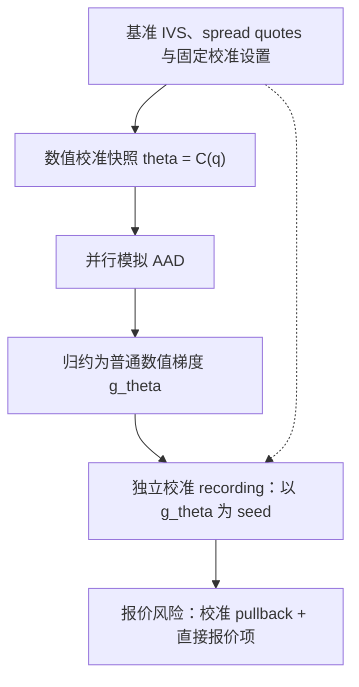
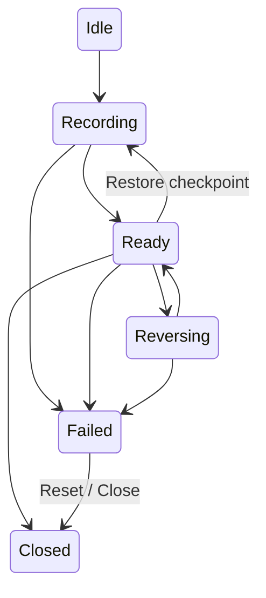

# DAL 自动微分改进方案

状态：待实施的技术方案。本文的提交只增加计划文档，不表示下述能力已经实现。

制定日期：2026-10-04。代码核对基线：`b5e3caca85bb1a5b1aa3acf7898b387832d443c8`（当时的 `master`）。

本文既供确定优先级，也供后续实现者编写局部设计。各节先解释缺口和收益，再给出建议实现、边界与验证方法。
所有新增类型、方法、错误名和示例调用均为**建议接口或伪代码**，除非明确标为已有符号；不能直接当作当前 DAL API 使用。

阅读路径：

- 关注先做什么：[实施原则](#1-目标与实施原则)、[P0 修复](#3-p0消除小-adjoint-的不安全截断)和[交付顺序](#7-分阶段交付与依赖)。
- 关注功能如何落地：[第 4 节](#4-重要功能补充)，包含校准与模拟的衔接、多个输出、结构化反向算子及二阶风险。
- 关注投入是否有效：[第 5 节](#5-性能提升计划)，包含成本模型、工作区复用边界、输出块内存估算和性能决策标准。
- 关注长期维护：[第 6 节](#6-代码设计优化)，包含状态机、对象所有权、后端契约及跨语言接口。
- 关注怎样证明做对：[第 8 节](#8-验收矩阵与执行要求)与[附录 A](#附录-a原生-aad-尺度问题的独立复现)，包含验收方法与缺陷复现。

## 1. 目标与实施原则

本方案将 DAL 的 AAD 改进分为数值正确性、重要功能、性能和代码设计四条工作线，
按可独立验证的增量 PR 交付。首要目标是可信、可解释的风险结果；随后补齐市场报价到估值的求导链，
提高多输出和组合风险吞吐，并降低新增数值方法接入 AAD 的成本。

优先级定义：

- **P0**：已复现的正确性缺陷，必须先修复。
- **P1**：近期核心能力和工程基础；按依赖关系分批交付。
- **P2**：需要局部原型和测量后再扩展的能力。

实施原则：

1. C++ 行为变更遵循 red-green-refactor，先建立独立参考或失败测试。
2. 保留已有 C++、Python、Excel 单输出入口；新增接口采用设置对象，避免继续增加位置参数。
3. 性能优化必须保持已声明的风险定义、路径编号、归约规则和后端语义。
4. 区分已验证事实、设计提议和性能假设；不把理论复杂度换算成未经测量的加速百分比。
5. 活动计划保留在 `.codex/artifacts/`。实施完成后，将已实现方法写入对应当前态指南，
   按需更新 `CHANGELOG.md`，再移除已完成计划；交付记录由 Git 和 PR 保存。

本轮不包含：直接实施全部改进、替换所有 AD 后端、构建完整 xVA 引擎、GPU/MPI 迁移、
任意计算图跨输入无条件重放，以及对任意非光滑 payoff 的精确高阶风险承诺。

### 1.1 用户最终能得到什么

**报价风险可以直接用于解释市场变动。** 例如，一个 local-vol 产品当前能对模型表面节点求导；
目标是进一步回答“某个期限、某个执行价的隐含波动率报价上移一个 vol point，价格的一阶变化是多少”。
结果应同时说明是否重新校准、哪些市场量固定、节点单位是什么，以及使用了怎样的平滑。
这比再增加几个基础数学函数更能改变用户的日常风险工作流。

**组合风险不必先计算所有逐笔风险。** 当用户只要同一模型和路径定义下的持仓总 Delta/Vega，
请求固定持仓权重后直接得到组合梯度。只有归因和逐笔对账才请求完整 Jacobian，
并允许限制内存。这两个请求在产品层面分开，避免以一个“多输出”开关混淆两种成本。

**新增数值算法有明确接入方式。** 实现一个求解器时，可以提供经过验证的反向公式，
不用把每个迭代步骤都录成标量节点；发生异常、跨线程误用或 tape 回退后引用失效时，
能在可定位的边界得到诊断，而不是在最终风险里看到难以解释的零或 NaN。

### 1.2 优先级背后的取舍

P0 修复属于所有后续工作的前提：若线性缩放已经能改变梯度是否为零，任何新功能的对账都缺少可信基线。
P1 优先把已有能力连成完整工作流，复用当前 tape、模型和曲线风险部件；不先替换底层实现。
P2 仅在明确工作负载上进入实施：例如单条路径的 tape 已接近预算，才值得付出路径内 checkpoint 的重算与状态管理成本。

资源有限时，建议首轮范围为 C01–C05、P01、D01/D04 的最小契约、F01 和 F02 的加权 VJP。
完整多输出矩阵、通用回调、自动稀疏识别和混合模式二阶 AD 可以后移。
这样第一轮结束时已有可使用的报价风险和组合风险，同时保留清晰的扩展位置。

## 2. 当前实现与证据

### 2.1 已有能力

- 原生 AAD 使用表达式模板和分块 tape；各线程通过 `Tape()` 获得自己的 recording 存储。
  参见 [expr.hpp](../../../dal-cpp/dal/math/aad/expr.hpp)、
  [tape.hpp](../../../dal-cpp/dal/math/aad/tape.hpp) 和
  [blocklist.hpp](../../../dal-cpp/dal/math/aad/blocklist.hpp)。
- 模拟已采用逐路径录制、`Mark` / `RewindToMark` 和分段反向传播；共享初始化在路径 adjoint 累加后反向传播。
  参见 [simulation.hpp](../../../dal-cpp/dal/script/simulation.hpp) 的 `InitModel4ParallelAAD`、`EvaluateAADBatch`。
- 原生后端已有 `SetNumResultsForAAD` 和向量 adjoint，主要公开估值接口仍输出一个 `PV` 及其参数梯度。
  参见 [aad.hpp](../../../dal-cpp/dal/math/aad/aad.hpp) 与
  [公开估值实现](../../../dal-public/src/value.cpp)。
- 曲线校准已有 AAD residual Jacobian、有效逆映射和报价风险。
  参见 [曲线风险方法](../../../docs/yield-curves/jacobian-risk.md) 与
  [联合报价风险](../../../docs/yield-curves/joint-quote-risk.md)。
- `RiskView_<T_>` 和 `DupireCalib<T_>` 提供可活动化的校准部件，但公开
  `CalibrateDupireLocalVolSurface` 调用 `DupireCalib<double>`，返回数值网格快照。
  参见 [ivs.hpp](../../../dal-cpp/dal/model/ivs.hpp)、
  [dupire.hpp](../../../dal-cpp/dal/model/dupire.hpp)、
  [dupire.cpp](../../../dal-cpp/dal/model/dupire.cpp)。
- LSM 已有独立训练/定价路径、可选验证、RQMC 和策略风险模式；`Frozen` 固定回归系数，
  `RetrainedBump` 加入重训策略的差分响应。二者都不是对回归求解器的完整解析 AD。
  参见 [LSM 方法](../../../docs/methodology/monte-carlo/lsm.md)。

### 2.2 本次核对的边界

已完成源代码和现有测试阅读，并对下述尺度问题运行了独立原生 AAD 复现。
此次没有运行完整 CTest、四后端测试矩阵或性能基准，因此所有加速方向仍是待测假设。
上游 XAD 的扩展能力仅作为设计参考；正式采用前必须确认仓库固定的子模块版本和 DAL 适配层是否支持。

### 2.3 一次现有 MC AAD 调用究竟做了什么

以不含提前行权的普通 MC 路径为例，从 [公开估值实现](../../../dal-public/src/value.cpp)
到 `MCAADSimulation` 的过程如下。LSM 使用其专门的训练与回放驱动。

1. 准备产品、模型元数据、时间线和观察定义，确定参数标签、脚本常量变量及 payoff 索引。
2. 把路径划分为 batch，将任务提交到线程池。任务通过 `ThreadPool_::ThreadNum()` 写入各 worker 的结果槽。
3. `EvaluateAADBatch` 创建该批的活动模型、随机数生成器、路径容器和 evaluator。
4. `InitModel4ParallelAAD` 注册模型参数和脚本常量，录制初始化，再设置 mark。
5. 每条路径先回退到 mark，再生成路径、执行 payoff、设置 seed，只反向传播路径后缀。
   mark 之前的初始化结果继续累积来自多条路径的 adjoint。
6. 一批路径结束后，调用 `PropagateMarkToStart`，把初始化结果的累计风险传给真正的独立参数。
7. 参数风险除以总路径数并归约；`aggregated_` 保持路径价值之和，在公开边界转成均值 `PV`。

这说明 DAL 已经有书中最重要的“公共前缀 + 单路径后缀”结构。
继续优化应着眼于批间重复初始化、多输出、校准连接和错误诊断；把所有路径录进一个巨大 tape 会破坏已有内存优势。
同时，`aggregated_` 与 `risks_` 的归一化时机不同，新结果适配时不能对两者机械地再除一次路径数。

### 2.4 与 Savine 书中方法的具体关系

第 10 章的分块内存和第 15 章的表达式模板已经体现在 DAL 原生实现中。
它们降低节点分配和简单算式录制的成本，但不能解决模型输入的经济含义、失效节点的生命周期或错误的传播阈值。
因此本方案不把“引入表达式模板”重复列为待建设能力。

第 12 章的并行模拟求导与现有每线程 tape、路径 skip-ahead、前缀累计逻辑相符。
DAL 的脚本、LSM、Hybrid 模型和多后端使边界更复杂：优化既要检查数值，也要保持路径编号、准备状态和异常排空。
书中单一演示模型的时间比不能直接作为 DAL 的性能目标。

第 13 章最值得补齐的是**校准映射的反向连接**：显式校准可以直接 AD，隐式校准通过残差或最优性条件求导。
DAL 的曲线部分已有相关能力；Dupire 也有模板化部件，但持久化数值快照与活动模拟图之间仍需显式连接。
第 4.1 节采用独立数值快照和 pullback 衔接，延续 checkpoint 的思想，同时适应 DAL 的多线程和 archive 边界。

第 14 章的向量 adjoint 提供多输出基础，但输出数增加后，每节点 adjoint 存储和传播算术都会增加。
第 4.2、5.3 节因此区分加权 VJP、完整 Jacobian 和有限块宽；不会把“几乎常数时间”解释为任意输出数量没有额外成本。
第 11 章和调试附录则对应本方案对控制流、高阶风险、数学域和对象有效性的明确限制。

## 3. P0：消除小 adjoint 的不安全截断

### 3.1 问题与复现

`TapNode_::PropagateOne` 和 `PropagateAll` 使用全局 `EPSILON = 2e-14` 判断是否传播。
小的中间 adjoint 不意味着小的最终梯度，因为后续局部导数可能很大。

对两个明确物化为 `Number_` 的操作：

```cpp
Number_ x = 3.0;
Number_ u = x * 1e16;
Number_ y = u / 1e16;
```

数学结果为 `y = x`、`dy/dx = 1`。在分析基线上的独立复现输出为：

```text
scale=1                 materialize=1 value=3 derivative=1
scale=10000000000       materialize=1 value=3 derivative=1
scale=10000000000000000 materialize=1 value=3 derivative=0
scale=10000000000000000 materialize=0 value=3 derivative=1
```

最后一行将表达式合并为 `(x * scale) / scale`，避免了中间节点上的阈值判断。
这说明问题同时破坏单位缩放一致性和表达式拆分一致性。复现程序见附录 A。

### 3.2 要求

- **C01**：默认反向传播不得按绝对阈值丢弃非零 adjoint；仅保留精确零的跳过优化。
- **C02**：标量和向量传播使用相同的数值规则；某一输出的梯度不得取决于其他输出是否同时被请求。
- **C03**：明确 NaN/Inf 策略。非有限 adjoint 不得因比较条件为假而静默变成零；
  数学域无效时应传播可诊断状态，或在规定边界抛出带上下文的异常。
- **C04**：保留现有的已消费中间 adjoint 清零和独立变量累加语义，避免破坏多次 sweep 与 MC checkpoint。
- **C05**：不在此修复中引入默认开启的近似稀疏截断；未来若提供近似模式，须独立命名并给出误差控制。

### 3.3 验收

在 [AAD 测试目录](../../../dal-cpp/tests/math/aad/) 补充：

- 上述物化/融合表达式导数都为 1，绝对容差 `1e-10`。
- 不发生浮点上溢/下溢的正负尺度、正负输出 seed，以及若干数量级的参数单位变换。
- 原生多输出单独请求与联合请求结果一致；精确零 seed 不污染其他结果。
- 非有限值案例按 C03 的明确策略处理，不返回无诊断的伪零梯度。
- 现有 tape、checkpoint、重复 Jacobian sweep 和并发测试通过；四后端适用的一阶测试一致。

先记录失败，再修复并运行相关套件。由此恢复的小梯度属于正确性变化，应在实际修复 PR 中说明。

### 3.4 根因、修复范围及不能混入的改动

原生节点存储的是本次执行的局部导数。反向经过 `y = u / scale` 后，`u` 的 adjoint 是 `1 / scale`；
只有继续经过 `u = x * scale` 才恢复为 1。当前阈值恰好在中间阶段丢掉这一贡献，
所以调小容差只能把错误推到另一种单位或数量级，不能修复机制。

建议把“是否传播”的规则限定为精确零检测，并保留对叶节点的现有区别：
内部节点传播后清零，独立输入留存累计值供提取。不要把本次修复扩大为重写 tape 分配器或所有后端，
否则性能与数值变化难以分别归因。

向量路径还需要逐通道定义规则。当前 `PropagateAll` 先判断整组是否含显著非零值，再传播全部通道；
因此一个通道是否传播可能受其他通道影响。修复后的语义应为：每个非零通道独立传播，精确零通道独立跳过。
若局部导数非有限，零 seed 通道也不应仅因为相邻通道活动而计算 `0 * Inf` 并变成 NaN。
是否采用分支、掩码或专门化循环由测量决定，但输出分组不能改变这一语义。

非有限处理建议分两层：传播内核不把非零 NaN/Inf seed 当作零；结果边界检查所请求的价值和风险是否有限，
失败时带上输出、参数及方法上下文。诊断构建可以进一步检查局部导数。
精确零跳过不等于证明模型输入合法，前向数学域检查仍由相应算法负责；已有其他后端的实际行为需要单独对齐。

### 3.5 最小修复包及完成证据

实现首先在 [test_number.cpp](../../../dal-cpp/tests/math/aad/test_number.cpp) 增加物化表达式的失败用例，
在 [test_tape.cpp](../../../dal-cpp/tests/math/aad/test_tape.cpp) 增加多通道独立性用例。
再检查 [test_checkpoint.cpp](../../../dal-cpp/tests/math/aad/test_checkpoint.cpp) 的累计语义，
确认多条路径仍累加到共同前缀，而不是最后一条覆盖前面的风险。

测试集至少取 `scale = 1, 1e10, 1e16` 及对应负尺度、seed 为 `1, -1, 0` 的组合；
非零 seed 的参考值就是 seed。更极端的尺度先验证前向和局部导数仍在有限可表示范围内，
避免把真实浮点溢出混成该缺陷。多输出同时覆盖“仅小 seed”“小 seed 与大 seed 同组”和分开求导。

修复证据包含修复前失败、修复后通过、checkpoint 回归以及正确性修复后的性能基线。
本项可能增加此前被错误省略的工作量；后续优化应与修复后的正确实现比较。

## 4. 重要功能补充

### 4.1 F01：从模型参数风险连接到市场报价风险（P1）

对于模型参数 $\theta=C(q)$ 和估值 $V(\theta,q)$，目标是计算：

$$
\nabla_q V = V_q^{\mathrm{direct}} + C_q^{\mathsf T}\nabla_\theta V.
$$

保留直接报价依赖，避免把所有风险都错误地归入校准链。

第一阶段限定为确定性利率下的 Dupire IVS spread 网格，连接 `RiskView_`、可活动校准和 local-vol 模拟梯度。
结果同时提供模型网格风险和 implied-volatility quote 风险；报价定义必须包含 strike/maturity 轴、单位、
插值及边界规则。初版应明确固定 spot、利率、股息和网格坐标的条件，防止误称为全部市场风险。
确定性利率校准出的表面接入随机利率模型，不自动获得联合校准正确性。

第二阶段统一校准的 pullback 接口：接受参数空间 adjoint，返回市场报价空间 adjoint。
复用曲线已有的报价轴、校准快照和风险 provenance；大规模场景按需求执行向量乘积，避免强制生成完整 Jacobian。

对可逆的精确残差系统 $R(\theta,q)=0$，可以采用：

$$
R_\theta^{\mathsf T}\lambda=\nabla_\theta V,
\qquad
\nabla_q V=V_q^{\mathrm{direct}}-R_q^{\mathsf T}\lambda.
$$

该公式的适用前提是显式契约。欠定、加权、正则化和近似拟合应从相应最优性条件推导；
不得把未计入残差二阶项的近似映射标成精确导数。秩亏、非收敛、活动约束改变时必须给出明确诊断。

**验收**：对平坦 IVS、Merton IVS 和受控 spread 扰动，逐个 bump 原始报价，重新校准并在共同随机路径上重新估值；
比较两到三个步长的稳定区间。基础光滑组件用解析/中心差分参考，完整 MC 案例分别报告采样、离散化和平滑误差。
测试至少包括零敏感度、边界节点、直接依赖、报价单位缩放和快照不匹配拒绝。容差必须在实现 PR 中按固定案例预先声明。

#### 4.1.1 先把“对什么求导”定义清楚

首个报价坐标建议定义为基准 IVS 上的加性 implied-volatility spread：

$$
\sigma_{\mathrm{imp}}(K,T;q)
=\sigma_{\mathrm{base}}(K,T)+\sum_a B_a(K,T)q_a,
$$

其中 $B_a$ 来自现有 `RiskView_` 的双线性插值，$q_a$ 的原始单位为绝对波动率，`0.01` 表示一个 vol point。
基础 IVS 的内部参数保持固定。因此结果描述的是“这组 spread quote 的 bucket risk”，
不自动等于 Merton 强度、跳幅参数或任意供应商波动率报价体系的风险。
若后续接入 delta-quoted surface，strike 随报价或 spot 移动的链式项必须另行纳入。

参数坐标 $\theta$ 是校准后的 local-vol 表面节点，按显式轴标识与模型参数对齐。
`LocalVolSurface_` 当前按 spot 行、time 列构建参数列表；`DupireCalib` 内部使用 time-major 临时矩阵，
返回时再转置。实现必须依据坐标映射，不能在两个容器之间按内存顺序盲目复制。
参考 [LocalVolSurface_](../../../dal-cpp/dal/model/surface/lvmodel.hpp) 和
[HybridLocalVolEquity_](../../../dal-cpp/dal/model/hybrid.hpp)。

#### 4.1.2 建议先采用两个 recording，通过数值梯度连接

初版不要求把校准 tape 放进每个模拟 worker。建议流程如下：



具体步骤：

1. 固定 quote axes、校准网格、插值/外推、有限差分 stencil、稳定区间选择和模型设置，生成不可变快照。
2. 用数值 local-vol 表面构造已有 Hybrid 模型；模拟仍对该表面节点和其他模型参数求导。
3. 汇总模拟风险后，从参数标签中取出该表面的梯度 $g_\theta$，校验坐标与快照完全匹配。
4. 在新的 recording 中把 spread quotes 注册为独立输入，调用 `DupireCalib<Number_>` 重建活动表面。
   先核对其 primal 值与数值快照在约定容差内一致，再播种 $g_\theta$。
5. 反向传播得到 $g_q$；合并独立计算的直接报价项，附上快照身份、报价单位和方法标签。
6. 提取普通数值结果后销毁 recording；结果和 archive 均不保存 `Number_`、adjoint 指针或线程局部 tape 句柄。

第 4 步的 seed 是数值常量，不能再次把模拟反向过程录进去，否则会把一阶链式连接错误地变成更高阶计算。
这个分解对可微映射是链式法则的等价实现，且只需要一次校准反向，不需要每条路径重新校准。
代价是额外重录一次校准；若后续测量表明这一步昂贵，再考虑同一快照内复用分解或专用 pullback。

#### 4.1.3 pullback 边界的建议契约

初版内部操作可以表达为以下伪接口：

```cpp
QuoteRisk_ PullbackCalibration(
    const CalibrationSnapshot_& snapshot,
    const ParameterAdjoints_& parameterAdjoints,
    const CalibrationRiskSettings_& settings);
```

`CalibrationSnapshot_` 至少保存报价轴和值、输出参数轴和值、模型/校准设置及算法版本标识。
`ParameterAdjoints_` 携带对应参数轴和数值，长度相同但轴不同也必须拒绝。
`QuoteRisk_` 返回原始报价导数、方法、状态以及所用快照身份。
对于大矩阵，可逐步增加多个 seed 右端或受控分块；初版不要求存下 $C_q$ 的每一个元素。

多个交易共享同一校准快照时，先累计各交易 $g_\theta$ 再做一次 pullback，
利用其对 seed 的线性性得到组合报价风险。需要逐笔归因时才对多个 seed 求导。
不同快照、坐标或校准设置不能先混合再 pullback，即使报价标签恰好相同。

#### 4.1.4 离散校准与数学公式之间的边界

`IVS_::LocalVol` 通过 call 价格的时间/执行价差分计算 Dupire 局部波动率。
这里的 AD 是对**实际差分离散程序**求导，仍受 stencil 步长、相减消失和曲率分母的影响，
不能标成无离散误差的连续 Dupire 灵敏度。
测试应分别改变 quote bump 和 stencil 设置，识别哪一种误差导致不稳定。

`DupireCalibMaturity` 当前用未传入 risk spread 的基准 ATM call 确定稳定 spot 区间，
区间外复制边界 local vol。初版建议沿用这一固定选择，报价 bump oracle 也使用同一基准 IVS 和 spread 约定。
边界复制意味着多个输出节点可能引用同一个活动值，播种必须使用累加语义。
若未来改为随报价重新选择稳定区间，则形成另一个被求导函数，区间切换点需要独立的方法定义和测试。

对不合法表面，至少区分：报价非有限、波动率域无效、Dupire 分母过小/非正、根号输入无效和网格不匹配。
不得为使风险计算继续而悄悄裁剪负 local variance 或改变曲率下限；如提供正则化，必须是显式设置，
并对正则化后的算法求导，报告是否在当前点生效。

#### 4.1.5 隐式校准的第二阶段如何接入

已有曲线风险映射先保持原契约，通过 adapter 接入共同结果结构。
新增 pullback 并不意味着要把已有显式 Jacobian/inverse 全部替换；小系统、反复按报价提取风险时，
缓存完整映射可能更合适。大系统只请求少数输出时，转置求解通常更值得评估。

若拟合定义为 $\min_\theta \phi(\theta,q)$，令 $G=\nabla_\theta\phi=0$，
则应解 $G_\theta^{\mathsf T}\lambda=g_\theta$ 并返回 $-G_q^{\mathsf T}\lambda$，再加直接项。
对于固定权重的最小二乘，$G_\theta$ 一般含 residual 的二阶贡献；只用 Gauss–Newton 矩阵是另一种近似。
权重依赖报价时也要包含该依赖。精确、近似、冻结校准三种模式必须在结果中可区分。

约束校准可在稳定活动集下对 KKT 系统推导，但不纳入首个 Dupire PR。
发生秩变化、条件数恶化或未达到残差/最优性容差时，初版建议拒绝发布“精确报价风险”，
返回失败诊断；若用户显式允许 bumped fallback，再提供清晰标记的数值结果。

#### 4.1.6 分层对账，避免一个大 MC 测试掩盖根因

第一层只测 `RiskView_` 插值：节点值、内部权重、边界和矩阵轴顺序都有独立手算参考。
第二层只测校准 $C(q)$：对选定的 $g_\theta$，比较 pullback 与标量函数 $g_\theta^{\mathsf T}C(q)$ 的中心差分。
这一层没有 MC 噪声，能直接定位校准链是否正确。

第三层测固定路径的估值 $\widehat V(\theta)$，比较 AAD 表面风险与相同随机数下的参数差分。
第四层才比较完整的 $\widehat V(C(q))$：bump 原始 spread、重校准、重新生成相同编号的路径并重新估值。
平滑设置和模型时间步保持相同。
平坦 IVS 的平行 bump Vega 可以再与 Black 的解析值比较，但有限网格和路径离散误差仍要单独报告。

新增行为测试主要落在现有
[Dupire AAD 测试](../../../dal-cpp/tests/math/aad/models/test_dupire.cpp)、
[Dupire 模型测试](../../../dal-cpp/tests/model/test_dupire.cpp) 和
[Hybrid 公开估值测试](../../../dal-public/tests/test_hybrid_value.cpp) 附近。
原有价格复现用例继续保留；价格正确并不能代替报价风险链正确。

### 4.2 F02：多输出 Jacobian 与加权输出梯度（P1）

提供两个独立请求语义：

- 固定权重输出 $w^{\mathsf T}f(\theta)$ 的梯度 $J^{\mathsf T}w$。
- 指定输出集合的 Jacobian，约定矩阵的行对应输出、列对应参数。

权重在此请求中是被动常数；若权重本身依赖市场，应作为显式估值计算参与求导。
保留单输出快捷入口；结果顺序由输入请求确定，不由线程调度或 map 遍历偶然决定。
采用有限宽度的输出块，设置内存预算，并为不支持向量 adjoint 的后端提供明确的标量 sweep 回退。
共享路径的前提是模型、估值日期、观察定义和采样设置兼容；不同产品需要统一 timeline/observation 准备后才能合并。

**验收**：单输出、逐输出循环、加权标量化和分块 Jacobian 相互一致；覆盖零权重、重复/未知输出名、
无效权重维度、常数输出、别名输出、checkpoint 前输出和不同块宽。多输出风险不能随分组改变。
固定路径上的有限差分 oracle 应验证 $J^{\mathsf T}w$，同时测试线程数和后端变化。

#### 4.2.1 用一个具体例子区分两种请求

设同一路径计算 call payoff $f_1$、put payoff $f_2$ 和对冲资产价值 $f_3$。
持仓为 $(2,-1,0.5)$ 时，组合梯度是 $2\nabla f_1-\nabla f_2+0.5\nabla f_3$。
加权 VJP 只需一个标量 root 或一次等价的加权播种，返回一个输出的参数梯度。
逐笔归因则返回三个输出对应的三行 Jacobian，内存和反向成本随行数增加。

首个实现范围建议限于同一个已准备脚本的多个可请求输出变量。
跨交易共享路径涉及合并时间线、历史状态、观察集合和 numeraire，作为后续聚合层实现；
不能只把几个现有 `PayOffIdx()` 拼在一起就宣称支持任意组合。

#### 4.2.2 播种、别名与 checkpoint

播种应先解析请求，把输出名转换为稳定的输出槽。重复输出名建议作为输入错误拒绝，
但不同输出名指向同一个活动节点是合法别名：同一 VJP 的 seed 要累加，不能后写覆盖前写。
多通道模式则在各自通道播种，相同节点也保留独立结果。

对于常数输出、直接引用模型参数的输出和 mark 前的初始化值，
使用与现有 `PayoffRoot` 一致的路径局部 root 语义，确保当前路径的贡献经过预期的传播区间。
逐路径完成后只消费后缀 adjoint，前缀累计值保留到该批路径结束。
提取 Jacobian 下一组之前，必须明确清除哪些输入/前缀结果，不能依赖“上次传播似乎已经清干净”。

零权重只表示该输出不贡献组合梯度；若请求仍要求它的价格，该价格的合法性检查仍然执行。
使用者如只要组合值和组合梯度，应通过结果选择明确表达，不能由内核隐式省略校验。

#### 4.2.3 分块算法必须适应现有存储

原生 tape 在节点创建时分配固定宽度的 `pAdjoints_`，参数指针也指向该布局。
因此不能录完图后直接把 `numAdj_` 从 4 改成 8，再把旧图当成八通道图使用。
块宽是 recording 的一部分，改变模式/宽度前必须结束旧 recording 并按支持的方式重建。

对固定的、完整保留在内存中的确定性图，可以保持块宽不变、反复播种不同输出并清理累计值，
最后一块不足宽度时使用零 seed 填充。
对当前逐路径回退的 MC 图，完整历史图已经被丢弃。最容易验证的第一版是每个输出块重跑同一组路径，
每块使用新 recording 和相同随机路径编号。这会重复前向计算，应真实计入成本。

更进一步的“每路径一次前向、多个输出块反向”需要额外管理每块的前缀 adjoint，
以及每次重播种前后哪些槽清零、哪些值要累计或转存；只有原型证明收益后才采用。
不能用确定性图的一次录制成本描述这条 MC 生产路径。
第三方后端初版可按标量 sweep 回退；是否能保留图、是否需要重录，由后端契约决定。

#### 4.2.4 API 示例与完成边界

下面是语义示意，不是当前可运行接口：

```text
请求 A：outputs = [CallPV, PutPV, HedgePV]
        weights = [2, -1, 0.5]
        derivative = WeightedGradient
返回 A：组合均值、一个长度为 n 的梯度、权重及三个输出的身份

请求 B：outputs = [CallPV, PutPV, HedgePV]
        derivative = Jacobian
        output_block_width = 4
返回 B：三个均值、3 × n 的矩阵、行轴和列轴
```

对请求 B 的矩阵按权重加总，应与请求 A 相同；常数列/输出用零填充，不能直接删掉而改变形状。
块宽、输出顺序和后端允许改变耗时，不允许改变导数定义。
首个交付包含 C++ 内核与公开结果语义；Python/Excel 绑定以相同金样本验证轴、权重与单位。

### 4.3 F03：自定义反向算子（P1 原型，P2 扩展）

以线性求解为首个受控原型，再扩展到隐式校准、三对角/PDE 回滚，最后评估回归拟合。
前向只保存反向所需的输入状态、分解和句柄；反向通过专用公式将输出 adjoint 累加到输入。

对于 $Ax=b$，反向公式是：

$$
A^{\mathsf T}\lambda=\bar x,
\qquad \bar b\mathrel{+}=\lambda,
\qquad \bar A\mathrel{+}=-\lambda x^{\mathsf T}.
$$

若输入只存对称、带状或其他结构化独立元素，必须映射到真实参数坐标，不能直接套用全矩阵存储公式。
优先复用前向分解；不显式计算矩阵逆。

契约包括：回调所有权、输入别名、多个输出 seed、重复传播、异常后的 recording 失效/重置、
checkpoint 回退时缓存释放以及后端能力限制。扩展机制应避免给每个普通标量节点增加昂贵的动态分派。

**验收**：小矩阵与标量 AD 和独立差分比较；增加方向伴随恒等式、重复反向、别名和异常恢复测试。
病态或奇异系统验证失败策略。回归的样本筛选、阶数选择和秩切换属于离散决策，初版不宣称能对这些决策解析求导。

#### 4.3.1 为什么首选线性求解

把线性代数内部的每个乘加都活动化，容易把本来紧凑的分解过程变成大量标量节点。
而隐式方程 $Ax=b$ 的微分为 $A\,dx=db-(dA)x$，与上文伴随方程结合即可得到反向公式。
该公式作用于数学求解结果，不要求对选主元或每一步迭代机械求导。
这是一个规模可控、参考结果充分、又能被曲线校准/PDE/回归复用的起点。

对稠密直接求解，前向分解通常是三次复杂度，复用分解的转置求解和外积通常是二次复杂度。
实际优势取决于矩阵规模、右端数、分解实现和缓存；小矩阵可能因回调开销反而变慢。
因此原型先比较小、中、大三个规模，同时记录 tape 节点和缓存内存，不仅比较算子本身的时间。

#### 4.3.2 从数学 pullback 到 tape 扩展，分两步交付

第一步实现可单测的普通数值 pullback：输入前向缓存和输出 seed，返回输入 adjoint 增量。
此时它可以像 F01 一样在显式阶段边界调用，并不需要立即为原生 tape 增加通用回调体系。
例如只对 $b$ 活动、$A$ 固定的求解，返回 $\bar b$ 就足够，不必分配完整 $\bar A$。

第二步才把该算子作为活动表达式的一部分接入 recording，明确操作顺序：

1. 前向取出数值输入，执行求解，记录输入槽、输出槽、解和可复用分解。
2. 在 tape 上建立一个反向事件，位置位于输入生产者之后、输出消费者之前。
3. 反向到达事件时，收集所有输出的 seed，执行转置求解，把贡献累加到输入槽。
4. 消费输出 seed，但保持前向缓存可供同一图的后续 sweep 使用。
5. recording 后缀回退或关闭时释放不再可达的缓存，且恰好释放一次。

原生实现可以研究“标量 tape 段 + 少量反向事件”的布局，在事件之间继续调用现有专门化传播循环。
这是避免普通节点逐个虚调用的一种候选设计，不是已经验证的实现。
若事件排序、checkpoint 或异常恢复使复杂度明显增加，应先保留显式阶段 pullback，
而不是为了接口统一修改所有标量节点。

#### 4.3.3 缓存、结构化输入和异常契约

前向缓存归 recording 所有，不捕获局部变量引用、不持有已可能回退的裸活动对象。
保存输入/输出的受检句柄，分解缓存使用不可变或明确独占的数值状态。
重复 reverse 不能把缓存当作一次性资源提前销毁；失败后将当前 recording 标为失效并重置，
不允许继续读取“已传播一半”的梯度。

对称矩阵如果只把上三角视为独立参数，非对角参数影响 $A_{ij}$ 和 $A_{ji}$ 两处，
其 adjoint 必须合并两项。带状矩阵只回传真正存储的带内参数；固定结构零不应产生虚构的风险坐标。
多个矩阵项或右端共用同一个活动输入时同样累加。
建议首版选择非奇异稠密系统并明确存储约定，验证后再扩展结构化存储。

“对精确解映射求导”和“对迭代若干步的程序求导”是不同目标。
若前向求解未达到声明的残差容差，不能直接套用精确解公式后宣称精确 AD。
前向与转置求解均报告残差；病态情况下即使残差小，梯度也可能很大，需报告条件性诊断而非任意截断。

XAD 的上游回调接口要求实现者保存反向所需状态，并明确回调异常后需要重置 tape；
这些要求可作为 adapter 契约的参考，实际支持仍以 DAL 固定版本为准。
参见 [CheckpointCallback 官方说明](https://auto-differentiation.github.io/ref/chkpt_cb/)。

#### 4.3.4 如何证明反向公式接入正确

除逐元素有限差分，还应验证任意小方向 $dA,db$ 和输出 seed $\bar x$ 满足：

$$
\bar x^{\mathsf T}dx
=\langle\bar A,dA\rangle+\bar b^{\mathsf T}db,
\qquad A\,dx=db-(dA)x.
$$

这里 $dx$ 由独立线性化求解得到，矩阵内积为对应元素乘积之和。
这一恒等式同时检查转置、符号和索引，能发现“标量值对了但梯度坐标错了”的问题。
还需把算子放进前后都含普通标量操作的表达式，覆盖多输出、重复 reverse 和 checkpoint 回退后再次录制。
独立 pullback 通过，并不代表其 tape 事件顺序已经正确。

### 4.4 F04：有边界的二阶风险（P2）

优先提供指定参数 Gamma、交叉 Gamma 和 Hessian-vector product $Hv$，不强制物化完整 Hessian。
第一阶段使用统一的 bump-over-AAD：显式指定 bump 单位/步长、共同随机路径、校准是否重做和 LSM 是否重训。
第二阶段选择光滑内核评估混合模式 AD；原生 `double` adjoint 结构不能仅靠打开设置变成嵌套 AD。

**验收**：Black 等解析内核、光滑多变量函数、交叉项对称性和 $Hv$ 的方向差分一致性。
对 MC payoff 必须单独论证估计器；例如直接二次求导分段线性路径 payoff 可能漏掉 Gamma 的边界贡献。
报告步长稳定性、平滑参数依赖和训练策略，而不是仅检查 AD 算术是否自洽。

#### 4.4.1 先明确三种二阶请求

对标量估值 $V$，用户可能需要单一 Gamma $H_{ii}$、少量交叉项 $H_{ij}$，
或场景方向 $v$ 下的 $Hv$。最后一种返回与输入轴相同长度的向量；
若只要二阶场景价值项，再计算 $\tfrac12 v^{\mathsf T}Hv$。
这几个结果不能都塞进含义不明的 `gamma` 字段，也不应默认计算一个 $n\times n$ 矩阵。

第一版令 $g(x)=\nabla V(x)$，通过：

$$
Hv\approx\frac{g(x+h v)-g(x-h v)}{2h}
$$

实现方向风险。用户同时给出方向坐标和 $h$ 的定义；不同单位的参数不能用同一个裸数字混合扰动。
例如按“1 bp 利率、1 vol point 波动率”定义的方向，应先转换为原始数值坐标，
结果再依据请求转换。混合二阶项的缩放包含两个坐标的尺度乘积，不能只缩放一次。

#### 4.4.2 报价 Gamma 不能只变换模型 Hessian

当 $\theta=C(q)$ 且 $V$ 仅通过 $\theta$ 依赖报价时：

$$
H_q=C_q^{\mathsf T}H_\theta C_q
+\sum_a \frac{\partial V}{\partial\theta_a}H_q(C_a).
$$

第二项来自校准映射的曲率。只把模型 Hessian 左右乘一阶校准 Jacobian 会漏掉它；
如果还有直接报价依赖，则另有直接与交叉贡献。
因此第一版报价二阶风险应 bump 原始报价、重新校准，并在两侧重新计算完整报价一阶风险。
这比先做一个不完整的“解析报价 Gamma”更容易形成可信验收。

#### 4.4.3 MC 与 LSM 下的估计器约定

在固定波动率的几何布朗运动中，路径终值随初始 spot 线性变化，有限条路径的普通 call payoff 因而对 spot 分段线性。
在不跨越 kink 的很小区间内，其样本梯度的差分可能为零；跨越时又可能剧烈跳动。
因此“减小 bump 直到两次结果一致”并不是普遍可靠的 Gamma 算法。
先用光滑解析函数验证二阶框架，再为具体 payoff 选择平滑、条件期望或其他有依据的估计器。

若使用平滑 payoff，必须同时研究路径数、bump 和平滑宽度的稳定性，
区分对平滑模型的正确导数与对原始合约的偏差。若使用 RQMC，以独立 scramble 的 replicate 结果评价抽样不确定性。
对固定样本的差分对账和对真实期望的统计验证分开进行。

LSM 的 `Frozen` 模式在两侧保持同一训练策略；若选择重训风险，两侧使用同样规则重新训练，
训练与定价样本仍独立，并使相应路径编号可配对。对已经包含有限差分的 `RetrainedBump` 再做差分，
属于嵌套数值估计，必须记录内外层步长及较高成本，不默认标为完整解析 Hessian。

#### 4.4.4 混合模式的试验门槛

原生 tape 的 primal、局部导数和 adjoint 都以 `double` 为基础；嵌套 AD 涉及数值类型、表达式运算和 tape 存储，
不是一个开关。建议先在可模板化的 Black 函数和小型校准内核验证 forward-over-reverse 的方向结果，
检查特殊函数重载、值提取和自定义算子是否意外截断更高阶信息。

XAD 上游提供 forward-over-adjoint / forward-over-forward 的 Hessian 支持，
但 DAL 当前一阶类型适配不因此自动具备该能力。参考
[Hessian 官方说明](https://auto-differentiation.github.io/ref/hessian/)，
局部原型通过后再决定选择性使用某后端或泛化原生内核。保留 bump-over-AAD 作为独立对账方法。

## 5. 性能提升计划

### 5.1 P01：先建立生产路径的可解释基准（P1）

扩展已有 target，避免平行建立重复基准：

- `tape_perf`：录制、分配、回退、传播和清零分项；增加活动常数/被动常数场景并核实实际节点计数。
- `jacobian_perf`：保留现有合成比较，增加实际 `HarvestCurveJacobian` 调用。
  当前合成代码每行 `ZeroAdjoints`，而生产原生分支利用中间节点消费时清零，二者不能互相代替。
- `script_mc_perf`：区分准备、每批初始化、路径生成、payoff 和反向传播；覆盖树解释/编译、普通/LSM 模拟。
- `curve_calibration_perf`、`quote_risk_perf` 和 `rate_risk_perf`：覆盖前向校准、风险映射及组合聚合。

低成本计数或专用诊断构建记录：节点数、边数、分配次数、块容量/使用量、tape 高水位、RSS、
活动参数数、输出块宽、路径数和线程数。计数开销应单独测量，不污染正式吞吐结论。

#### 5.1.1 先回答时间花在哪里

把一次风险请求的墙钟时间按关键路径或不重叠计时窗口归因到以下概念项；
并行 worker 的累计 CPU 时间另外报告，不能直接把各 worker 耗时相加当作总延迟：

$$
T=T_{\mathrm{prepare}}+T_{\mathrm{calibrate}}
+T_{\mathrm{worker\ init}}+T_{\mathrm{paths}}
+T_{\mathrm{reverse}}+T_{\mathrm{reduce}}+T_{\mathrm{quote\ map}}.
$$

除总耗时，还报告 AAD 相对相同路径 `double` 定价的增量、首次请求与稳定重复请求的差别。
如果基准先做了模型准备、cache 预热或结果分配，应明示这些成本是否排除。
路径生成和 payoff 已与录制交织时，可以通过单独的诊断运行分解，而不能假装计时器天然能精确分开所有成本。

一个假设例子：若批初始化只占总耗时的 5%，即使完全消除它，总加速上限也只有约 `1 / 0.95`。
这个计算用于筛选优化方向，不是当前 DAL 的测量结果。
只有看到初始化或分配占比显著，才推进更复杂的工作区复用；反向内存访问占主导时，则优先研究块宽和结构化算子。

#### 5.1.2 建议的生产案例与尺寸

基准扩展先选择少量能区分瓶颈的案例，不做所有维度的笛卡尔积：

- **短图、多次请求**：少量参数的简单模型，小路径批量，反复估值；观察准备、线程任务和分配开销。
- **长路径**：固定产品增加时间步，记录单 worker tape 高水位随步数增长，判断是否需要路径内 checkpoint。
- **大参数表面**：local-vol 网格逐步扩大，区分参数注册、前缀反向与路径插值的成本。
- **多输出**：输出数取 `1, 4, 16, 64`，比较逐输出、加权 VJP、分块 Jacobian；保持输出计算内容一致。
- **曲线风险**：真实 `HarvestCurveJacobian` 和报价映射，保留已有小/中/大曲线与组合规模。
- **并行缩放**：线程数取 `1, 2, 4` 及机器适用值，同时报告路径吞吐、总内存和归约成本。

初版 path 数和步数应让单案例足够长以超出计时噪声，又能完成多次进程级采样。
报告必须给出实际数字和输入构造；不能只写“large model”。
对新功能测量时，比较能得到**同一结果**的实现，例如组合 VJP 对比逐笔梯度再求和，
而不是把只算一个结果的时间与返回完整矩阵的时间混为纯内核加速。

#### 5.1.3 需要保留的诊断数据

每次基准记录源码 SHA、编译器/选项、后端、依赖版本、硬件、线程数、RNG、路径数、时间步、输出/参数数和方法模式。
内存至少区分 live tape bytes、已分配 block capacity、结果数组和外部算子缓存；RSS 作为进程层补充，
不能用它倒推出 tape 实际使用量。
诊断计数器先在独立构建或显式开关下运行，再用未插桩构建得出吞吐结论。

### 5.2 P02：复用 AAD worker 工作区（P1）

`EvaluateAADBatch` 每批创建模型、RNG、路径和 evaluator。先复用容器容量与被动预计算，
再在测量支持下复用模型对象或初始化结构。每次 recording 必须重新绑定/注册活动参数，并重建失效表达式。

保留原有任务异常排空和线程所有权规则，不在线程间搬运存活的 AAD 值。
工作区按一次估值拥有或受控复用，避免一次极大交易永久抬高所有 worker 的内存占用。
新增释放/预算策略必须和 tape 中仍存活的值保持一致。

路径编号和浮点归约分组分别定义：现有普通 MC 的 batch 大小可能依赖线程数，不能宣称全库已跨线程 bitwise 一致。
LSM 已有的固定分块/确定性归约契约必须保留；普通 MC 的新一致性承诺需单独实现与测试。

**验收**：相同设置下原有 PV/Greeks 和异常行为一致；测量初始化占比、分配数、峰值内存与完整估值时间。
普通/极小 batch、超大参数集、连续多次不同模型估值及任务失败后复用都需要覆盖。

#### 5.2.1 复用对象分为三类

**可以先复用容量的对象**包括高斯向量、路径容器、evaluator 的数值/栈空间和临时梯度数组。
它们仍要在每批开始按现有语义初始化，只省去反复申请内存。
被动的时间线、观察索引、准备后的脚本代码可以只读共享，但要确认对象自身不含隐藏的活动引用。

**可在重建活动状态后复用的对象**包括模型实例和 evaluator。
它们可能包含参数指针、依赖参数计算的系数和 `Number_` 成员；`Rewind` 后必须重新注册参数、
重算活动派生量，并重建任何已失效的表达式。只保留旧模型对象、跳过 `Init` 是不成立的优化。

**不能跨任务携带的状态**包括上一 recording 的活动节点句柄、未完成的反向缓存和路径后缀的引用。
随机数生成器可复用对象，但每批必须定位到 `firstPath_`，不得依赖哪个任务先完成。
改变模型维度、Brownian bridge 设置或 scramble 时要重建相应配置。

#### 5.2.2 工作区的建议所有权

引入一次估值拥有的 worker 工作区集合，每个槽在实际 worker 上首次使用时惰性构造活动对象。
任务开始后根据 worker 身份取本地工作区；整个调用期间同一槽不能被两个执行流同时使用。
如线程池存在嵌套任务或可重入执行，应检测占用并拒绝不支持的复入，或使用新的独立工作区。
不能只因为槽号相同就假设不存在嵌套生命周期。

一次任务的步骤建议为：校验配置签名 → 定位 RNG → 重置 recording → 重新绑定活动输入 → 初始化模型 →
执行路径 → 提取普通数值结果 → 释放本批活动状态。
`SimulationTaskGroup_` 继续在离开捕获作用域前排空任务；工作区销毁必须晚于任务完成。
需要线程关联清理的后端，其清理也在所属 worker 完成，不能依赖主线程析构恰好安全。

配置签名至少包含模型类型/参数结构、时间线与观察集合、compiled/tree、平滑设置、RNG/bridge、后端与块宽。
数值参数变化可以保留容量，但始终触发活动派生量重算；结构变化则重新配置相关容器。
第一版不做跨用户请求的永久线程缓存，减少失效和内存回收策略的复杂度。

#### 5.2.3 内存预算与退出条件

设置每次估值的工作区预算，估计并测量所有并发 worker 的总容量。
大请求结束后是否释放块、何时收缩容量，应在所有活动对象失效并结束 recording 后执行。
不能为了满足 RSS 目标在仍有活跃节点时释放其 block。

成功标准是相同正确性和路径规则下，目标工作负载的分配次数或总耗时可重复改善，且峰值内存不超出声明预算。
若只减少分配计数、完整估值没有改善，报告为结构改善或测量无显著变化，不能直接写成吞吐提升。

### 5.3 P03：多输出分块与需求驱动求导（P1）

比较宽度 1、4、8、16 的输出块，在缓存容量、结果存储和初始化成本之间寻找合适配置。
仅需组合风险时直接计算 $J^{\mathsf T}w$；完整 Jacobian 才分块提取。
请求参数子集时，单纯少复制几列不会自动减少 tape 工作，必须区分输出提取节省和活动依赖裁剪。

**验收**：全部块宽满足 F02 正确性；报告每输出成本、总吞吐和内存，保留单输出性能。
不同规模可选不同默认策略，但不能仅根据一个微基准自动切换。

#### 5.3.1 块宽的成本与预算模型

令单 worker 活跃节点数为 $N$、边数为 $E$、输出块宽为 $k$。
向量 adjoint 本身至少需要约 $8Nk$ 字节，另有节点、边导数、指针和 block 未使用容量。
其中边的导数和指针约占 `E × (sizeof(double) + sizeof(double*))` 字节。
当前布局还保留节点内的标量 adjoint，这部分也不能从预算中漏掉。
完整结果矩阵至少需要约 $8mn$ 字节，其中 $m$ 是输出数、$n$ 是所请求参数数。

例如 $N=10^6$ 时，仅八通道 adjoint 就约为 64 MB（十进制）；16 个 worker 约为 1.024 GB。
这只是容量算例，不是 DAL 的已测峰值；实际还要加入上述其他部分和校准缓存。
这个量级说明默认最大块宽不一定最快，也不一定能在目标机器运行。

若当前实现按每个输出块重跑 MC，设块数 $b=\lceil m/k\rceil$，其主要时间近似为
$b(T_{\mathrm{forward}}+T_{\mathrm{reverse}}(k))$，另加准备、归约和结果写入。
若以后做到每路径只前向一次，则重新测量相应成本模型，不沿用这条近似。
预算不足时先缩小块宽；若已知宽度 1 和结果输出也无法满足预算，执行前拒绝请求。

路径控制流可能使实际节点数事先未知，因此准备阶段只能拒绝可确定超限的请求，并给出其余部分的保守估算。
执行时在分配边界检查实际预算，超限则排空任务并清理当前 recording，不返回部分风险。
预算先覆盖 tape、结果和本请求拥有的算子缓存等可计量容量；RNG、第三方库和进程 RSS 的范围另行说明，
不能把内部容量限制宣称为严格的进程 RSS 上限。尺寸乘法还需防止整数溢出。

#### 5.3.2 参数子集与缓存友好性

只要求 10 个参数不意味着可以从原图中跳过其他参数相关节点：同一中间量可能同时影响所选参数。
初版只保证减少提取和结果存储，并明确这不改变传播量。
要降低录制量，需要在建图前把确实不需求导的输入被动化，或者证明其依赖可安全裁剪。
若影响模型准备/缓存，必须建立不同活动集合的签名。

逐通道连续存储有利于反向内循环，但 SIMD 是否有效还受指针追踪、seed 稀疏度和分支规则影响。
先保持 C02/C03 的零通道隔离，再检查编译器向量化与硬件计数。
没有实测证据时，不为追求对齐额外填充所有节点或引入多套不可维护的内核。

### 5.4 P04：真实稀疏性与模式选择（P2）

从实际观察/曲线依赖或可证明的结构元数据获取稀疏模式，评估局部传播、压缩 seed 和图着色。
禁止仅按名义 maturity 猜测 Jacobian 前缀：支付滞后、日历调整、投影与贴现的跨曲线依赖可能越界。
动态控制流或结构改变后，缓存的模式必须失效或采用保守超集。

输入少、输出多时评估前向模式；输入多、输出少时优先反向模式。模式选择以实际图成本和后端能力为依据。
稀疏重建必须与完整稠密参考比较，包括故意构造的非前缀依赖。

建议先利用已有 `rowWidths` 元数据建立“已证明依赖范围”的对照，而不把所有短行都解释为录制/传播已稀疏。
当前 `HarvestCurveJacobian` 中 row width 主要限制结果提取的列数，仍会执行相应反向 sweep。
若要压缩计算量，需要新的 seed 方案或图/算子级支持。

例如多个输出的参数支持集互不相交时，可以用同一个 seed sweep 得到一组组合梯度，再按已知支持集分离。
若两个输出共享某个输入，简单相加就无法区分贡献。图着色必须建立在保守而正确的支持集上，
漏掉一个非零依赖会产生无告警的错误重建，比多算几个零严重。

先保存稠密参考，统计真实零比例、压缩方向数和模式构建成本；只有重复请求足以摊销该成本时缓存模式。
缓存键包括曲线/产品结构、观察定义、活动参数集合和必要的控制流结构信息。
模式无法证明有效时回退到稠密求导，不在发布模式假设“上次的零这次仍是零”。

### 5.5 P05：结构化算子和路径内部 checkpoint（P2）

通过 F03 降低求解器/PDE 的标量录制量；只有单条路径也足够大时才引入路径内部 checkpoint。
明确保存状态、随机数位置和分支恢复方式，比较重算成本与内存节省。
当前原生 tape 存储的是本次执行的局部导数；跨新参数或新路径重用内存不等于可直接重放旧导数。

对含 $L$ 个时间步的长路径，设每步录制成本约为 $a$ 字节，每个完整路径状态为 $s$ 字节。
简单的定长分段方案，每 $h$ 步保存状态，反向时重算一个段，其峰值可粗略估为
$a h+s\lceil L/h\rceil$，再加模型前缀和结果；前向重算会增加计算量。
这个模型用于筛选段长，实际状态大小、随机数和 evaluator 历史可能使 $s$ 很大。

checkpoint 必须保存能重建该段的所有状态：模型因子、累计现金流/观察、脚本变量、路径统计以及随机数位置。
Brownian bridge 等变换可能对整条路径高斯向量有依赖，不能只存“下一个随机数编号”就宣称可恢复任意段。
LSM 的未来现金流和策略回放也需要专门设计，首个路径分段原型建议选择没有提前行权的长路径模型。

重算时重新执行前向局部导数，核对恢复位置和分支；不重用旧参数下的数值导数。
验收除了 PV/风险一致，还应测总重算步数、峰值内存、异常中断后资源释放和多次分段恢复。
若当前单路径内存很小，保留已有逐路径 checkpoint 即可。

### 5.6 测量与合入门槛

执行 [DAL 性能流程](../../references/benchmark-workflow.md)：正确性先通过，baseline/head 使用独立源码与构建目录，
配置和硬件一致，交错成对采样，并按仓库当前 best-of-N 规则判断。
当前门禁为两轮各十次采样、每轮均超过 4% 才判回退；执行时以脚本和参考文件为准。
噪声未稳定时报告 inconclusive，不宣称加速。

九个受控 target 的门禁保持原有范围。`script_mc_perf` 等当前未纳入配对门禁的 target 作为性能证据；
若要新增正式门禁，另行修改并验证测量政策。单输出、重复小估值和非目标模型也必须检查，避免局部加速掩盖整体代价。
每项优化的目标是预先选定生产工作负载上可复现的时间或内存改善；具体目标随局部设计锁定，本计划不承诺统一加速比例。

## 6. 代码设计优化

### 6.1 D01：显式 recording 作用域与 checkpoint（P1）

把通用生命周期职责移入 AAD 层。现有
[TapeGuard_](../../../dal-cpp/dal/curve/tapeguard.hpp) 进入/退出都 rewind 到起点，适合独立求导，不能直接充当嵌套保护。

区分独立 recording、recording 内的 checkpoint、反向 seed 与区间，以及结果提取后的释放。
第一阶段检测并拒绝未支持的嵌套；需要嵌套时再引入位置恢复或独立 recording，而不是静默清除外层图。
保留线程局部默认入口，同时让底层对象能表达所属上下文。

异常清理后必须可确认 recording 已恢复或已失效；不得因吞掉清理异常而让后续调用继续使用未知状态。
测试正常退出、异常退出、嵌套拒绝、checkpoint 前缀保留及下一次估值恢复。

#### 6.1.1 recording 的状态机

建议由 AAD 层的作用域对象表达以下状态，名称为设计占位符：



`Recording` 允许登记独立输入和建立图；`Ready` 允许按能力播种/反向；
`Reversing` 不允许无契约地再创建同一 recording 的活动节点。
重复 sweep 仅在图和前向缓存仍有效时允许。`Failed` 只能清理或重置，不能提取部分梯度后继续当作成功结果。
MC 的逐路径录制/反向是该作用域内受控的子窗口，不意味着为每条路径创建新的全局独立作用域。

建议接口职责为 `RecordingScope_` 管全局生命周期，`Checkpoint_` 管区间位置，
独立的 sweep 操作管 seed、累计和提取。旧 `Tape()` 入口继续委托默认线程上下文，
先迁移曲线 Jacobian，再迁移普通 MC，最后处理 LSM 特有回放。

#### 6.1.2 把“重置”拆成有明确含义的动作

至少区分以下操作：释放全部 recording 存储、回退到起点并保留容量、回退到 checkpoint、
清除待计算 sweep 的 adjoint、完成并消费一个反向区间。
这些动作不能因为都叫 reset 而互换。

MC 路径循环需要保留 checkpoint 前的累计 adjoint；独立 Jacobian 行之间则需要清除上一次行的输入结果。
推荐由更高层的执行辅助函数表达这两种意图，底层 adapter 负责各后端正确的清理步骤。
对原生多输出，现有 `ZeroAdjoints` 的标量字段循环也不能当作已覆盖所有向量槽，
新契约应逐通道验证全清零和区间保留行为。

checkpoint 句柄保存 owner、recording 身份、位置和模式，不只是一个可随意传递的迭代器。
恢复旧 recording 的 checkpoint、对已关闭作用域调用 reverse、改变仍存活图的块宽都应在明确边界拒绝。
第一版只承诺一个活动路径 mark；若需要多个嵌套 checkpoint，要先证明每个后端位置和回退语义可表达。

#### 6.1.3 析构安全与显式完成

析构函数不能在异常展开时抛出第二个异常，但这不意味着清理失败可以无痕忽略。
正常流程提供显式 `Finish`/`Close` 操作，允许报告失败；析构只做不抛异常的兜底清理，
必要时标记上下文失效，使下一次入口先重建。
首次业务异常保持为主异常，清理失败作为附加诊断，避免丢失真正原因。

迁移现有 `TapeGuard_` 时，先保留其“独立求导前后回退”的行为并加测试。
发现已有外层 recording 时拒绝不支持的嵌套；不能进入函数就清掉外层图。
如果业务确实需要在活动估值里调用独立校准，优先采用 F01 的数值阶段连接，
或经验证的独立上下文，而不是把 guard 改成名义上的嵌套 RAII。

### 6.2 D02：可选的 tape 所有权和节点有效性诊断（P1）

诊断构建记录 owner/recording 标识和槽位代次或有效区间，尽早检测跨线程、跨 tape、rewind 后使用以及非法模式切换。
只检查指针是否位于内存块内不充分：同一地址可能已被另一节点复用。
`RewindToMark` 只能使被丢弃后缀失效，不能误伤仍有效的前缀。对象代次的设计必须覆盖这个区别。

诊断模式默认不增加发布构建的逐节点存储成本；发布模式仍检查公开入口的尺寸、能力和状态前置条件。
输出上下文应包括 recording、操作及参数标识，帮助定位录制阶段错误。

#### 6.2.1 两类常见失效需要不同证据

第一类是空间所有权错误：线程 A 的 `Number_` 被线程 B 使用，或者属于其他 recording 的值被当成本图输入。
第二类是时间有效性错误：同一 tape 回退后，旧对象仍指向一块合法地址，但该地址已经不代表原来的节点。
只检查线程 ID 或只检查地址范围，都不足以覆盖第二类错误。

诊断构建建议为节点句柄增加 owner token、recording token、槽位置和槽代次；
另由 side metadata 保存有效 recording 范围。校验同时检查所属上下文、槽仍位于有效前缀/后缀内，
以及槽代次与对象持有值一致。槽被重新分配时递增代次，即使地址相同也能拒绝旧引用。
整图重置更新 recording 身份；仅回退后缀时保留前缀身份，避免错误拒绝模型参数。

#### 6.2.2 诊断点与成本限制

优先在注册输入、从表达式物化 `Number_`、读取/设置 adjoint、创建/恢复 checkpoint 和跨作用域返回活动值时检查。
不要求发布版每条标量乘加都携带字符串或做哈希查找。
错误信息用 token 定位录制上下文，参数名和业务输出名在外层补充。

表达式模板还可能引用临时对象；调试时应覆盖把表达式存入 `auto` 后延迟求值、对象容器重分配和模型复制的情形。
对象复制应重新建立内部参数指针这一类已有约定，需要在新增工作区复用时重新核对。
诊断不能保证检测任意 C++ 悬垂引用，适用边界应写清；配合适用的 ASan/UBSan 和并发检查使用。

验收以用户可观察错误为准：跨线程使用在受检入口报错，回退后缀对象失效，前缀输入继续有效，
同地址新节点不被旧句柄接受。发布构建验证诊断字段/检查确实关闭，
但请求维度、块宽和后端能力等必要前置条件仍使用 release 生效的检查。

### 6.3 D03：统一后端适配与能力声明（P1）

逐步把 `aad.hpp`、`expr.hpp`、`tape.hpp`、`tape.cpp` 中的后端差异集中到编译期 adapter。
业务层通过统一契约操作记录、seed、传播和提取，不直接依赖某后端内部存储。

能力声明至少包含多输出、checkpoint、嵌套、自定义反向和高阶模式。
可安全回退的功能明确说明成本，例如多输出回退到多次标量 sweep；不可等价回退的功能在执行前拒绝。
避免把每个标量运算改成运行时虚调用，也不为去重牺牲已测量有效的标量/向量传播专门化。

四后端契约测试覆盖：注册顺序、重复 seed、梯度累加/清零、前缀 adjoint 保留、传播后的 recording 位置、
异常恢复和线程退出。适配不得假设所有底层库的 `computeAdjoints` 都具有相同副作用。

#### 6.3.1 分层而不是再增加一个庞大的 facade

建议保留三个职责边界：底层 backend adapter 处理记录位置和梯度存储；
AAD 执行层组织 recording、checkpoint、VJP/Jacobian；业务层选择模型、风险坐标和校准方法。
公开 `RiskRequest_` 不包含某库的内部 slot 或 position 类型。

adapter 的最小操作集包括激活上下文、开始记录、登记输入、获取/恢复位置、设置与读取 seed、
按区间 reverse、清除指定梯度状态和释放存储。
先在现有条件编译分支外定义契约与测试，再逐步集中实现，避免仅移动文件却改变行为。
`Number_` 的基础算术继续编译期选择后端，业务执行边界可以做一次能力分派。

#### 6.3.2 能力表要表达“DAL 可用”，而非“上游宣传支持”

能力项建议包括固定图重复 sweep、部分区间 reverse、前缀累计保留、固定宽度向量 adjoint、
独立/嵌套 recording、自定义反向事件和方向二阶模式。
每项标记原生支持、经过验证的等价回退或不支持，并记录回退是否需要重录前向。
只有相应 adapter 测试通过，才向请求规划器报告该能力。

例如某上游库能计算 Hessian，但 DAL 固定的 `Number_` 类型和特殊函数绑定只提供一阶，
此时对外仍应报告高阶原生模式不可用。
某后端可以多次 scalar sweep 获得完整 Jacobian，但不支持 k 通道节点存储，
则 Jacobian 能力可用、向量传播能力不可用，这两个信息应分开。

#### 6.3.3 后端一致性的标准是数学结果与生命周期

不要求底层存储、清零时机和指针布局完全一致，而要求同一个受支持请求得到同一数学结果，
并具有明确的异常/重置后状态。
例如当前 XAD `PropagateMarkToStart` 会先回退到 mark，其他实现的具体副作用不同；
执行层必须在调用前把仍需要的路径输出值转为普通数值，不能在之后依赖后缀仍可访问。

跨后端测试共享输入和参考值，分别验证空图、常数输出、相同变量重复作为输入、
多次 seed、部分区间传播、异常后下一次录制以及线程退出。
不支持的能力应有明确拒绝用例；“跳过该测试”不等于已实现功能。
可把通过的能力契约作为更换子模块版本的回归门槛。

### 6.4 D04：结构化风险请求与结果（P1）

以下名称是设计占位符，需在实施前形成最终 API 决定，不代表现有公开符号：

- `RiskRequest_`：输出集合、参数/报价集合、固定输出权重、求导阶数/方向、风险坐标、
  校准/策略处理方式、单位缩放和内存预算。
- `RiskResult_`：输出值、梯度/Jacobian/方向结果、稳定的行列标识、单位、方法标签、
  校准快照身份、平滑与策略模式、后端及必要诊断。

结果轴必须唯一、稳定且可核对；空请求、重复标识、未知标识和维度不匹配需要预先定义。
原始导数与 DV01/vol-point 缩放在一个层次执行并标记，禁止重复归一化。
公开 MC 结果统一为均值及其梯度；核心 `aggregated_` 仍为路径和的既有约定由适配边界正确处理。
RQMC 的每 replicate 路径数、跨 replicate 平均和条件误差含义必须保持明确。

保留现有 `PV` 和 `d_...` 字典形式，由新结果投影生成兼容视图；不悄悄改变 key 或单位。
C++ 用类型化设置和结果，Python 用关键字参数与可索引的结果，Excel 用不可变设置/结果句柄及 getter。
新增枚举遵循 Machinist，并同步生成文件；内存中的活动节点不得序列化到风险结果或模型 archive。

特别标明 `Frozen`、`RetrainedBump`、平滑宽度及校准是否参与：这些是估计器定义，不能只隐藏在实现细节中。
有限差分回退和病态校准诊断也必须可见，不能统一标成解析 AAD。

#### 6.4.1 请求解析必须先于昂贵计算

请求应先解析并验证输出、坐标与方法，再开始 calibration 或提交路径任务。
建议新接口的规则为：未指定输出时使用现有默认 payoff；显式给空输出集合则报错；
未指定参数集合表示所有可用参数，显式空集合表示只要价格。
重复/未知标识、权重长度不匹配、非法步长和可确定超预算的请求都在准备阶段失败。
动态录制才发现的超限按第 5.3.1 节的执行期失败规则处理。

标识比较遵循 DAL 既有 `String_` 语义，并在规范化后检测冲突。
展示标签与稳定 ID 分开，防止换一个显示名称就改变风险坐标。
报价 ID 至少含所属曲线/表面、报价类型和节点坐标；仅用 `Vega_1` 无法跨请求对账。

初版默认成功返回完整请求结果，任一必需子步骤失败则返回错误，不把部分结果无标记地混入成功结果。
若未来允许部分输出失败，需引入逐输出状态和显式 opt-in，不能改变旧调用方的成功语义。

#### 6.4.2 结果字段的最小可用集合

建议结果包含以下信息组，详细计时和内核统计可以另附 diagnostics：

- **数值**：输出均值及所请求的梯度、矩阵或方向结果，明确行列维度。
- **坐标**：输出 ID、参数/报价 ID、所属对象、坐标值和原始单位；顺序与请求一致。
- **方法**：一阶 AAD、bump-over-AAD、解析 pullback 或显式数值 fallback；不同链段的方法可以组合描述。
- **条件**：校准固定/重做、LSM 模式、平滑设置、模型时间步及需要解释结果的输入快照身份。
- **缩放**：原始导数或指定报告尺度，以及具体尺度因子；不从列名猜测单位。
- **可重复性信息**：后端、路径/RQMC 设置和方法版本。是否提供统计误差取决于估计器，未计算时明确缺失。

例如原始 `dPV/dsigma = 100`，报告每一个 vol point 的风险为 `1`，因为尺度因子是 `0.01`。
利率的每 bp 风险使用 `1e-4`。方向风险同时保存方向的坐标和单位，避免把 `Hv` 误当作一个标量 Gamma。
结果内部优先保留原始导数，显示/兼容投影时只缩放一次。

对 MC，公共价格和梯度都是样本均值。
对有 $R$ 个 scramble replicate 的 RQMC，先形成每个 replicate 的均值，再对 $R$ 个均值及梯度平均；
采样不确定性依据独立 replicate 估计，不把一个 Sobol 网内的点机械视为独立样本。
条件于固定 LSM 策略的误差不能标成包含训练不确定性的总误差。

#### 6.4.3 跨语言形状示例

以下示例只表达建议语义，实际函数命名按 DAL 公开接口约定决定：

```text
C++：RiskRequest_ + ValueWithRisk(...) -> RiskResult_
     类型化输出轴、报价轴和 Matrix_ 数值；独立设置对象控制方法。

Python：以关键字选择 outputs / coordinates / method / memory_budget
        result.values、result.jacobian、result.output_ids、result.input_ids
        Jacobian 形状固定为 (输出数, 输入数)，单行也不隐式降维。

Excel：创建不可变请求句柄 -> 计算得到结果句柄 -> getter 提取轴和数值
       getter 不重新校准或运行 MC；展示矩阵时保留行列标签。
```

不要让 Python 自动按照字典迭代顺序决定矩阵列，也不要把 Excel 的单元格格式当作数值单位。
需要序列化时只保存数值、设置和稳定 provenance，不保存活动图；反序列化也不能恢复一个可 reverse 的 recording。
新对象的 archive 版本在实际进入持久化范围时再设计，不先为所有调试字段固化格式。

#### 6.4.4 兼容迁移的实际步骤

先在内部把旧 `SimResults_` 投影到新结构，核对归一化与参数标签；旧 `MonteCarlo_Value` 等入口继续得到相同 `PV`、`d_...`。
再增加新请求入口，旧请求可映射成单输出、一阶、模型参数坐标的请求。
若旧字符串字典会因标签碰撞丢失信息，新接口使用唯一 ID，旧接口保留既有可表示范围并明确校验，不能静默覆盖。

C++ 稳定后，在 [Python 估值绑定](../../../dal-python/src/bindings/value.cpp) 和
[Excel 估值入口](../../../dal-excel/src/__value.cpp) 暴露相同能力。
用同一组固定数值测试三个入口的 shape、轴、单位、默认设置与错误信息。
新增枚举、Excel 工厂/getter 和相应生成物按现有 Machinist 流程交付，不手工维护一套不同语义。

## 7. 分阶段交付与依赖

### 阶段 A：可信的一阶基础

1. **PR-A1 / P0**：C01–C05，尺度截断修复及原生多输出/后端回归测试。
2. **PR-A2 / P1**：P01，生产路径基准和测量元数据，保留既有门禁政策。
3. **PR-A3 / P1**：D01–D03 的最小生命周期/能力契约与诊断；分小 PR 迁移，避免一次性重写。

退出条件：已知尺度问题修复，重复传播和 checkpoint 契约可测，生产基准可以解释成本。

### 阶段 B：市场风险和组合输出

4. **PR-B1 / P1**：D04 的最小结果结构及兼容视图，先明确轴、单位和方法语义。
5. **PR-B2 / P1**：F01 的 Dupire 报价风险闭合链，附原始报价 bump/recalibrate oracle。
6. **PR-B3 / P1**：F02 的固定权重 VJP，再增加有限宽度多输出和后端回退。
7. **PR-B4 / P1**：P02/P03，在新契约下测量工作区复用和输出分块。

B2/B3 依赖阶段 A 和 B1；B4 先具备对应功能参考结果，再引入优化。
绑定按 C++、Python、Excel 顺序交付，明确每个 PR 的公开范围，阶段完成前补齐承诺的三个入口。

### 阶段 C：结构化数值求导

8. **PR-C1 / P1–P2**：F03 线性求解原型及后端能力验证。
9. **PR-C2 / P2**：根据 C1 结果扩展隐式校准/PDE pullback；每类算法单独推导和验收。
10. **PR-C3 / P2**：P04/P05 的真实稀疏性或路径内部 checkpoint，以已测热点决定先后。

C1 的局部研究可在阶段 A 后开始，不应阻塞不依赖回调机制的显式 Dupire 链。

### 阶段 D：二阶风险

11. **PR-D1 / P2**：F04 的 bump-over-AAD、指定交叉项和方向风险。
12. **PR-D2 / P2**：在光滑内核中验证混合模式，再决定是否推广到模拟与校准。

工作量和排期在每个局部设计与基准完成后估算；阶段 C/D 的试验失败应保留诊断结果并调整范围，
不以强行合入新抽象作为成功标准。

### 7.1 把阶段编号落实为可评审的交付包

上面的 PR 编号表示逻辑交付包，不要求一个大包只能有一个 GitHub PR。
尤其 A3 和 B3 应按以下顺序细分，每一步独立通过验证：

- **A1：数值修复。** 只改传播条件和相关数值检查/测试，给出尺度与多通道错误的前后证据。
  不同时调整 block 大小、表达式模板或线程批量。
- **A2：基准覆盖。** 扩展已有 benchmark target，保存能反映生产路径的案例和测量协议。
  暂不调整九项正式门禁范围，也不以诊断插桩构建宣布加速。
- **A3a：生命周期契约。** 在现有实现外建立作用域和失败状态，先迁移独立曲线 Jacobian。
  交付嵌套拒绝、重复 sweep 和异常后恢复用例。
- **A3b：后端与诊断。** 逐后端验证部分传播/清零语义，再增加可关闭的 owner/槽代次检查。
  将 MC 迁移放在其基础上；不能一次同时改 LSM、分配器和全部公共接口。
- **B1：请求/结果与兼容。** 先只表示现有单输出一阶风险，证明旧接口投影相同。
  未实现的请求模式执行前拒绝，不能返回形状正确但全零的占位结果。
- **B2a：校准 pullback。** 只做 quote → local-vol 的数值映射和反向，建立无 MC 的独立 oracle。
  **B2b：完整风险链。** 接入已有 Hybrid 表面梯度，补充共同路径 bump/recalibrate 测试及跨语言接口。
- **B3a：组合 VJP。** 同一准备脚本的多个输出，固定权重标量化、别名/常数输出和旧单输出兼容。
  **B3b：分块 Jacobian。** 明确前向重录策略、块宽布局和预算，最后再完善跨交易路径共享。
- **B4：有证据的优化。** 先容量复用，再活动对象重建流程复用；每一步单独比较正确性和完整请求成本。
  输出块优化与工作区优化宜分提交，避免基准无法归因。
- **C1/C2：数值核后接 tape。** 先交付普通数值线性求解 pullback，再验证活动表达式接入和缓存生命周期。
  每种 PDE/校准算子都需要独立推导，不因通用接口存在而自动获得正确导数。
- **C3/D1/D2：按需求进入。** 用长路径内存、实际稀疏结构或明确的二阶用户案例启动。
  原型没有达到数值或性能目标时停止推广，不把原型 API 默认公开。

### 7.2 每个实现设计进入编码前必须给出的内容

局部设计应回答：请求求导的函数是什么，哪些变量活动，哪些离散决策固定；
输入输出轴如何确定；recording 与缓存归谁所有；哪些后端原生支持、哪些需要重录或回退；
失败后下一次请求处于什么状态；以及参考结果如何独立得到。

性能工作还要给出可证伪假设，例如“每批模型分配占稳定请求时间的显著部分，复用容量应减少该项且不增加峰值内存”，
以及确认/否定它的测量方式。不能把“提升性能”作为没有目标案例的验收条件。
所有新增默认值在局部设计中给出理由和适用范围，再由测量决定是否自动选择。

### 7.3 源码改动位置与责任边界

传播与生命周期属于 [AAD 核心目录](../../../dal-cpp/dal/math/aad/)；
校准 pullback 属于相应 curve/model 数值模块，不能放进 Python/Excel 绑定。
组合执行与工作区属于 [模拟驱动](../../../dal-cpp/dal/script/simulation.hpp) 及其合理拆出的内部模块，
保持模型只负责模型动态、产品只负责 payoff/观察定义。

跨语言公共请求与结果先在 `dal-public` 确定，再由绑定转换；
不能让 `dal-cpp` 反向依赖 `dal-public` 或在内核中构造语言特定对象。
若核心也需要风险元数据，定义最小核心类型，由公开层包装为句柄。
文件拆分以职责和编译依赖为依据，不在计划阶段预先创建大量空壳头文件。

## 8. 验收矩阵与执行要求

### 8.1 数值验收

- **C01–C05**：尺度、seed、表达式物化、多输出独立性及非有限值；以解析值和后端交叉比较验证。
- **F01**：原始报价 bump → 完整校准 → 估值；覆盖直接依赖、单位和非收敛。
- **F02/P03**：逐输出参考、加权标量化、块宽变化、别名及共同路径差分。
- **F03**：小型解析/标量 AD 对照、方向伴随恒等式、结构化矩阵坐标和奇异策略。
- **F04**：解析二阶值、方向差分、交叉对称性和 MC 估计器有效性。
- **D01–D03/P02**：生命周期、重复求导、异常恢复、线程归属及 checkpoint 前缀有效性。
- **D04**：C++/Python/Excel 输出维度、名称、单位、模式及序列化一致性。

解析光滑小算例使用 `1e-8` 至 `1e-10` 量级容差；缩放很大或随机案例需要同时声明绝对/相对容差及统计标准。
近零导数不能仅使用相对误差。控制流/秩/活动集改变处单独分类，不把不稳定差分自动判作 AD 错误或 AD 正确。
训练路径、定价路径和随机 seed 固定，比较方法必须对应同一个被求导函数。

#### 8.1.1 有限差分 oracle 的固定协议

对原始坐标 $x_i$ 的一阶参考使用中心差分：

$$
d_i(h)=\frac{V(x+h e_i)-V(x-h e_i)}{2h}.
$$

对相同案例至少计算 $h, h/2, 2h$，查看截断误差与相减/模拟不稳定之间是否存在可用区间。
尺度以该坐标的经济单位指定；不对利率、现货和波动率硬套相同步长。
若参数接近域边界而必须使用单边差分，单独标记阶数和误差目标。

固定路径比较时，bump 两侧保持路径编号、随机变换、时间线、平滑和策略模式相同；
报价风险 oracle 必须重做声明参与的校准。AAD 与差分比较的是同一个有限样本程序，
不因样本数有限就给它额外放宽一个任意的 MC 容差。
与解析期望比较则另外处理采样、离散化和方法偏差。

验收一般采用 `绝对误差 <= atol + rtol × 参考尺度`。
案例预先声明 `atol`、`rtol` 和参考尺度；近零导数由绝对容差控制。
发生失败后先检查步长稳定区间和方法是否一致，再判定缺陷；不能直到测试变绿才不断放宽阈值。

#### 8.1.2 三组便于定位错误的恒等式

**线性性。** 同一图和同一坐标下，`VJP(a*w1 + b*w2)` 等于对应两个 VJP 的线性组合。
F01 的参数 seed pullback 也满足这一规则。若失败，优先检查 seed 覆盖、叶节点残留和别名累加。

**拆分与单位。** 数学上等价的物化/融合表达式、合理单位变换及输出分组应给出变换后的一致结果。
若只有分组后小梯度恢复，首先检查传播阈值和零通道规则。

**伴随一致性。** 对任意方向 $v$ 和 seed $w$，$w^{\mathsf T}(Jv)=v^{\mathsf T}(J^{\mathsf T}w)$。
左侧用独立方向线性化或稳定差分得到，不把同一错误 Jacobian 复制到两侧。
结构化算子使用第 4.3.4 节更具体的形式；光滑二阶算例另验证 Hessian 的交叉对称性。

#### 8.1.3 并发、失败与复用的验收场景

生命周期测试至少覆盖“成功 → 成功”“失败 → 成功”“大图 → 小图”“块宽变化”“模型维度变化”和不同线程数。
故障注入点选在模型初始化、某条路径 payoff、反向回调及任务提交/执行边界，
确认已提交任务完成清理，后续估值不读到上一请求的结果或失效缓存。

数值相等分三种承诺：相同实现和相同归约顺序的严格重复、不同线程/分组下的容差一致、
不同估计器的统计一致。测试名称和报告明确采用哪一种，不把后两种包装成 bitwise reproducibility。
LSM 已有更强确定性要求的路径保持原契约；不得用新通用容差弱化旧回归测试。

### 8.2 测试和构建

构建命令以 [CLAUDE.md](../../../CLAUDE.md) 为准，测试规范以
[unit-test-style.md](../../references/unit-test-style.md) 为准。
行为改动先运行相关 AAD、curve、script、model 和公开接口测试，再完成该 PR 所需工作区与后端检查。
基础命令示例：

```bash
bash ./build_linux.sh
ctest --test-dir build/Release-linux --output-on-failure -LE benchmark
python3 .github/scripts/check_docs.py
```

需要性能测量时显式启用 `DAL_CPP_BUILD_BENCHMARKS=ON`，使用隔离构建和仓库配对脚本。
新增测试使用 `TEST`、`ASSERT_*`，并验证数学或外部行为，避免仅重复实现代码。
本计划 PR 的发布门槛为文档检查及范围检查，另运行附录 A 的独立问题复现；
上述完整行为测试要求由后续实现 PR 执行，不预先标为通过。

### 8.3 文档与完成定义

每个实现 PR 应包含需求 ID、受影响入口、独立正确性证据、适用的性能结果和残余限制。
当前态方法文档在功能实际交付时更新；显著能力和数值行为变化加入 changelog。
完成必须意味着对应验收条目满足、旧接口兼容、无未说明回退，且风险报告的经济含义清楚。

## 9. 风险、取舍与实施前决策

- **正确性修复的性能成本**：移除阈值后可能增加传播量，必须报告；不能用错误梯度的旧耗时作为必须维持的目标。
- **向量 adjoint 内存增长**：用输出分块和预算约束，不能只展示吞吐而隐藏 RSS。
- **旧节点复用**：工作区和 tape 内存可以复用，失效的活动值不可直接复用。
- **不光滑校准/策略**：秩、约束、样本筛选和 exercise 决策切换必须作为方法边界暴露。
- **后端差异**：先测试固定子模块版本，再宣称能力；完整 Jacobian、VJP 和高阶支持分别声明。
- **默认策略变化**：平滑宽度、风险坐标、归一化和精度模式不在性能 PR 中静默改变。

以下局部决策在对应实现前记录，当前建议作为默认方向：

1. 非有限 adjoint 的默认发布策略：建议保留传播并在明确结果边界拒绝非有限梯度，调试模式尽早定位。
2. 多输出默认块宽与内存预算：由真实价格/风险工作负载决定，先允许显式配置。
3. 新风险结果的最小公共字段：先稳定坐标、单位、输出形状和方法标签，其余诊断按需扩展。
4. 首个原子算子的矩阵域：建议从已有分解可复用的非奇异线性求解开始，再扩展结构化输入。
5. 稀疏和高阶模式的后端：以局部原型测量和固定依赖能力决定，不预设必须改写原生 tape。

这些决策属于后续实现设计，不影响当前完整方案文档的评审。

### 9.1 建议默认选择与重新评估的触发点

报价风险优先采用独立校准 pullback：符合当前数值 archive 与每线程 tape 边界，开发与验证范围可控。
当校准重录在完整请求中成为明显热点，或者大量交易共享快照并反复请求不同 seed 时，
再评估分解缓存、块 seed 或持久化数值映射。

多输出优先交付加权 VJP：最贴近组合总风险需求，且不要求改变每节点存储。
逐笔归因成为明确需求后再开放分块 Jacobian。自动块宽先不默认开启，
积累不同图规模和线程数的基准后再给出受预算约束的策略。

生命周期优先阻止非法状态，再做彻底代码归并。
若后端能力确实无法统一，用显式能力边界表达，保留经过测量的专门化路径；
不以消除所有 `#if` 为成功标准。

高阶风险优先可对账的 bump-over-AAD，光滑内核试验满足正确性与成本目标后才推广混合模式。
如果主要瓶颈是 payoff 不光滑或训练不稳定，应优先研究估计器，而不是继续优化 Hessian 算术。

## 10. 参考资料

- Antoine Savine, *Modern Computational Finance: AAD and Parallel Simulations*，2019：
  第 10/15 章（tape 与表达式模板）、第 12 章（模拟求导）、第 13 章（校准与 checkpoint）、
  第 14 章（多输出），以及调试附录。本文只总结设计关联，不分发书籍内容。
- [DAL AAD 方法](../../../docs/methodology/aad.md)、
  [Monte Carlo 方法](../../../docs/methodology/monte-carlo/README.md)、
  [Local volatility](../../../docs/models/local-volatility.md)。
- [XAD CheckpointCallback](https://auto-differentiation.github.io/ref/chkpt_cb/)：自定义反向回调的上游接口参考。
- [XAD Hessian](https://auto-differentiation.github.io/ref/hessian/)：混合模式求导的上游能力参考。

## 附录 A：原生 AAD 尺度问题的独立复现

以下是分析时使用的完整程序，可保存为本地临时 C++ 文件。
编译时使用当前 checkout 的头文件及 `dal-cpp/dal/math/aad/tape.cpp`，并链接原生 DAL 支持库。
本次复现环境为 Linux、GCC 15.2、C++17、`-O2`；支持库使用已有本地构建，
而本例涉及的 tape 和表达式实现从核对基线重新编译。因此这项证据只证明所示原生路径，不代表整个基线已重新构建验证。

```cpp
#include <dal/platform/platform.hpp>
#include <dal/math/aad/aad.hpp>
#include <iomanip>
#include <iostream>

void Probe(double scale, bool materialize) {
    using namespace Dal::AAD;
    Clear(*Tape());
    Number_ x(3.0);
    Number_ y;
    if (materialize) {
        Number_ intermediate = x * scale;
        y = intermediate / scale;
    } else {
        y = (x * scale) / scale;
    }
    Adjoint(y) = 1.0;
    PropagateToStart(*Tape());
    std::cout << std::setprecision(17) << "scale=" << scale
              << " materialize=" << materialize
              << " value=" << Value(y) << " derivative=" << Adjoint(x) << '\n';
}

int main() {
    Probe(1.0, true);
    Probe(1e10, true);
    Probe(1e16, true);
    Probe(1e16, false);
}
```

复现程序的作用是展示当前问题；正式修复必须将 C01–C05 转成仓库内自动化测试，并对所支持后端重新构建验证。
