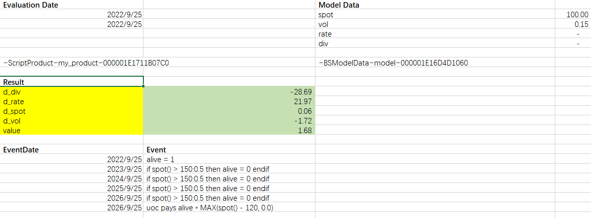

# DAL - *D*erivatives *A*lgorithms *L*ib

<table>
<tr>
  <td>Build Status</td>
  <td>
    <a href="https://github.com/wegamekinglc/Derivatives-Algorithms-Lib/actions">
    
  </a>
    </a>
  </td>
</tr>
<tr>
  <td>Coverage</td>
  <td></td>
</tr>
</table>


## Introduction

This is a project inspired by following books & codes repositories:

* [*Derivatives Algorithms:  Volume 1: Bones* by Tom Hyer](https://github.com/TomHyer/DA_Bones_Mirror)
  
* [*Modern Computational Finance: AAD and Parallel Simulations* by Antoine Savine](https://github.com/asavine/CompFinance)

* [*Modern Computational Finance: Scripting for Derivatives and xVA* by Antoine Savine](https://github.com/asavine/Scripting)

* [*Finite Difference Methods for Financial Partial Differential Equations* by Brian Huge & Jesper Andreasen](https://github.com/brnohu/CompFin)

* [*WBS_FD* by Brian Huge](https://github.com/brnohu/WBS_FD)

> Some codes are directly copied from above resources.

## Examples

* [C++ examples](examples)
* [Excel/python bindings](miscs)

## Interface

### Excel

> **NOTE**: This part is only in infancy and should evolve quickly.

We will give a public interface to show the functionality of this project.

we have following data table

| **x** 	  | **y** 	  |
|------|------|
| 1 	  | 10 	 |
| 3 	  | 8 	  |
| 5 	  | 6 	  |
| 7 	  | 4 	  |
| 9 	  | 2 	  |

and we will use follow excel function to create a linear interpolator:

```excel
=INTERP1.NEW.LINEAR(E1,A2:A6,B2:B6)  # return a object string id, e.g. ~Interp1~my.interp~2F18E558
```

later we can use the interpolator:
```excel
=INTERP1.GET("~Interp1~my.interp~2F18E558", 6.5)  # will return 4.5
```

#### Scripted Exotic Option Pricing

We will price an european option with our script ability and a basic BS model

The product will be described in excel like :

| **Date** 	  | **Event** 	 |
|-------------|-------------|
| 2022/9/25 	 | call pays MAX(spot() - 120, 0.0) |

and we can create a product in excel with the above table:

```excel
=PRODUCT.NEW("my_product", A2, B2)
```

then we set a model to price this:

| **Field** 	 | **Value** |
|-------------|-----------|
| spot 	   | 100 	     |
| vol	       |  0.15 	   |
| rate	       | 0.0       |
| dividend   | 0.0 	     |

```excel
=BSMODELDATA.NEW("model", D2, D3, D4, D5)
```

finally we price this product with the model:
```excel
=MONTECARLO.VALUE(A5, C7, 2^20, "sobol", FALSE)
```

| value |4.0389  |
|-------|-----|

#### other excel based exotic products example

* [up and out call](miscs/excel/004.up%20and%20out%20call.xlsx)
* [snowball](miscs/excel/005.snowball.xlsx)

#### Some screenshot



### Python

The above simple european option pricing example can also be replicated in python:

```python
from dal import *

today = Date_(2022, 9, 15)
EvaluationDate_Set(today)

spot = 100.0
vol = 0.15
rate = 0.0
div = 0.0
strike = 120.0
maturity = Date_(2025, 9, 15)

n_paths = 2 ** 20
use_bb = False
rsg = "sobol"
model_name = "bs"

event_dates = [maturity]
events = [f"call pays MAX(spot() - {strike}, 0.0)"]

product = Product_New(event_dates, events)
model = BSModelData_New(spot, vol, rate, div)

res = MonteCarlo_Value(product, model, n_paths, rsg, False, True)
vega = 0.0
for k, v in res.items():
    print(f"{k:<8}: {v:>10.4f}")
```
The output should look like:

```python
d_div   :   -85.2290
d_rate  :    73.1011
d_spot  :     0.2838
d_vol   :    58.7140
value   :     4.0389
```
#### other python based exotic products example

* [up and out call](miscs/python/002.uoc.py)
* [snowball](miscs/python/003.snowball.py)
